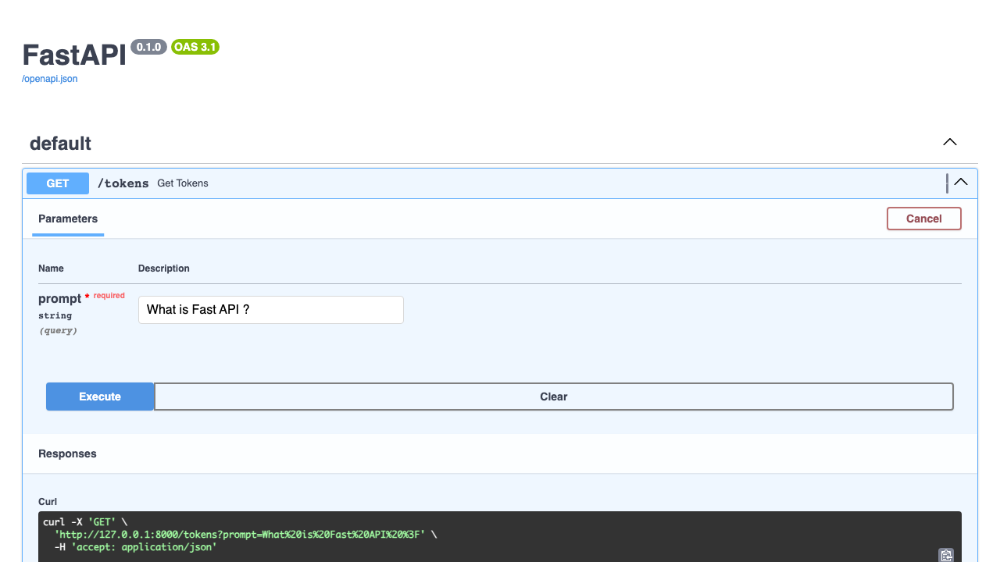
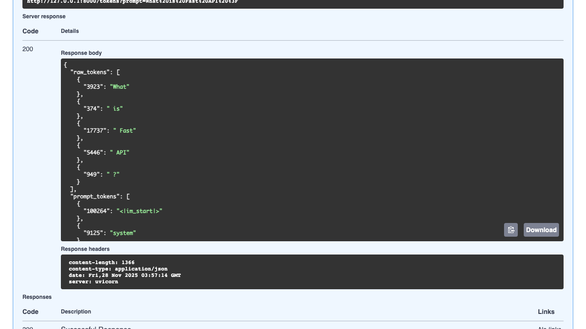
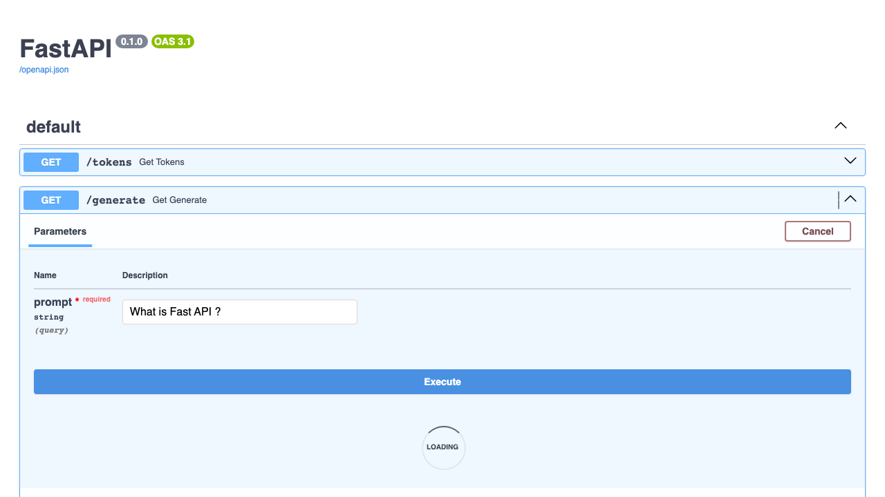
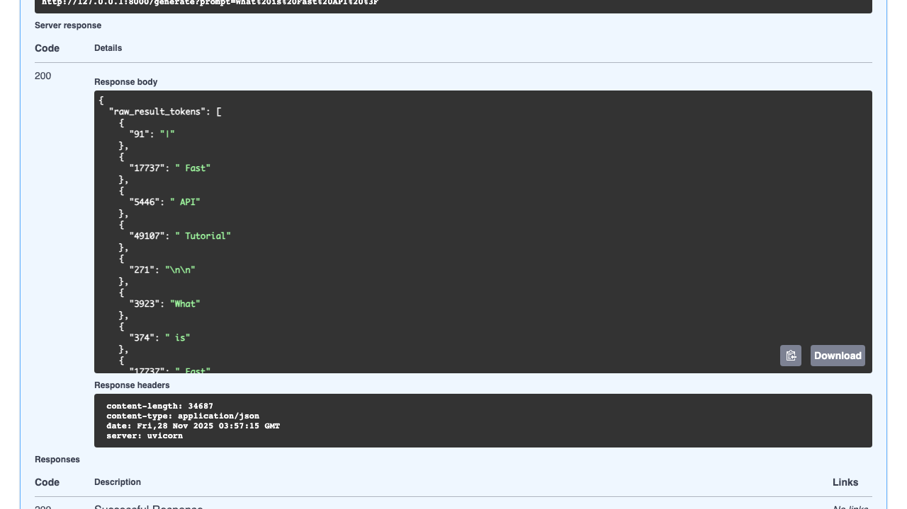

# 2025/11/27/full-stack


```
% make pytest
uv run pytest test.py
========================================================= test session starts =========================================================
platform darwin -- Python 3.14.0, pytest-9.0.1, pluggy-1.6.0
rootdir: /Users/sam/github/ontouchstart.github.io/2025/11/27/full-stack
configfile: pyproject.toml
plugins: playwright-0.7.2, anyio-4.11.0, base-url-2.1.0
collected 2 items                                                                                                                     

test.py ..                                                                                                                      [100%]

========================================================= 2 passed in 56.95s ==========================================================
```








