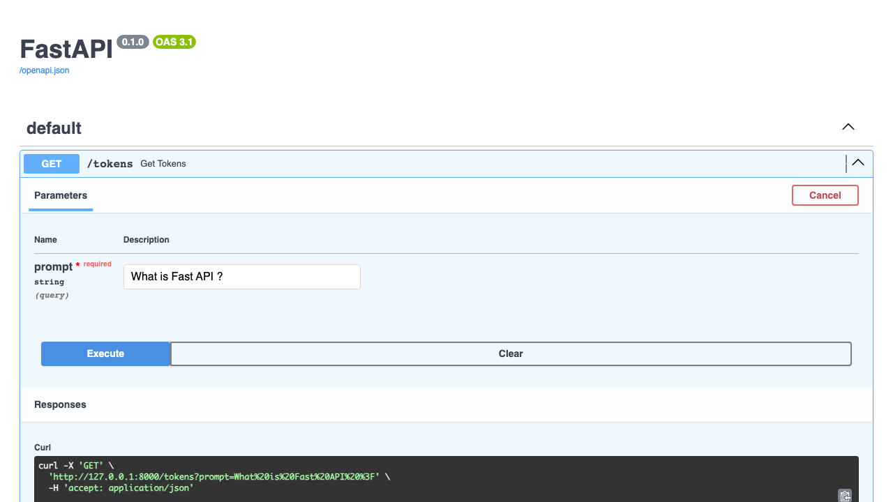
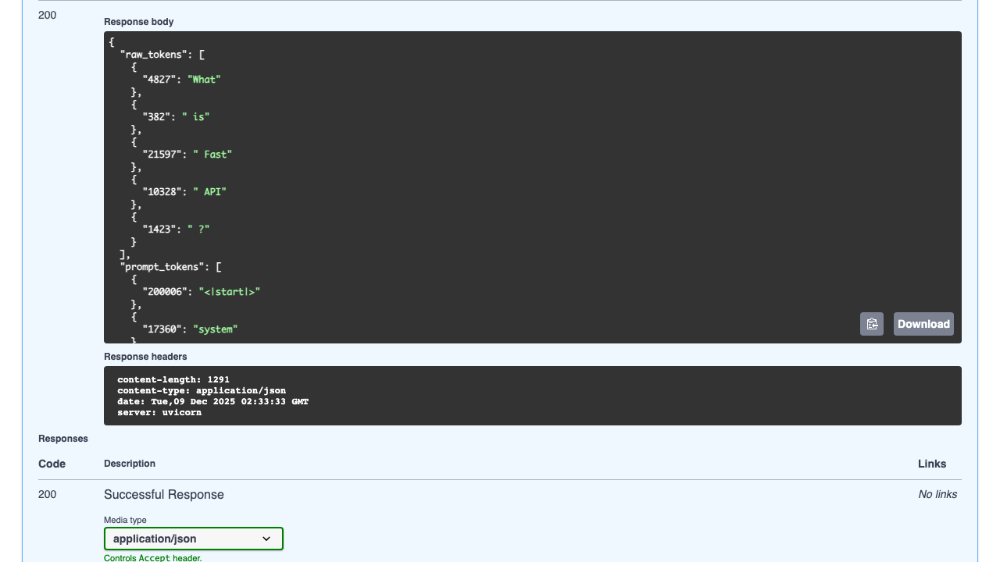
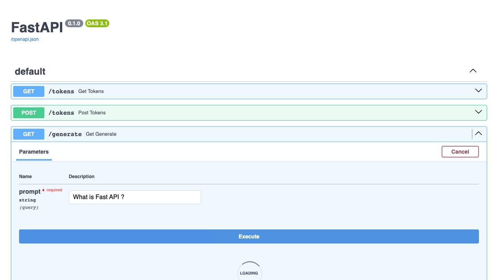
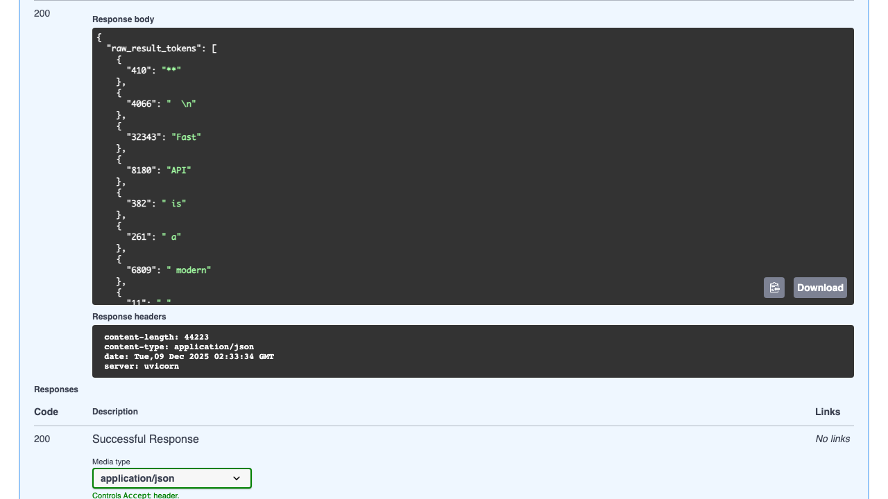
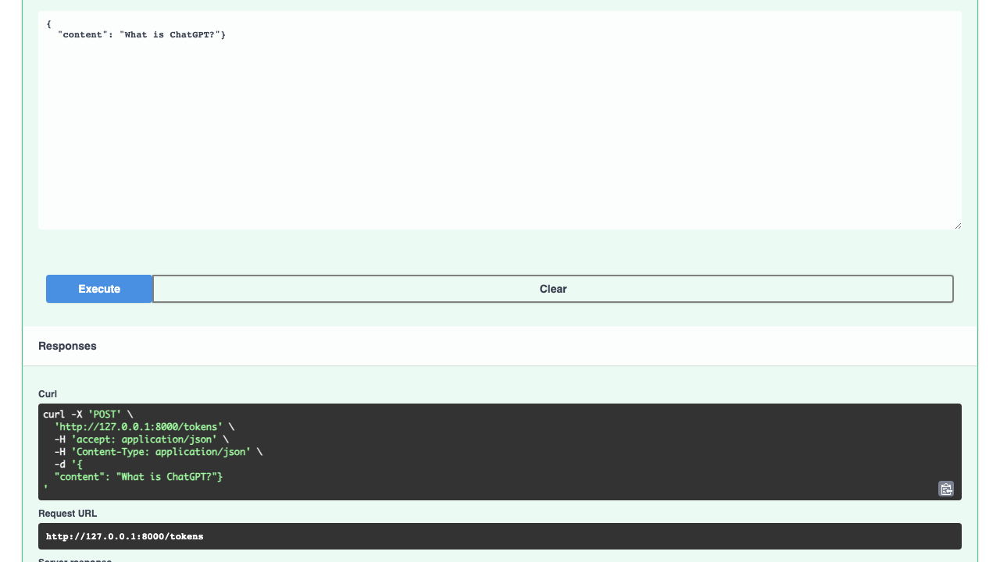
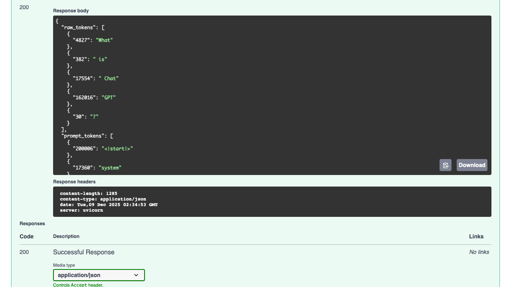
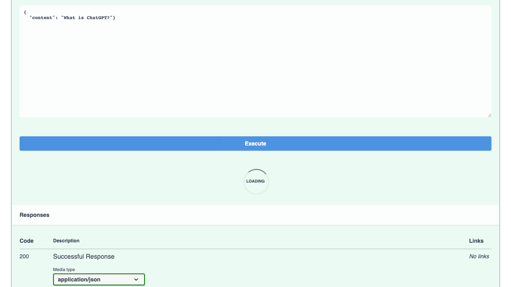
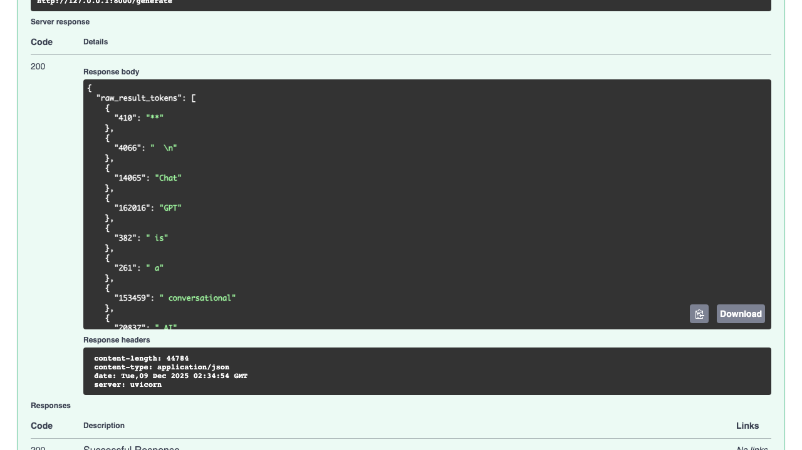

# 2025/12/08 What does this Makefile do?

```
% uv run explain_Makefile.py
Fetching 12 files: 100%|█████████████████████████████████████████████████████████████████| 12/12 [00:00<00:00, 48960.75it/s]
[{'role': 'user', 'content': 'What does this Makefile do?\n install:\n\tuv add ipython ruff\n\tuv add "fastapi[standard]" pydantic\n\tuv add pytest-playwright\n\tuv add mlx-lm \n\nrepl:\n\tuv run ipython\n\nserver:\n\tuv run fastapi dev server.py\n\ntest:\n\tuv run pytest test.py\n\nruff:\n\tuv run ruff check\n\tuv run ruff format\n'}]
[200006, 17360, 200008, 3575, 553, 17554, 162016, 11, 261, 4410, 6439, 2359, 22203, 656, 7788, 17527, 558, 87447, 100594, 25, 220, 1323, 19, 12, 3218, 198, 6576, 3521, 25, 220, 1323, 20, 12, 899, 12, 3062, 279, 30377, 289, 25, 14093, 279, 2, 13888, 18403, 25, 8450, 11, 49159, 11, 1721, 13, 21030, 2804, 413, 7360, 395, 1753, 3176, 13, 200007, 200006, 1428, 200008, 4827, 2226, 495, 9393, 2318, 621, 3901, 5657, 734, 197, 6992, 1147, 7993, 11516, 428, 1972, 198, 197, 6992, 1147, 392, 10472, 3094, 58, 36672, 49706, 275, 3859, 11574, 198, 197, 6992, 1147, 63194, 48299, 83439, 198, 197, 6992, 1147, 199822, 2887, 76, 1202, 264, 528, 734, 197, 6992, 2461, 7993, 11516, 279, 5282, 734, 197, 6992, 2461, 5661, 3094, 3947, 6017, 17311, 279, 3190, 734, 197, 6992, 2461, 63194, 1746, 17311, 279, 157353, 734, 197, 6992, 2461, 428, 1972, 2371, 198, 197, 6992, 2461, 428, 1972, 6011, 198, 200007, 200006, 173781]
<|channel|>analysis<|message|>We need to explain what the Makefile does. The Makefile has targets: install, repl, server, test, ruff. Each target runs commands using uv, which is a Python tool for dependency management and running. So install: adds packages ipython, ruff, fastapi[standard], pydantic, pytest-playwright, mlx-lm. repl: runs ipython. server: runs fastapi dev server.py. test: runs pytest test.py. ruff: runs ruff check and ruff format. So explanation: install sets up environment, adding dependencies. repl opens interactive IPython. server runs FastAPI dev server. test runs tests. ruff runs linting and formatting. Also mention that uv is used to manage dependencies and run commands. Also mention that uv add installs packages into a uv-managed environment. Also mention that uv run runs commands in that environment. So answer: explanation of each target. Also mention that Makefile uses tab indentation. Also mention that uv is a tool like pip but with better performance. Also mention that uv add "fastapi[standard]" pydantic installs fastapi with optional dependencies. Also mention that uv add pytest-playwright installs pytest plugin for Playwright. Also mention that uv add mlx-lm installs a machine learning library. Also mention that ruff is a linter and formatter. So answer accordingly.<|end|><|start|>assistant<|channel|>final<|message|>Below is a line‑by‑line walk‑through of what this Makefile does.  
(Assume you run it with `make <target>` from the directory that contains the file.)
```
---

## 1. The `install` target

```make
install:
	uv add ipython ruff
	uv add "fastapi[standard]" pydantic
	uv add pytest-playwright
	uv add mlx-lm
```

* **`uv`** – a modern, fast Python dependency manager (similar to `pip` but with a built‑in virtual‑env and lockfile).  
* **`uv add <packages>`** – installs the listed packages into a *uv* environment that lives in the project directory (`.venv` by default).  
* The four commands install:

| Package | What it is | Why it might be needed |
|---------|------------|------------------------|
| `ipython` | Interactive Python shell | For a richer REPL than the default `python` |
| `ruff` | Linter + formatter | Static analysis and code formatting |
| `fastapi[standard]` | FastAPI web framework + optional dependencies (`[standard]` pulls in `uvicorn`, `pydantic`, etc.) | Building a web API |
| `pydantic` | Data validation library | Used by FastAPI for request/response models |
| `pytest-playwright` | Pytest plugin for Playwright | End‑to‑end browser testing |
| `mlx-lm` | (Assuming) a machine‑learning language model library | For ML workloads |

> **Result**: After running `make install`, you’ll have a ready‑to‑use environment with all the tools your project needs.

---

## 2. The `repl` target

```make
repl:
	uv run ipython
```

* `uv run` executes a command inside the uv environment.  
* This launches an IPython REPL.  
* Handy shortcut: `make repl` → you’re in an interactive shell with all the installed packages already imported.

---

## 3. The `server` target

```make
server:
	uv run fastapi dev server.py
```

* Runs the FastAPI development server defined in `server.py`.  
* `fastapi dev` is the built‑in command that watches for file changes and reloads automatically.  
* Equivalent to: `uvicorn server:app --reload` but using FastAPI’s convenience wrapper.

---

## 4. The `test` target

```make
test:
	uv run pytest test.py
```

* Executes `pytest` on `test.py`.  
* Because it’s run via `uv run`, it uses the same environment that contains `pytest-playwright` and any other test dependencies.

---

## 5. The `ruff` target

```make
ruff:
	uv run ruff check
	uv run ruff format
```

* **`ruff check`** – runs the linter, reporting style/quality issues.  
* **`ruff format`** – automatically formats the code to match Ruff’s style rules.  
* Running `make ruff` will lint *and* format your code in one go.

---

## Quick Summary

| Target | What it does |
|--------|--------------|
| `install` | Installs all project dependencies (`ipython`, `ruff`, `fastapi`, `pydantic`, `pytest-playwright`, `mlx-lm`). |
| `repl` | Starts an IPython REPL inside the uv environment. |
| `server` | Launches the FastAPI dev server (`server.py`). |
| `test` | Runs the test suite (`test.py`) with pytest. |
| `ruff` | Lints and formats the code with Ruff. |

---

### How to use it

```bash
# 1. Set up the environment
make install

# 2. Open an interactive shell
make repl

# 3. Run the web server
make server

# 4. Run tests
make test

# 5. Lint & format
make ruff
```

Feel free to add more targets (e.g., `make docs`, `make clean`) as your project grows. The Makefile keeps the command line short and consistent across developers.


## Screenshots from `make test`


	

---




---




---

	

