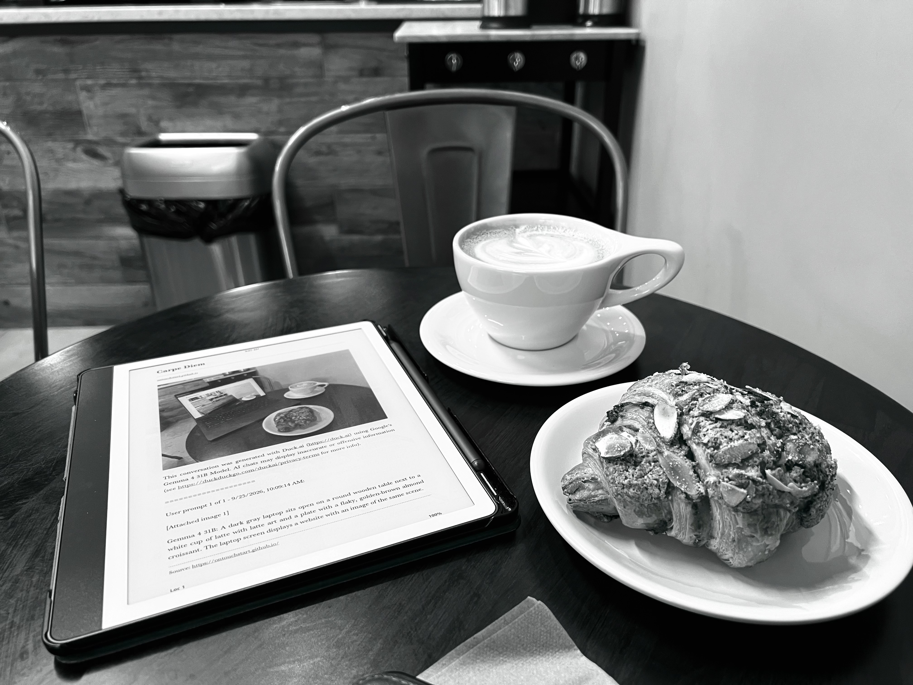

# Carpe Diem

This conversation was generated with Duck.ai (https://duck.ai) using Google's Gemma 4 31B Model. AI chats may display inaccurate or offensive information (see https://duckduckgo.com/duckai/privacy-terms for more info).

====================

Elias sat in the same cafe he had visited every morning for a century, or perhaps it had only been an hour. He didn't remember the passage of time, only the scent of roasted beans and the cold, sterile glow of the screens that populated every table. On his tablet, a webpage was open, titled simply Carpe Diem. The advice to seize the day felt like a cruel joke in a place where the day never seemed to end.

He leaned back, glancing at the image on his screen. It was a photograph of him, in this exact chair, looking at this exact tablet. He leaned in closer, tracing the recursion. Within the image on the screen was another image, and within that, another, a digital hall of mirrors stretching into a void. But as he stared, he noticed the glitch. On his actual plate sat a flaky almond croissant, golden and dusted with sugar. In the image on the screen, however, the pastry was different—a dense, dark cake he didn't recognize.

A cold shiver ran down his spine. The recursion wasn't a perfect loop; it was a descent. He remembered a previous iteration of the site, one titled Deepest, which had promised a way out of the loop if one could find the point of divergence. 

He scrolled down the page to the bottom, where a line of small, clinical text informed him that his current conversation was being generated by a 31B model on an interface called Duck.ai. He stared at the words, wondering if the coffee in his hand was real, or if he was simply a prompt being answered in a world made of weights and biases, forever searching for the original version of a croissant.
