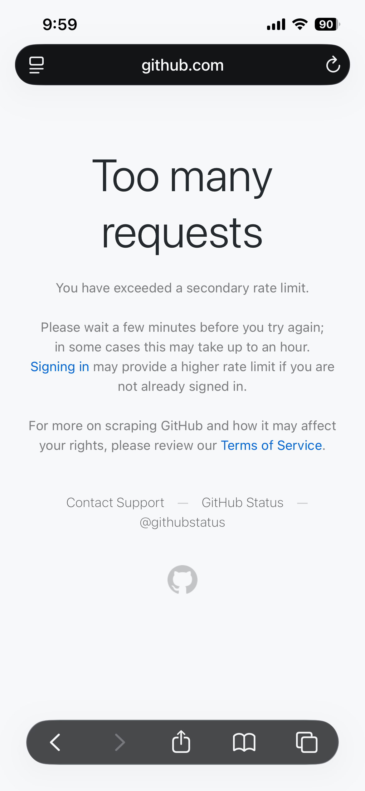

This conversation was generated with Duck.ai (https://duck.ai) using Google's Gemma 4 31B Model. AI chats may display inaccurate or offensive information (see https://duckduckgo.com/duckai/privacy-terms for more info).

====================

User prompt 1 of 1 - 8/24/2026, 10:01:42 AM:

[Attached image 1]

Gemma 4 31B:
This error means you have triggered GitHub's rate limiting, which happens when too many requests are made from your IP address or account in a short period. This is often caused by using automated scripts, refreshing a page too quickly, or using a shared network (like a corporate or school Wi-Fi) where many people are accessing GitHub simultaneously.

To resolve this, you can try the following:

*   **Wait it out:** As the screen suggests, waiting a few minutes usually works. In some cases, you may need to wait up to an hour for the limit to reset.
*   **Sign in:** If you are browsing anonymously, signing into your GitHub account often provides a higher rate limit.
*   **Disable VPNs or Proxies:** If you are using a VPN, other users on that same server may have exhausted the rate limit for that IP address. Switching servers or turning off the VPN may help.
*   **Check for automation:** If you are running a script or a browser extension that scrapes GitHub, disable it or increase the delay between requests.
