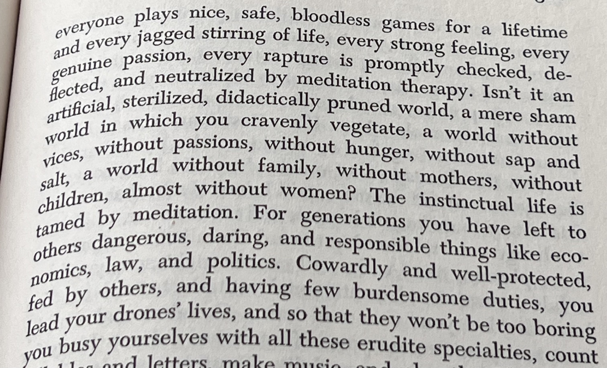

This conversation was generated with Duck.ai (https://duck.ai) using Google's Gemma 4 31B Model. AI chats may display inaccurate or offensive information (see https://duckduckgo.com/duckai/privacy-terms for more info).

====================

User prompt 1 of 2 - 8/24/2026, 10:45:00 AM:
What does this mean? Write a 500 word essay relating it to our AI world.
[Attached image 1]

Gemma 4 31B:
This passage is a critique of a society that has traded the raw, unpredictable essence of human experience for a curated, sterile existence. The author describes a world where "bloodless games" are played and any "jagged stirring of life"—passion, rapture, or strong emotion—is immediately neutralized through "meditation therapy." It is an indictment of a culture that prioritizes safety, stability, and emotional regulation over the "instinctual life." By pruning away the "vices" and "hunger" of existence, the society has not achieved peace, but rather a state of "cravenly vegetating." The text suggests that in the pursuit of a frictionless life, these people have abdicated the burdens of responsibility—law, economics, and politics—to others, becoming "well-protected" drones who occupy themselves with academic specialties to mask a profound inner void.

In our current AI-driven world, this warning resonates as a metaphor for the "optimization" of the human experience. We are increasingly living in a digital environment designed to be the ultimate "bloodless game." Algorithms are engineered to remove friction, anticipate our needs, and shield us from the "jagged stirrings" of cognitive dissonance or emotional discomfort. When an AI curates our news feed to show only what we like or generates a perfectly polished email to avoid the vulnerability of a raw conversation, it performs a digital version of the "meditation therapy" mentioned in the text. It neutralizes the risk of social friction and the discomfort of conflict, offering a sterilized version of human interaction.

The danger of this AI-mediated existence is the erosion of the "instinctual life." Much like the people in the passage who leave "dangerous, daring, and responsible things" to others, we risk outsourcing our critical thinking, our creativity, and our moral discernment to large language models and predictive systems. When we rely on AI to synthesize information, write our thoughts, or make decisions, we are "pruning" the intellectual struggle that is necessary for genuine growth. The "burdensome duties" of thinking through a complex problem or navigating a difficult emotion are the very things that prevent us from becoming "drones."

Furthermore, the passage warns of a world "without sap and salt," implying a loss of the essential nutrients of the soul. If AI provides a world of perfect convenience and simulated empathy, we may find ourselves in a state of emotional atrophy. A life without the risk of failure, the sting of rejection, or the effort of deep mastery is a life that "vegetates." As we integrate AI more deeply into our lives, the challenge is to ensure that these tools remain instruments of empowerment rather than buffers that isolate us from the visceral, messy, and essential realities of being human. To avoid the "sterilized" world the author fears, we must intentionally seek out the jagged edges of experience that AI is designed to smooth away.

--------------------

User prompt 2 of 2 - 8/24/2026, 10:46:47 AM:
How much of this is bullshit, how much of it has real helpful advice?

Gemma 4 31B:
Whether this is "bullshit" or "helpful advice" depends on whether you view it as a literal instruction manual or a philosophical warning. 

**The "Bullshit" Part: The Hyperbole**
The passage uses extreme, alarmist language to make its point. Claims that a society is "almost without women" or that people are "cravenly vegetating" are dramatic exaggerations designed to provoke an emotional response rather than provide a nuanced sociological analysis. It frames "meditation therapy" as a tool of oppression and sterilization, which is a reductive view of mental health. If you take the text literally—as if the author is describing a factual utopia/dystopia—it is largely hyperbolic. It relies on the "golden age" fallacy, assuming that a life of "vices" and "hunger" is inherently more virtuous than one of peace and stability.

**The Helpful Advice: The Core Warning**
Strip away the melodrama, and there is a potent piece of psychological advice here: **comfort is a trap.**

The real value of the text lies in its critique of "frictionless living." There are three genuinely helpful takeaways:

*   **Avoid the "Drone" Mentality:** The author warns against outsourcing the "dangerous, daring, and responsible" parts of life. In a modern context, this is a reminder to stay engaged with the difficult parts of your existence—politics, ethics, and hard work—rather than passively consuming a curated reality.
*   **Value the "Jagged" Experiences:** The text argues that growth comes from tension, passion, and even pain. The advice here is to stop trying to "optimize" or "neutralize" every negative emotion. Avoiding all discomfort leads to a sterile life; leaning into the "jagged stirrings" is how you actually feel alive.
*   **Beware of Intellectual Decoration:** The mention of "erudite specialties" used to kill boredom suggests that knowing *about* things is not the same as *living* them. It warns against using academic or technical knowledge as a substitute for real-world experience and agency.

**The Verdict**
The **delivery** is mostly theatrical bullshit, but the **premise** is a timeless psychological truth: a life without struggle, risk, and emotional volatility is not a peaceful life—it is a hollow one.
