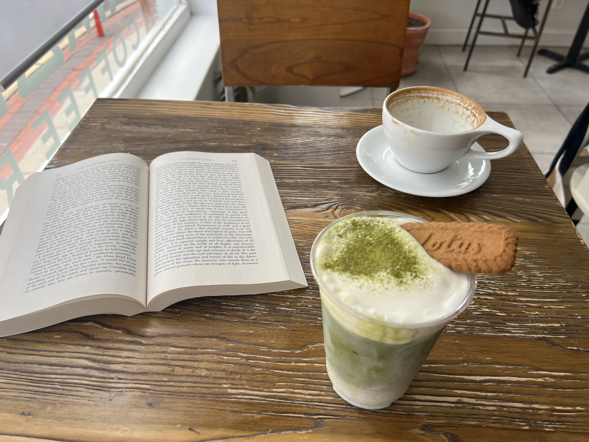

This conversation was generated with Duck.ai (https://duck.ai) using Google's Gemma 4 31B Model. AI chats may display inaccurate or offensive information (see https://duckduckgo.com/duckai/privacy-terms for more info).

====================

User prompt 1 of 4 - 8/24/2026, 11:14:36 AM:
What drink is this?
[Attached image 1]

Gemma 4 31B:
Based on the visual characteristics, the drink in the foreground is a matcha latte. It features a layered appearance with a green tea base and a thick layer of white foam or cream on top, dusted with matcha powder and garnished with a Biscoff cookie.

--------------------

User prompt 2 of 4 - 8/24/2026, 11:15:22 AM:
What kind of Matcha drink is it? 

Gemma 4 31B:
This appears to be a matcha cream latte or a matcha einspänner. Unlike a standard latte where the milk is steamed into the drink, this version features a distinct, dense layer of cold cream or foam sitting on top of the matcha, creating a sharp visual contrast between the green and white layers.

--------------------

User prompt 3 of 4 - 8/24/2026, 11:17:30 AM:
Why is it a popular drink?

Gemma 4 31B:
Matcha cream lattes are popular because they offer a balance of contrasting flavors and textures. The natural earthiness and slight bitterness of the matcha are offset by the richness and sweetness of the heavy cream layer, creating a more indulgent experience than a traditional tea.

The visual appeal also plays a major role in its popularity. The distinct layering—often transitioning from a deep green to a bright white—makes it highly "Instagrammable," which has helped it trend in specialty cafes and across social media. Additionally, matcha provides a more sustained energy boost than coffee due to the combination of caffeine and L-theanine, an amino acid that promotes relaxation and focus without the typical jitteriness associated with espresso.

--------------------

User prompt 4 of 4 - 8/24/2026, 11:17:57 AM:
What is instagrammable? 

Gemma 4 31B:
Instagrammable is a colloquial term used to describe something that is visually appealing or striking enough to be photographed and shared on Instagram. It refers to a specific aesthetic quality—often characterized by vibrant colors, unique architecture, artistic plating, or a "perfect" composition—that is likely to attract likes and engagement from others.

The concept has influenced how businesses design their physical spaces and products. For example, cafes might install neon signs, floral walls, or create visually layered drinks specifically to encourage customers to take photos and post them online, effectively turning the customers into a form of free marketing for the brand.
