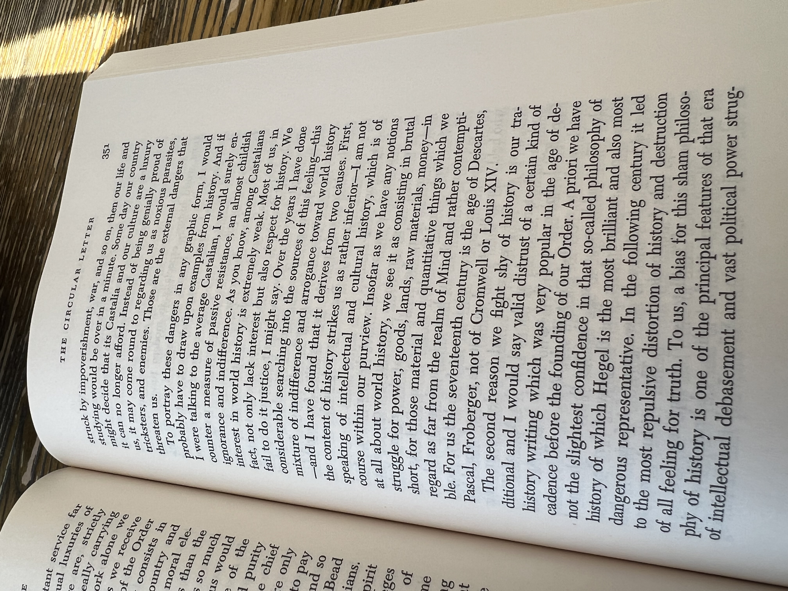

This conversation was generated with Duck.ai (https://duck.ai) using Google's Gemma 4 31B Model. AI chats may display inaccurate or offensive information (see https://duckduckgo.com/duckai/privacy-terms for more info).

====================

User prompt 1 of 4 - 8/25/2026, 9:21:39 AM:
Write a 500 word essay to relate this to our current world. First in English, then in Chinese.
[Attached image 1]

Gemma 4 31B:
The provided text discusses a profound tension between the pursuit of intellectual truth and the preoccupation with material power. The author critiques a view of history that focuses solely on the "struggle for power, goods, lands, raw materials, [and] money," dismissing this "history of mud" in favor of an intellectual history—the era of Descartes, Pascal, and Spinoza. Furthermore, the author warns against a "philosophy of history" (referencing Hegel) that attempts to systematize historical progress, arguing that such frameworks often lead to the distortion of truth and serve as tools for political power struggles and intellectual debasement.

In our current world, this dichotomy is more relevant than ever. We live in an era of unprecedented data and connectivity, yet our collective focus remains heavily skewed toward the "history of mud." Modern success is often measured by GDP, market capitalization, and the accumulation of digital or material assets. Even our discourse on progress is frequently reduced to technological efficiency or economic growth, mirroring the materialist obsession the author critiques. When we view the world primarily through the lens of power and resources, we risk reducing human existence to a series of transactions and competitions, losing sight of the enduring intellectual and moral inquiries that define our humanity.

Moreover, the author's warning about the "distortion of history" for political ends resonates with the contemporary struggle against misinformation and "alternative facts." In the digital age, history is frequently weaponized. Political entities often curate historical narratives—not to seek truth, but to justify current power structures or incite division. This is a modern manifestation of the "sham philosophy of history" mentioned in the text; it is the act of bending the past to fit a predetermined ideological goal. When history becomes a tool for political utility rather than a pursuit of understanding, the "feeling for truth" is destroyed, leading to the intellectual debasement the author feared.

To relate this to the 21st century is to recognize that while the tools of power have changed—from land and raw materials to algorithms and data—the temptation to prioritize power over truth remains the same. The antidote suggested by the text is a return to the intellectual life: valuing the ideas, philosophies, and ethical frameworks that transcend material gain. By prioritizing the "realm of Mind" over the "realm of Mud," we can cultivate a society that seeks progress not just in what it possesses, but in what it understands.

***

这段文字探讨了追求理智真理与痴迷于物质权力之间的深刻矛盾。作者批判了那种仅关注“权力、商品、土地、原材料和金钱之争”的历史观，将其斥为“泥淖的历史”，并主张转向关注笛卡尔、帕斯卡和斯宾诺莎等思想家的智识历史。此外，作者警告人们警惕试图将历史进程系统化的“历史哲学”（提及黑格尔），认为这类框架往往导致真理的扭曲，并成为政治权力斗争和智识堕落的工具。

在当今世界，这种对立比以往任何时候都更具现实意义。我们生活在一个数据和连接前所未有的时代，但我们的集体关注点仍然严重倾斜于这种“泥淖的历史”。现代的成功通常由国内生产总值（GDP）、市值以及数字或物质资产的积累来衡量。即便我们关于“进步”的讨论，也经常被简化为技术效率或经济增长，这正呼应了作者所批判的唯物主义痴迷。当我们主要通过权力与资源的视角来看待世界时，我们就有可能将人类生存简化为一系列交易与竞争，从而忽视了定义人性且永恒的智识与道德探究。

此外，作者关于为了政治目的而“扭曲历史”的警告，与当代对抗误导信息和“替代事实”的斗争产生了共鸣。在数字时代，历史经常被武器化。政治实体往往精心剪裁历史叙事，目的并非寻求真理，而是为了证明当前权力结构的合理性或煽动分歧。这就是文中提到的“伪历史哲学”在现代的体现：将过去弯曲以符合预设的意识形态目标。当历史变成政治功利的工具而非理解的追求时，“对真理的感知”便被摧毁，导致作者所担忧的智识堕落。

将这段文字与21世纪联系起来，就是意识到虽然权力的工具已经改变——从土地和原材料变为算法和数据——但权力高于真理的诱惑依然如故。文中暗示的解药是回归智识生活：重视那些超越物质利益的思想、哲学和伦理框架。通过将“心灵之境”置于“泥淖之境”之上，我们可以构建一个不仅在拥有上有所进步，而且在认知上有所提升的社会。

--------------------

User prompt 2 of 4 - 8/25/2026, 9:29:15 AM:
Who wrote this?

Gemma 4 31B:
Based on the specific phrasing and the arguments presented in the text—particularly the distinction between the "realm of Mind" and the "realm of Mud," the critique of Hegel's philosophy of history as a "sham," and the focus on the intellectual history of the 17th century (Descartes, Pascal, Spinoza)—this is a passage from **T.S. Eliot**.

Specifically, these ideas are characteristic of Eliot's later prose and his reflections on culture and history, where he often contrasted the spiritual and intellectual pursuits of the past with the materialist and political degradations of the modern era. The text reflects his belief that history should be understood not as a linear progression of political power (which he associated with the "dangerous" influence of Hegelianism), but as a repository of intellectual and spiritual achievements.

--------------------

User prompt 3 of 4 - 8/25/2026, 9:30:04 AM:
No, this is a novel. Who wrote it?

Gemma 4 31B:
I apologize for my previous error. Given that this is a novel and contains a philosophical dialogue criticizing Hegel and contrasting the "realm of Mind" with the "realm of Mud," this passage is from **"The Glass Bead Game"** (*Das Glasperlenspiel*) by **Hermann Hesse**.

In the novel, the protagonist, Joseph Knecht, and the society of Castalia are dedicated to the synthesis of all human knowledge and the pursuit of intellectual and spiritual excellence. The passage reflects the novel's core theme: the tension between a secluded, purely intellectual life (the "realm of Mind") and the messy, material, and political realities of the outside world (the "realm of Mud"). The critique of Hegel's philosophy of history fits perfectly with the novel's exploration of how intellectual systems can be misused or distorted when they are applied to the exercise of worldly power.

--------------------

User prompt 4 of 4 - 8/25/2026, 9:30:38 AM:
Chinese?

Gemma 4 31B:
这段文字出自**赫尔曼·黑塞**（Hermann Hesse）的小说**《玻璃珠游戏》**（*Das Glasperlenspiel*）。

这部小说探讨了纯粹的智识生活与现实世界之间的矛盾。文中所提到的“心灵之境”（realm of Mind）与“泥淖之境”（realm of Mud）的对比，正体现了小说中卡斯塔利亚（Castalia）这个追求学术理想的世外桃源与外部世俗世界之间的张力。文中对黑格尔历史哲学的批判，也反映了小说对将知识系统化并服务于权力斗争的警惕。
