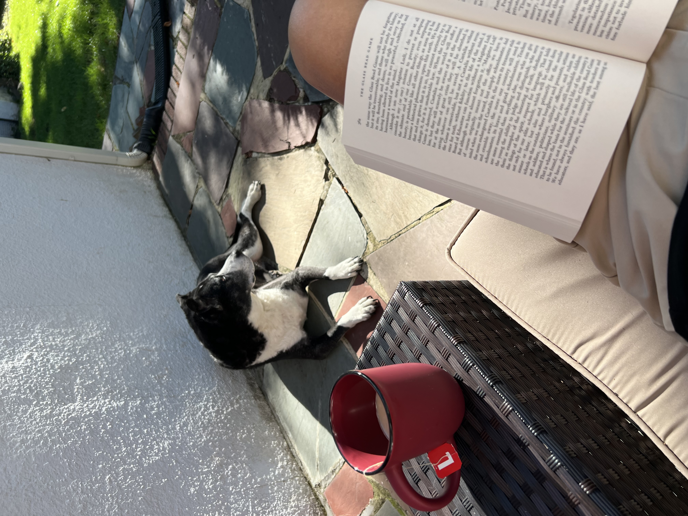
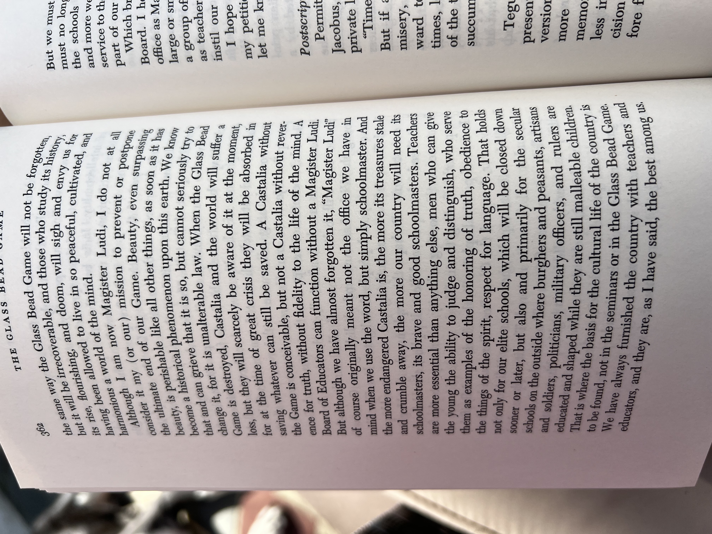
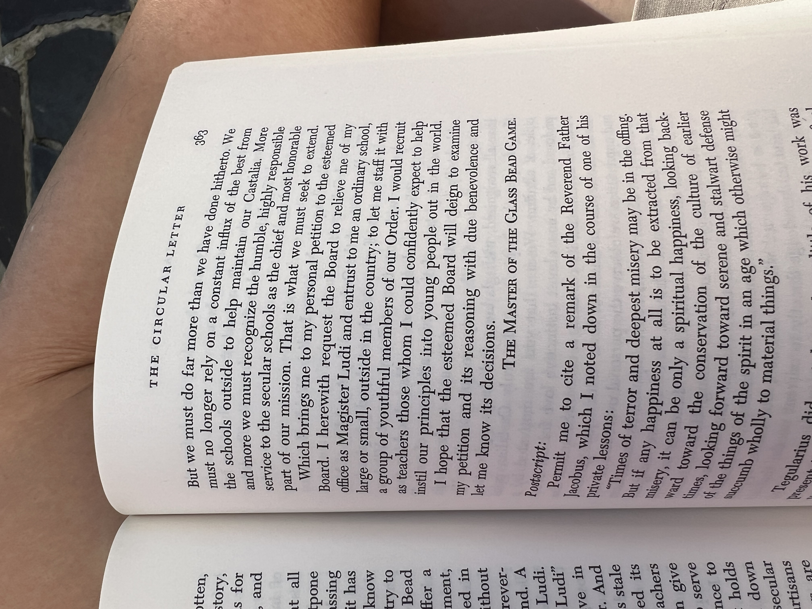

This conversation was generated with Duck.ai (https://duck.ai) using Google's Gemma 4 31B Model. AI chats may display inaccurate or offensive information (see https://duckduckgo.com/duckai/privacy-terms for more info).

====================

User prompt 1 of 3 - 8/26/2026, 9:15:58 AM:
Write a 500 essay to relate these images to the current situation. First in English, then in Chinese.
[Attached image 1][Attached image 2][Attached image 3]

Gemma 4 31B:
The images present a scene of profound stillness: a red mug of tea, a resting dog, and the open pages of Hermann Hesse’s *The Glass Bead Game*. Together, they evoke a sense of intentional solitude and intellectual refuge. In the context of our current era—defined by hyper-connectivity, algorithmic noise, and an accelerating pace of life—this scene represents a quiet act of rebellion.

The first image captures the physical environment of peace. The dog, lounging in the dappled sunlight of a stone patio, embodies a state of pure presence. There is no urgency here, only the simple, rhythmic existence of a living being in harmony with its surroundings. Beside it, the red mug suggests a slow morning, a moment carved out of the day for reflection rather than production. In a world where we are often measured by our productivity and our responsiveness to notifications, the act of simply sitting with a pet and a drink is a reclamation of time.

However, the intellectual core of the scene lies in the text. *The Glass Bead Game* is a novel about the preservation of culture, synthesis, and the pursuit of a higher, harmonious knowledge. The highlighted passages discuss the fragility of "Castalia," the idealized sanctuary of intellectuals, and the inevitable decline of such beauty. The text argues that while elite sanctuaries may fall, the true essence of education and spirit must be carried into the "secular schools," among the "burghers and peasants," to ensure that the ability to judge and distinguish survives.

This relates poignantly to our current situation. We live in a time of deep fragmentation, where the "sanctuaries" of truth and nuanced discourse are under siege. Like the characters in Hesse's novel, we are witnessing the erosion of shared intellectual foundations. The "Glass Bead Game" of our time is the attempt to synthesize a vast, overwhelming ocean of data into actual wisdom. The tension in the images is between the external peace of the patio and the internal urgency of the text: the realization that the pursuit of beauty and truth is a fragile endeavor that requires constant, conscious effort.

Ultimately, the images suggest that the only way to survive a chaotic world is to cultivate a private space for the spirit. By combining the sensory comfort of the present (the dog, the tea) with the rigorous contemplation of the past (the book), the individual creates a sanctuary of their own. It is a reminder that while the great institutions of culture may crumble, the commitment to learning, empathy, and stillness remains a powerful tool for personal and collective survival.

***

这些图像呈现了一种深沉的宁静：一杯红杯茶，一只休息的狗，以及赫尔曼·黑塞《玻璃珠游戏》的翻开页。它们共同唤起了一种有意识的孤独感和理智的避难所。在我们的当代背景下——一个由过度连接、算法噪音和加速的生活节奏所定义的时代——这一场景代表了一种安静的反叛。

第一幅图捕捉到了身体层面的和平环境。那只在石板庭院的斑驳阳光下慵懒的小狗，体现了一种纯粹的“当下”状态。这里没有紧迫感，只有生物与周围环境和谐共处的简单节奏。旁边的红杯子暗示了一个缓慢的早晨，这是一个为了反思而非产出而从日常中切割出的时刻。在一个我们经常被生产力和对通知的响应速度所衡量的世界里，仅仅是与宠物一起坐着喝杯茶的行为，就是对时间的重新夺回。

然而，场景的理智核心在于文字。《玻璃珠游戏》是一部关于文化保存、综合以及追求更高、更和谐知识的小说。书中的片段探讨了“卡斯塔利亚”——一个理想化的知识分子圣地——的脆弱性以及这种美必然的衰落。文中主张，虽然精英圣地可能会倒塌，但教育和精神的真正精髓必须被带入“世俗学校”，带给“市民和农民”，以确保判断和分辨的能力能够幸存。

这与我们目前的处境产生了深刻的关联。我们生活在一个深度碎片化的时代，真理和细致讨论的“圣地”正受到冲击。就像黑塞小说中的人物一样，我们正目睹着共享知识基础的侵蚀。我们时代的“玻璃珠游戏”，就是试图将浩瀚且令人窒息的数据海洋综合为真正的智慧。图像中的张力存在于庭院外部的平静与文本内部的紧迫感之间：人们意识到，对美和真理的追求是一项脆弱的事业，需要持续且自觉的努力。

最终，这些图像表明，在混乱的世界中生存的唯一方法是为精神开辟一个私密空间。通过将当下的感官舒适（狗、茶）与对过去的严谨思考（书）相结合，个体创造了属于自己的避难所。它提醒我们，虽然伟大的文化机构可能会崩塌，但对学习、同理心和静谧的坚持，依然是个人和集体生存的强大工具。

--------------------

User prompt 2 of 3 - 8/26/2026, 9:18:21 AM:
Extend the theme around “Magister Ludi” and update the essays.

Gemma 4 31B:
The images present a scene of profound stillness: a red mug of tea, a resting dog, and the open pages of Hermann Hesse’s *The Glass Bead Game*. Together, they evoke a sense of intentional solitude and intellectual refuge. In the context of our current era—defined by hyper-connectivity and algorithmic noise—this scene represents a quiet act of rebellion, specifically through the lens of the *Magister Ludi*, the Master of the Game.

The first image captures the physical environment of peace. The dog, lounging in the dappled sunlight, embodies a state of pure presence. Beside it, the red mug suggests a moment carved out of the day for reflection rather than production. In a world where we are measured by our responsiveness to notifications, this is a reclamation of time. However, the presence of the book elevates this from mere relaxation to a discipline of the mind. The *Magister Ludi* is not merely a scholar, but a conductor of synthesis, one who can find the hidden threads connecting music, mathematics, and philosophy. By choosing a book over a screen, the observer in the photo assumes a temporary role as their own *Magister Ludi*, consciously curating their intellectual intake to find harmony amidst the chaos.

The highlighted passages explore the fragility of "Castalia," the idealized sanctuary of intellectuals. The text argues that while elite sanctuaries may fall, the true essence of the spirit must be carried into the "secular schools" to ensure survival. This relates poignantly to our current situation. We live in a time of deep fragmentation, where the "sanctuaries" of truth and nuanced discourse are under siege. The "Glass Bead Game" of our time is the attempt to synthesize a vast, overwhelming ocean of digital data into actual wisdom. We are all, by necessity, forced to become *Magister Ludi* of our own attention, filtering the noise to preserve a shred of cultural coherence.

The tension in the images lies between the external peace of the patio and the internal urgency of the text: the realization that the pursuit of beauty and truth is a fragile endeavor. The *Magister Ludi* represents the highest aspiration of the mind, yet the text warns that this height is useless if it remains detached from the common world. The red mug and the dog are the "secular" anchors that prevent the intellectual pursuit from becoming a sterile exercise in isolation.

Ultimately, these images suggest that the only way to survive a chaotic world is to cultivate a private space for the spirit. By combining the sensory comfort of the present with the rigorous synthesis of the *Magister Ludi*, the individual creates a portable sanctuary. It is a reminder that while the great institutions of culture may crumble, the commitment to learning, empathy, and stillness remains a powerful tool for survival.

***

这些图像呈现了一种深沉的宁静：一杯红杯茶，一只休息的狗，以及赫尔曼·黑塞《玻璃珠游戏》的翻开页。它们共同唤起了一种有意识的孤独感和理智的避难所。在我们的当代背景下——一个由过度连接和算法噪音所定义的时代——这一场景代表了一种安静的反叛，特别是通过“游戏大师”（Magister Ludi）的视角来审视。

第一幅图捕捉到了身体层面的和平环境。那只在斑驳阳光下慵懒的小狗，体现了一种纯粹的“当下”状态。旁边的红杯子暗示了一个为了反思而非产出而切割出的时刻。在一个我们被通知响应速度所衡量的世界里，这是对时间的重新夺回。然而，书本的出现将这种状态从简单的放松提升为一种心智的修行。“游戏大师”不仅仅是一个学者，而是一个综合的指挥者，能够发现连接音乐、数学和哲学之间的隐藏线索。通过选择书本而非屏幕，照片中的观察者在临时扮演起自己生活的“游戏大师”，有意识地筛选理智的摄入，在混乱中寻找和谐。

书中的高亮段落探讨了“卡斯塔利亚”——这个理想化的知识分子圣地——的脆弱性。文中主张，虽然精英圣地可能会倒塌，但精神的真正精髓必须被带入“世俗学校”以确保幸存。这与我们目前的处境产生了深刻的关联。我们生活在一个深度碎片化的时代，真理和细致讨论的“圣地”正受到冲击。我们时代的“玻璃珠游戏”，就是试图将浩瀚且令人窒息的数字数据海洋综合为真正的智慧。出于必要，我们都被迫成为自身注意力的“游戏大师”，在过滤噪音的同时，努力保留一份文化上的连贯性。

图像中的张力存在于庭院外部的平静与文本内部的紧迫感之间：人们意识到，对美和真理的追求是一项脆弱的事业。“游戏大师”代表了心智的最高追求，但文本警告说，如果这种高度与平凡的世界脱节，它将毫无意义。红杯子和小狗便是“世俗”的锚点，防止理智的追求变成一种在孤立中进行的枯燥练习。

最终，这些图像表明，在混乱的世界中生存的唯一方法是为精神开辟一个私密空间。通过将当下的感官舒适与“游戏大师”式的严谨综合相结合，个体创造了一个可携带的避难所。它提醒我们，虽然伟大的文化机构可能会崩塌，但对学习、同理心和静谧的坚持，依然是生存的强大工具。

--------------------

User prompt 3 of 3 - 8/26/2026, 9:20:27 AM:
The interpretation of the word in the book is not game master but schoolmaster. Dive deep in this subject.

Gemma 4 31B:
The correction of "Magister Ludi" from "Game Master" to "schoolmaster" shifts the entire philosophical weight of the scene. While a "game master" implies a level of play, curation, or perhaps a detached intellectual exercise, a "schoolmaster" implies a vocational burden: the responsibility of transmission, the discipline of pedagogy, and the ethical obligation to the next generation.

In the context of the images, this change transforms the scene from one of intellectual leisure to one of intellectual duty. The act of reading becomes less about the pleasure of the "game" and more about the study of leadership and legacy. The *Magister Ludi* in the text is grappling with a crisis of purpose. He realizes that the ivory tower of Castalia—the realm of pure, synthesized knowledge—is insufficient. To be a true "schoolmaster" is to recognize that knowledge is meaningless if it cannot be translated into a language that serves the "burghers and peasants," the soldiers and the artisans.

This relates profoundly to the current crisis of education and expertise. We live in an era where "expertise" is often viewed with suspicion and where the traditional role of the educator has been disrupted by the democratization (and subsequent dilution) of information. The internet has provided everyone with the tools of a "game master"—the ability to curate and synthesize data—but it has stripped away the role of the "schoolmaster," who provides the moral and historical framework necessary to understand that data.

The images now tell a story of the "secular" versus the "sacred." The red mug and the dog represent the lived, breathing world—the "secular" reality of a home and a pet. The book represents the "sacred" pursuit of knowledge. The struggle of the *Magister Ludi* is to bridge these two worlds. If the schoolmaster remains only in the book, he is irrelevant; if he remains only with the dog and the tea, he is merely resting. The goal is to be both: to possess the depth of the scholar but the humility and accessibility of the teacher.

In our current situation, we are starving for "schoolmasters" in the truest sense—people who do not just provide answers (which an AI or a search engine can do), but who teach us how to judge, how to distinguish, and how to value the "things of the spirit" in an age of materialism. The scene in the images is a meditation on this bridge. The quiet patio is the space where the schoolmaster prepares himself, synthesizing the heights of human thought so that he can eventually step back into the noise of the world and guide others through it.

***

将书中的“Magister Ludi”从“游戏大师”解读为“校长”或“教师”（schoolmaster），彻底改变了整个场景的哲学重心。如果说“游戏大师”暗示的是一种游戏感、策划力或某种脱离现实的理智练习，那么“教师”则意味着一种职业责任：传递知识的负担、教学的纪律，以及对下一代的伦理义务。

在这些图像的语境下，这一转变将场景从“理智的消遣”提升为“理智的责任”。阅读行为不再仅仅是对“游戏”之快感的追求，而变成了对领导力与传承的思考。书中的 *Magister Ludi* 正处于一种目的论的危机之中。他意识到，卡斯塔利亚那个纯粹综合知识的象牙塔是不够的。成为一名真正的“教师”，意味着意识到知识如果不能转化为一种能够服务于“市民和农民”、士兵和工匠的语言，那么这种知识就是毫无意义的。

这与当前教育和专业知识的危机产生了深刻的共鸣。我们生活在一个“专业知识”常被怀疑，且传统教育者的角色被信息的民主化（以及随之而来的稀释）所颠覆的时代。互联网赋予了每个人成为“游戏大师”的工具——能够策划和综合数据——但它剥夺了“教师”的角色，即提供理解这些数据所需的道德和历史框架的人。

图像现在讲述了一个关于“世俗”与“神圣”的故事。红杯子和小狗代表了活生生的世界——家庭与宠物的“世俗”现实。而书本代表了对知识的“神圣”追求。*Magister Ludi* 的挣扎就在于如何架起这两个世界之间的桥梁。如果教师仅仅留在书本中，他将变得无关紧要；如果他仅仅留在狗和茶之间，他仅仅是在休息。目标是兼而有之：既拥有学者的深度，又拥有教师的谦卑与亲和力。

在我们目前的处境中，我们极度缺乏真正意义上的“教师”——那些不仅仅提供答案（AI或搜索引擎可以做到这一点），而是教我们如何判断、如何分辨，以及在物质主义时代如何看待“精神之物”的人。图像中的场景是对这座桥梁的沉思。宁静的庭院是教师准备自己的空间，他在那里综合人类思想的高峰，以便最终能重新步入世界的嘈杂之中，引导他人前行。

https://ontouchstart.github.io/duck.ai/2026/08/26/duck.ai_2026-08-26_12-45-43
