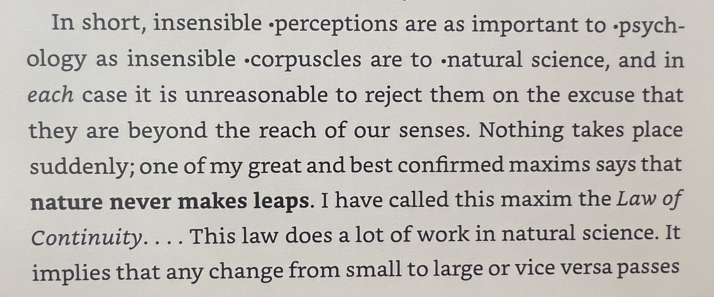

This conversation was generated with Duck.ai (https://duck.ai) using Google's Gemma 4 31B Model. AI chats may display inaccurate or offensive information (see https://duckduckgo.com/duckai/privacy-terms for more info).

====================

User prompt 1 of 4 - 8/26/2026, 2:50:36 PM:
Write a 500 word essay about this in English, Chinese, French and German.
[Attached image 1]

Gemma 4 31B:
## The Law of Continuity and the Invisible World

The provided text explores the philosophical and scientific necessity of accepting "insensible" elements—things that exist but cannot be perceived by human senses—to understand the mechanics of the universe and the mind. The central argument is built upon the Law of Continuity, the maxim that nature never makes leaps. By asserting that change is always gradual and incremental, the author argues that there is no logical justification for dismissing the existence of particles in physics or subconscious perceptions in psychology simply because they are too small or too subtle for us to detect.

In the realm of natural science, the mention of "insensible corpuscles" refers to the early scientific understanding of atoms or molecules. Before the invention of advanced microscopy, these particles were theoretical. However, to deny their existence based on a lack of direct sight would be to ignore the underlying patterns of chemistry and physics. The Law of Continuity suggests that if we see the macroscopic effects of matter, there must be a continuous chain of smaller components leading up to that effect. Nature does not jump from "nothing" to "something"; it builds through a series of infinitesimal steps.

The author extends this logic to psychology, arguing that "insensible perceptions" are equally vital. This is a precursor to the study of the subconscious. Just as the physical world is composed of invisible particles, the human experience is shaped by stimuli and mental processes that occur below the threshold of conscious awareness. If the mind operated only on what we could consciously perceive, our reactions would be erratic and fragmented. Instead, the Law of Continuity implies a seamless flow of mental processing where subtle, unnoticed inputs gradually accumulate to produce a conscious thought or emotion.

Ultimately, this perspective encourages a humility regarding human perception. It posits that the limits of our senses are not the limits of reality. By embracing the Law of Continuity, we acknowledge that the invisible infrastructure of the world—whether it be the dance of corpuscles or the whisper of an unnoticed perception—is what provides the stability and predictability of the natural world. To reject the invisible is to reject the very continuity that allows science and psychology to function as coherent disciplines.

***

## 连续性定律与不可见世界

这段文字探讨了接受“不可感”元素（即存在但人类感官无法察觉的事物）在理解宇宙和心灵机制中的哲学与科学必要性。其核心论点建立在“连续性定律”之上，即自然界从不跳跃。作者认为，既然所有变化都是渐进的，那么仅仅因为物理粒子或心理感知过于微小而无法被察觉，就将其否定，在逻辑上是不合理的。

在自然科学领域，“不可感微粒”是指早期科学对原子或分子的认知。在先进显微镜发明之前，这些粒子仅在理论上存在。然而，如果仅因无法直接观察而否认它们，就等于忽视了化学和物理学的潜在规律。连续性定律表明，如果我们观察到宏观物质的效应，那么必然存在一条由更小组件组成的连续链条。自然界不会从“无”突然跳跃到“有”，而是通过一系列极小的步骤构建而成。

作者将这一逻辑延伸至心理学，认为“不可感感知”同样至关重要。这是对潜意识研究的先驱性思考。正如物理世界由不可见的粒子组成，人类的体验也被那些处于意识阈值之下的刺激和心理过程所塑造。如果大脑仅依赖于我们能意识到的感知，我们的反应将会变得不稳定且碎片化。相反，连续性定律意味着心理处理是一个无缝的流动过程，微妙且未被察觉的输入逐渐累积，最终产生意识层面的想法或情感。

最终，这一观点鼓励我们对人类感官的局限性保持谦卑。它指出，感官的极限并非现实的极限。通过接纳连续性定律，我们承认世界的不可见基础设施——无论是微粒的舞动还是未被察觉的感知之语——正是自然界稳定性与可预测性的来源。否认不可见之物，就是否认让科学和心理学成为连贯学科的连续性基础。

***

## La loi de la continuité et le monde invisible

Le texte proposé explore la nécessité philosophique et scientifique d'accepter les éléments « insensibles » — des choses qui existent mais ne peuvent être perçues par les sens humains — pour comprendre les mécanismes de l'univers et de l'esprit. L'argument central repose sur la Loi de la Continuité, ce principe selon lequel la nature ne fait jamais de sauts. En affirmant que tout changement est toujours graduel et progressif, l'auteur soutient qu'il n'y a aucune justification logique pour rejeter l'existence de particules en physique ou de perceptions inconscientes en psychologie sous prétexte qu'elles sont trop petites ou trop subtiles pour être détectées.

Dans le domaine des sciences naturelles, la mention de « corpuscules insensibles » renvoie à la compréhension scientifique primitive des atomes ou des molécules. Avant l'invention de la microscopie avancée, ces particules étaient théoriques. Cependant, nier leur existence sur la base d'une absence de vue directe reviendrait à ignorer les schémas sous-jacents de la chimie et de la physique. La Loi de la Continuité suggère que si nous observons les effets macroscopiques de la matière, il doit y avoir une chaîne continue de composants plus petits menant à cet effet. La nature ne passe pas brusquement du « rien » au « quelque chose » ; elle construit à travers une série d'étapes infinitésimales.

L'auteur étend cette logique à la psychologie, affirmant que les « perceptions insensibles » sont tout aussi vitales. C'est un précurseur à l'étude du subconscient. Tout comme le monde physique est composé de particules invisibles, l'expérience humaine est façonnée par des stimuli et des processus mentaux qui se produisent sous le seuil de la conscience. Si l'esprit ne fonctionnait qu'avec ce que nous pouvons percevoir consciemment, nos réactions seraient erratiques et fragmentées. Au contraire, la Loi de la Continuité implique un flux transparent de traitement mental où des intrants subtils et inaperçus s'accumulent progressivement pour produire une pensée ou une émotion consciente.

En fin de compte, cette perspective encourage une certaine humilité face à la perception humaine. Elle pose que les limites de nos sens ne sont pas les limites de la réalité. En embrassant la Loi de la Continuité, nous reconnaissons que l'infrastructure invisible du monde — qu'il s'agisse de la danse des corpuscules ou du murmure d'une perception inaperçue — est ce qui assure la stabilité et la prévisibilité du monde naturel. Rejeter l'invisible, c'est rejeter la continuité même qui permet aux sciences et à la psychologie de fonctionner comme des disciplines cohérentes.

***

## Das Gesetz der Kontinuität und die unsichtbare Welt

Der vorliegende Text untersucht die philosophische und wissenschaftliche Notwendigkeit, „unempfindliche“ Elemente zu akzeptieren – Dinge, die existieren, aber von den menschlichen Sinnen nicht wahrgenommen werden können –, um die Mechanismen des Universums und des Geistes zu verstehen. Das zentrale Argument stützt sich auf das Gesetz der Kontinuität, die Maxime, dass die Natur keine Sprünge macht. Indem der Autor behauptet, dass jede Veränderung stets allmählich und schrittweise erfolgt, argumentiert er, dass es keine logische Rechtfertigung gibt, die Existenz von Teilchen in der Physik oder unterbewussten Wahrnehmungen in der Psychologie abzulehnen, nur weil sie zu klein oder zu subtil sind, um detektiert zu werden.

Im Bereich der Naturwissenschaften bezieht sich die Erwähnung „unempfindlicher Korpuskeln“ auf das frühe wissenschaftliche Verständnis von Atomen oder Molekülen. Vor der Erfindung fortschrittlicher Mikroskope waren diese Teilchen theoretischer Natur. Es jedoch, ihre Existenz aufgrund fehlender direkter Sichtbarkeit zu leugnen, hieße, die zugrunde liegenden Muster der Chemie und Physik zu ignorieren. Das Gesetz der Kontinuität legt nahe, dass, wenn wir die makroskopischen Auswirkungen von Materie sehen, eine kontinuierliche Kette kleinerer Komponenten existieren muss, die zu diesem Effekt führen. Die Natur springt nicht vom „Nichts“ zum „Etwas“, sondern baut sich durch eine Serie infinitesimaler Schritte auf.

Der Autor überträgt diese Logik auf die Psychologie und argumentiert, dass „unempfindliche Wahrnehmungen“ ebenso lebensnotwendig sind. Dies ist ein Vorläufer der Erforschung des Unterbewusstseins. So wie die physische Welt aus unsichtbaren Teilchen besteht, wird die menschliche Erfahrung durch Reize und mentale Prozesse geformt, die unterhalb der Schwelle des bewussten Erlebens stattfinden. Wenn der Geist nur auf Basis dessen operieren würde, was wir bewusst wahrnehmen können, wären unsere Reaktionen sprunghaft und fragmentiert. Vielmehr impliziert das Gesetz der Kontinuität einen nahtlosen Fluss mentaler Verarbeitung, bei dem subtile, unbemerkte Inputs allmählich akkumulieren, um einen bewussten Gedanken oder eine Emotion hervorzubringen.

Letztendlich fordert diese Perspektive eine gewisse Demut gegenüber der menschlichen Wahrnehmung. Sie postuliert, dass die Grenzen unserer Sinne nicht die Grenzen der Realität sind. Indem wir das Gesetz der Kontinuität akzeptieren, erkennen wir an, dass die unsichtbare Infrastruktur der Welt – sei es der Tanz der Korpuskeln oder das Flüstern einer unbemerkt bleibenden Wahrnehmung – das ist, was die Stabilität und Vorhersehbarkeit der natürlichen Welt ermöglicht. Das Unsichtbare abzulehnen bedeutet, genau jene Kontinuität zu verleugnen, die es der Wissenschaft und der Psychologie erlaubt, als kohärente Disziplinen zu existieren.

--------------------

User prompt 2 of 4 - 8/26/2026, 2:51:33 PM:
Who is the author?

Gemma 4 31B:
The author of the passage is **Gottfried Wilhelm Leibniz**, a prominent 17th-century philosopher and mathematician.

The text is from his work ***New Essays on Human Understanding*** (specifically the Preface). In this passage, Leibniz discusses his concept of *petites perceptions* (small perceptions)—the idea that there are perceptions in our minds that are too subtle or "insensible" to be consciously noticed, but which still influence our thoughts and actions. He compares these to the invisible "corpuscles" (atoms or particles) used in the natural sciences of his time to explain the physical world.

--------------------

User prompt 3 of 4 - 8/26/2026, 2:52:21 PM:
How is this related to modern physics and computer science?

Gemma 4 31B:
The passage's core idea—that the macroscopic world is governed by a continuous chain of invisible, infinitesimal components—parallels foundational concepts in both modern physics and computer science.

### Relation to Modern Physics

The "insensible corpuscles" Leibniz mentions are a direct conceptual ancestor to **Quantum Mechanics**. Leibniz argued that you cannot have a macro-effect without a micro-cause. In modern physics, this is seen in the transition from classical mechanics to the quantum level:

*   **Quantization vs. Continuity:** While Leibniz argued for a "Law of Continuity," modern physics discovered that at the smallest scales, energy is actually "quantized" (delivered in discrete packets called quanta). However, the *principle* remains the same: the behavior of the visible world (classical physics) is an emergent property of the invisible, subatomic world (quantum physics).
*   **Field Theory:** The idea that there are "insensible" forces acting everywhere—such as Higgs fields or gravitational waves—mirrors Leibniz's belief that the universe is filled with subtle, unseen interactions that dictate the structure of everything we can actually see.

### Relation to Computer Science

The leap from "insensible perceptions" to conscious thought is a strong metaphor for the architecture of **Computing and Artificial Intelligence**:

*   **Abstraction Layers:** Computer science is built entirely on "insensible" layers. A user sees a high-level interface (the "conscious perception"), but that interface is powered by thousands of layers of abstraction: high-level code $\rightarrow$ assembly $\rightarrow$ machine code $\rightarrow$ logic gates $\rightarrow$ voltage shifts in transistors. Like Leibniz's corpuscles, the user cannot "see" the electrons moving in the silicon, but the system would not function without those discrete, invisible events.
*   **Neural Networks and Deep Learning:** Modern AI (Large Language Models) operates on a principle very similar to Leibniz's *petites perceptions*. A neural network processes millions of "weights" and "biases"—tiny numerical values that, on their own, mean nothing to a human observer (they are "insensible"). However, the aggregate of these millions of tiny, invisible calculations results in a "conscious" output: a coherent sentence or a recognized image. 
*   **Digital Sampling:** The "Law of Continuity" is the central problem of digital audio and video. To make a digital signal sound "continuous" (like a human voice), computer science uses high sampling rates. By creating enough "insensible" slices of data per second, the computer tricks the human brain into perceiving a smooth, continuous flow, effectively simulating Leibniz's Law of Continuity.

--------------------

User prompt 4 of 4 - 8/26/2026, 2:53:12 PM:
Update the essay in all four languages.

Gemma 4 31B:
## The Law of Continuity: From Leibniz to the Digital Age

The provided text by Gottfried Wilhelm Leibniz explores the philosophical necessity of accepting "insensible" elements—things that exist but cannot be perceived by human senses—to understand the mechanics of the universe and the mind. The central argument is built upon the Law of Continuity, the maxim that nature never makes leaps. By asserting that change is always gradual and incremental, Leibniz argues that there is no logical justification for dismissing the existence of particles in physics or subconscious perceptions in psychology simply because they are beyond the reach of our senses.

In the realm of natural science, the "insensible corpuscles" Leibniz describes serve as an early conceptual bridge to modern quantum physics. While Leibniz viewed the universe as a seamless continuum, modern science has revealed a world of quantized energy. Yet, the fundamental premise remains: the macroscopic reality we experience is an emergent property of an invisible subatomic infrastructure. The Law of Continuity persists in the way we understand field theory and the underlying forces that govern the visible cosmos.

This logic extends equally to the mind and modern computation. Leibniz’s "insensible perceptions" prefigure the study of the subconscious and the architecture of artificial intelligence. In a neural network, millions of infinitesimal weight adjustments occur beneath the surface. Individually, these numerical shifts are "insensible" and meaningless, but collectively, they produce the coherent, high-level intelligence we interact with. Much like Leibniz's theory of the mind, AI transforms a vast sea of invisible data points into a singular, perceptible output.

Ultimately, this perspective encourages a humility regarding human perception, suggesting that the limits of our senses are not the limits of reality. Whether it is the dance of subatomic particles or the hidden layers of a deep learning model, the "invisible" provides the essential stability and predictability of our world. By embracing the Law of Continuity, we recognize that the most profound truths often reside in the gaps between what we can perceive and what actually exists.

***

## 连续性定律：从莱布尼茨到数字时代

这段由戈特弗里德·威廉·莱布尼茨撰写的文字探讨了接受“不可感”元素（即存在但人类感官无法察觉的事物）在理解宇宙和心灵机制中的哲学必要性。其核心论点建立在“连续性定律”之上，即自然界从不跳跃。莱布尼茨认为，既然所有变化都是渐进的，那么仅仅因为物理粒子或心理感知超出了感官范围就将其否定，在逻辑上是不合理的。

在自然科学领域，莱布尼茨描述的“不可感微粒”成为了通往现代量子物理的早期概念桥梁。虽然莱布尼茨将宇宙视为一个无缝的连续体，但现代科学揭示了一个量子化的能量世界。然而，基本前提依然成立：我们体验到的宏观现实是不可见亚原子基础设施的涌现属性。连续性定律在我们将场论以及支配可见宇宙的底层力量理解为整体的过程中依然存在。

这一逻辑同样延伸至心灵与现代计算。莱布尼茨的“不可感感知”预示了对潜意识的研究以及人工智能的架构。在神经网络中，表面之下发生了数百万次极小的权重调整。就个体而言，这些数值变化是“不可感”且无意义的，但从整体来看，它们产生了一种连贯的高级智能。就像莱布尼茨的心灵理论一样，人工智能将庞大的不可见数据点转化为单一的、可感知的输出。

最终，这一观点鼓励我们对人类感官的局限性保持谦卑，表明感官的极限并非现实的极限。无论是亚原子粒子的舞动，还是深度学习模型的隐藏层，这些“不可见”之物为我们的世界提供了必不可少的稳定性和可预测性。通过接纳连续性定律，我们认识到最深刻的真理往往存在于我们能感知到的事物与实际存在的事物之间的缝隙中。

***

## La Loi de la Continuité : de Leibniz à l'ère numérique

Le texte de Gottfried Wilhelm Leibniz explore la nécessité philosophique d'accepter les éléments « insensibles » — des choses qui existent mais ne peuvent être perçues par les sens humains — pour comprendre les mécanismes de l'univers et de l'esprit. L'argument central repose sur la Loi de la Continuité, ce principe selon lequel la nature ne fait jamais de sauts. En affirmant que tout changement est toujours graduel et progressif, Leibniz soutient qu'il n'y a aucune justification logique pour rejeter l'existence de particules en physique ou de perceptions inconscientes en psychologie sous prétexte qu'elles sont hors de portée de nos sens.

Dans le domaine des sciences naturelles, les « corpuscules insensibles » décrits par Leibniz servent de pont conceptuel précoce vers la physique quantique moderne. Bien que Leibniz ait envisagé l'univers comme un continuum sans couture, la science moderne a révélé un monde d'énergie quantifiée. Pourtant, le postulat fondamental demeure : la réalité macroscopique que nous expérimentons est une propriété émergente d'une infrastructure subatomique invisible. La Loi de la Continuité persiste dans notre compréhension de la théorie des champs et des forces sous-jacentes qui gouvernent le cosmos visible.

Cette logique s'étend également à l'esprit et à l'informatique moderne. Les « perceptions insensibles » de Leibniz préfigurent l'étude du subconscient et l'architecture de l'intelligence artificielle. Dans un réseau de neurones, des millions d'ajustements de poids infinitésimaux se produisent sous la surface. Individuellement, ces décalages numériques sont « insensibles » et dénués de sens, mais collectivement, ils produisent l'intelligence cohérente de haut niveau avec laquelle nous interagissons. Tout comme la théorie de l'esprit de Leibniz, l'IA transforme une vaste mer de points de données invisibles en une sortie unique et perceptible.

En fin de compte, cette perspective encourage une certaine humilité face à la perception humaine, suggérant que les limites de nos sens ne sont pas les limites de la réalité. Qu'il s'agisse de la danse des particules subatomiques ou des couches cachées d'un modèle d'apprentissage profond, l'« invisible » fournit la stabilité et la prévisibilité essentielles de notre monde. En embrassant la Loi de la Continuité, nous reconnaissons que les vérités les plus profondes résident souvent dans l'écart entre ce que nous pouvons percevoir et ce qui existe réellement.

***

## Das Gesetz der Kontinuität: Von Leibniz in das digitale Zeitalter

Der vorliegende Text von Gottfried Wilhelm Leibniz untersucht die philosophische Notwendigkeit, „unempfindliche“ Elemente zu akzeptieren – Dinge, die existieren, aber von den menschlichen Sinnen nicht wahrgenommen werden können –, um die Mechanismen des Universums und des Geistes zu verstehen. Das zentrale Argument stützt sich auf das Gesetz der Kontinuität, die Maxime, dass die Natur keine Sprünge macht. Indem Leibniz behauptet, dass jede Veränderung stets allmählich und schrittweise erfolgt, argumentiert er, dass es keine logische Rechtfertigung gibt, die Existenz von Teilchen in der Physik oder unterbewussten Wahrnehmungen in der Psychologie abzulehnen, nur weil sie außerhalb der Reichweite unserer Sinne liegen.

Im Bereich der Naturwissenschaften dienen die von Leibniz beschriebenen „unempfindlichen Korpuskeln“ als früher konzeptioneller Wegbereiter für die moderne Quantenphysik. Während Leibniz das Universum als nahtloses Kontinuum betrachtete, hat die moderne Wissenschaft eine Welt quantisierter Energie enthüllt. Dennoch bleibt die grundlegende Prämisse bestehen: Die makroskopische Realität, die wir erleben, ist eine emergente Eigenschaft einer unsichtbaren subatomaren Infrastruktur. Das Gesetz der Kontinuität findet sich heute in unserem Verständnis der Feldtheorie und den zugrunde liegenden Kräften wieder, die den sichtbaren Kosmos steuern.

Diese Logik erstreckt sich gleichermaßen auf den Geist und die moderne Informatik. Leibniz' „unempfindliche Wahrnehmungen“ nehmen die Erforschung des Unterbewusstseins und die Architektur der künstlichen Intelligenz vorweg. In einem neuronalen Netz finden unter der Oberfläche Millionen von infinitesimalen Gewichtsanpassungen statt. Einzeln betrachtet sind diese numerischen Verschiebungen „unempfindlich“ und bedeutungslos, doch in ihrer Gesamtheit erzeugen sie die kohärente, hochgradige Intelligenz, mit der wir interagieren. Ähnlich wie Leibniz' Theorie des Geistes transformiert die KI ein riesiges Meer unsichtbarer Datenpunkte in einen einzigen, wahrnehmbaren Output.

Letztendlich fordert diese Perspektive eine gewisse Demut gegenüber der menschlichen Wahrnehmung und legt nahe, dass die Grenzen unserer Sinne nicht die Grenzen der Realität sind. Ob es der Tanz subatomarer Teilchen oder die verborgenen Schichten eines Deep-Learning-Modells ist – das „Unsichtbare“ verleiht unserer Welt die essenzielle Stabilität und Vorhersehbarkeit. Indem wir das Gesetz der Kontinuität akzeptieren, erkennen wir an, dass die tiefgreifendsten Wahrheiten oft in den Lücken zwischen dem liegen, was wir wahrnehmen können, und dem, was tatsächlich existiert.
