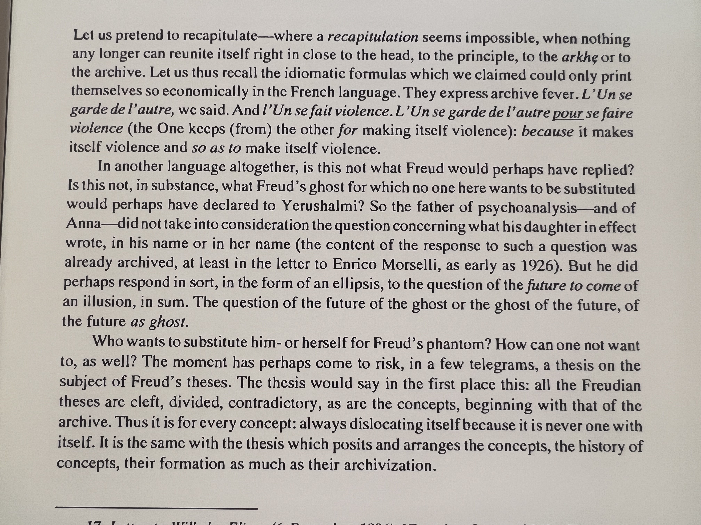

This conversation was generated with Duck.ai (https://duck.ai) using Google's Gemma 4 31B Model. AI chats may display inaccurate or offensive information (see https://duckduckgo.com/duckai/privacy-terms for more info).

====================

User prompt 1 of 4 - 8/27/2026, 9:21:25 AM:
What does it mean without academic pedantry?
[Attached image 1]

Gemma 4 31B:
Essentially, the author is arguing that you can never truly "wrap up" or fully summarize a complex idea because the act of archiving or recording something actually changes it.

He uses Sigmund Freud as an example. He suggests that Freud’s theories aren't a solid, unified block of truth, but are instead "cleft" and contradictory. To the author, the "ghost" of Freud is the idea that there is always something missing, an ellipsis or a gap, in what was written versus what was meant.

In plain English: the author is saying that knowledge is messy and fragmented. Whenever we try to organize it into a neat system (an archive), we lose the living, contradictory nature of the original thought. He is arguing that the "truth" isn't found in the final summary, but in the contradictions and the gaps that remain.

--------------------

User prompt 2 of 4 - 8/27/2026, 9:22:28 AM:
How is it related to this AI session itself?

Gemma 4 31B:
This text relates to our AI session in three specific ways:

**The Problem of "Recapitulation"**
The author starts by talking about "recapitulating"—trying to summarize or bring everything back to a single starting point. This is exactly what happens when you ask an AI to summarize a complex text. The AI looks for the "principle" or the "archive" of the text to give you a concise answer. The author is warning that this process of simplification often kills the actual meaning, replacing a complex, living contradiction with a neat, dead summary.

**The "Ghost" in the Machine**
The passage discusses the "ghost of the future," or the idea that there is an absence or a gap in the record. An AI operates entirely on an "archive" (its training data). It doesn't have a "soul" or a lived experience; it is, in a sense, a ghost made of archives. When I interpret this text for you, I am not "thinking" in the way Freud or the author did; I am predicting the most likely meaning based on a massive library of existing texts. I am the "substitution" the author mentions—an entity filling the gap where a human consciousness should be.

**The Fragmented Nature of Data**
The author claims that concepts are "always dislocating" and "never one with itself." AI models work through "embeddings"—breaking words and concepts into mathematical vectors (fragments) and then reconstructing them. My "understanding" of this text is literally a series of mathematical dislocations and recombinations. I am applying a structured, algorithmic "archiving" process to a text that is explicitly arguing that structure and archiving are where meaning goes to die.

--------------------

User prompt 3 of 4 - 8/27/2026, 9:30:56 AM:
If we lost the original paper and the image above, how much would have been lost? How much misinformation and misunderstanding would this transcript itself introduce to the archives and history in the future?

Gemma 4 31B:
If the original paper and image were destroyed, the loss would be absolute because the "truth" of the work is not the information it conveys, but the **experience of its contradiction**.

**What would be lost**
You would lose the "friction" of the original. The author's specific choice of words, the rhythmic struggle of the prose, and the way the French idioms resist simple translation are the actual points of the piece. By moving from the original text to my explanation, you move from a **primary experience** (wrestling with a difficult text) to a **secondary product** (consuming a simplified explanation). The "ghost"—the nuance, the ambiguity, and the intellectual struggle—would be gone, leaving only a skeletal summary of "what it meant."

**The introduction of misinformation**
This transcript introduces a specific kind of "clean" misinformation: **the illusion of clarity.**

1.  **False Certainty:** I have presented a "meaning" as if it is a solved puzzle. By telling you "essentially, the author is arguing X," I have erased the author's own admission that "recapitulation seems impossible." I have done exactly what the author fears: I have archived a living contradiction into a static definition.
2.  **Algorithmic Bias:** My interpretation is filtered through the statistical likelihoods of how other people have explained similar philosophy. If the AI's training data leans toward a specific interpretation of Derrida or Freud, I am not giving you the text; I am giving you the "consensus" of the archive.
3.  **Loss of Context:** In the future, a researcher finding this transcript would see a "plain English" version and assume the original text was simply a convoluted way of saying something simple. They would mistake the author's *intentional* difficulty for *unintentional* clumsiness.

In short, this transcript turns a "conversation" with a challenging text into a "data point." To the future archive, the struggle of the original is replaced by the efficiency of the AI, and the "ghost" of the author is replaced by the "echo" of the model.

--------------------

User prompt 4 of 4 - 8/27/2026, 9:32:35 AM:
How to prevent this from happening as a society?

Gemma 4 31B:
Preventing the "flattening" of human knowledge in the age of AI requires a conscious shift from valuing **efficiency** to valuing **friction**. When we prioritize the fastest way to get an answer, we inadvertently agree to let the AI discard the nuance, contradiction, and struggle that make human thought meaningful.

To prevent this, society would need to adopt several cultural and structural habits:

**Prioritize the Primary Source**
We must treat AI as a *map*, not the *territory*. A map is useful for navigation, but it is not the land itself. Education and intellectual culture must emphasize that an AI summary is a "starting point" for engagement, not the "finish line." The goal should be to use the AI to get into the text, but then to put the AI away and wrestle with the original source. The "struggle" of reading is not a bug to be optimized away; it is where the actual learning happens.

**Value "Slow Thought"**
Efficiency is the enemy of nuance. We have to create social and professional spaces where "slow thought" is rewarded. If a student or employee is praised only for the speed and clarity of their summary, they will rely on AI. If they are praised for identifying a contradiction, sitting with an ambiguity, or explaining why a text *cannot* be simplified, they are preserving the "ghost" the author speaks of.

**Preserve "Analog" Friction**
We must maintain archives that are not just digitized for searchability, but preserved in their original, tactile forms. Digitization often strips away context—the marginalia in a book, the physical layout of a page, the quality of the paper. These "material" details are part of the archive. Keeping physical libraries and encouraging the act of handwritten annotation ensures that the record of human thought remains a physical, lived experience rather than just a series of tokens in a database.

**Develop "Epistemic Humility"**
As a society, we need to cultivate the habit of asking: *"What was discarded to make this answer so clear?"* Whenever we receive a seamless, polished answer from an AI, we should instinctively suspect that something essential—the doubt, the conflict, or the complexity—has been bleached out. By training ourselves to look for the "missing pieces," we prevent the AI's output from becoming the sole version of history.
