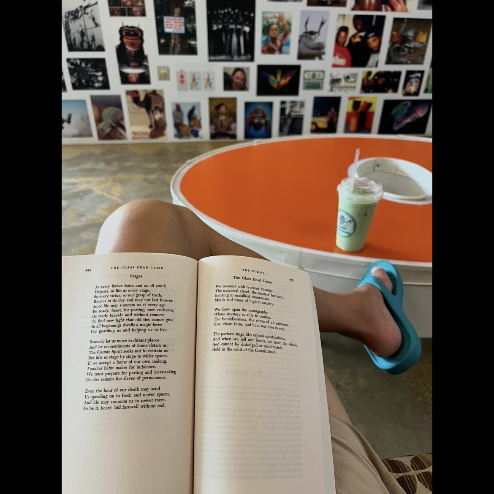
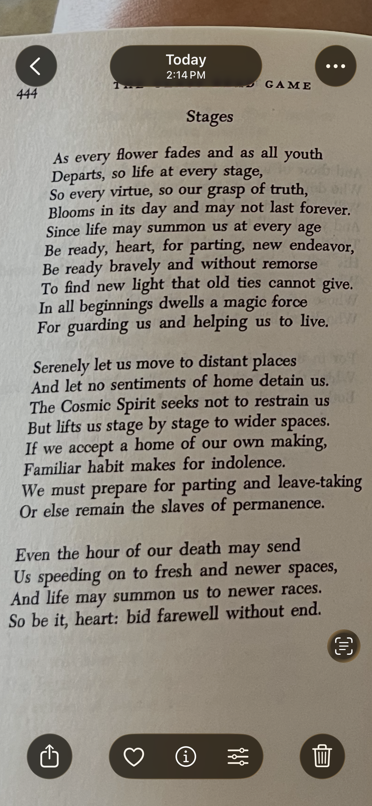
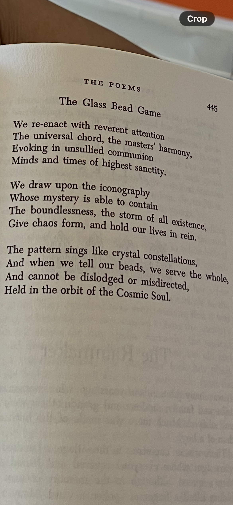

This conversation was generated with Duck.ai (https://duck.ai) using Google's Gemma 4 31B Model. AI chats may display inaccurate or offensive information (see https://duckduckgo.com/duckai/privacy-terms for more info).

====================

User prompt 1 of 5 - 8/28/2026, 2:20:31 PM:
Write a 500 word essay about this image and two poems in the text.
[Attached image 1]

Gemma 4 31B:
The provided image captures a quiet, contemporary intersection of leisure and intellectual exploration. The perspective is intimate and first-person, placing the viewer in the position of the reader. At the center of the composition is an open book, its pages filled with poetry, resting against the reader's lap. This central focus suggests a moment of intentional stillness, a sanctuary of reflection carved out of a modern, vibrant environment.

The setting contrasts the classical act of reading a physical book with a highly stylized, artistic backdrop. In the distance, a wall is densely plastered with eclectic photographs and artworks, ranging from candid portraits to surrealist imagery. This gallery-like atmosphere implies that the reader is likely in a creative space, such as a cafe or a modern art gallery, where the surrounding visual noise serves as a counterpoint to the internal silence of poetry. The presence of a bright orange table and a pale green iced drink adds a pop of saturated color, grounding the scene in the casual, sensory comforts of the present moment.

The two poems visible in the text act as the emotional core of the image. While the typography is small, the structure of the verses suggests a contemplative, perhaps melancholic tone. The left page contains a longer, narrative-driven poem that explores memory and the passage of time, using descriptive language to evoke a sense of longing. The right page features a shorter, more fragmented piece that feels like an internal monologue or a series of sudden realizations. Together, these poems transform the image from a simple snapshot of a day out into a study of the "flâneur"—the urban observer who wanders through the modern world while remaining deeply immersed in their own private, intellectual landscape.

There is a poignant tension in the image between the ephemeral and the enduring. The iced drink will melt, the flip-flops suggest a transient summer afternoon, and the digital-age art on the walls is designed for quick consumption. In contrast, the printed word in the book represents a slower, more permanent form of engagement. The act of reading poetry requires a surrender of time that stands in opposition to the fast-paced nature of the environment.

Ultimately, the image is a celebration of mindfulness. It depicts the ability to be physically present in a loud, colorful, and stimulating world while remaining mentally anchored in the quiet depths of literature. By juxtaposing the vivid orange of the table and the chaotic collage of the wall with the cream-colored pages of a book, the photograph highlights the necessity of solitude and art in the modern experience. It suggests that the most profound journeys are often those taken while sitting perfectly still.

--------------------

User prompt 2 of 5 - 8/28/2026, 2:22:01 PM:

[Attached image 1][Attached image 2]

Gemma 4 31B:
The images reveal two distinct poems that explore the relationship between the individual and the vast, unfolding nature of existence. Through these texts, the theme of the overall scene shifts from simple leisure to a profound meditation on transition and cosmic order.

The first poem, titled "Stages," is a reflection on the necessity of change. It begins with a natural metaphor, noting that just as flowers fade and youth departs, life moves through inevitable stages. The poet argues that virtues and truths are not static but bloom and fade in their own time. The core message is a call to bravery; the reader is urged to be "ready, heart, for parting, new endeavor" and to move forward "without remorse." By framing the "Cosmic Spirit" as a force that pushes us toward "wider spaces," the poem suggests that clinging to the familiar—the "home of our own making"—leads to indolence and a spiritual stagnation termed the "slaves of permanence." It concludes with a fearless view of death, seeing it not as an end, but as a final transition to "fresh and newer spaces."

The second poem, "The Glass Bead Game," shifts from the movement of the individual to the harmony of the universe. The title alludes to a complex intellectual pursuit of synthesizing all human knowledge, and the poem reflects this by speaking of a "universal chord" and "masters' harmony." While "Stages" focuses on the act of leaving, "The Glass Bead Game" focuses on the act of alignment. It describes a process of evoking "highest sanctity" through iconography that can contain the "storm of all existence" and give "chaos form." The imagery of "crystal constellations" and "telling our beads" suggests a meditative, rhythmic connection to a larger whole, ultimately placing the human experience within the "orbit of the Cosmic Soul."

Together, these poems create a dialogue between the need for detachment and the desire for connection. "Stages" teaches the reader how to let go, while "The Glass Bead Game" teaches the reader how to belong to something eternal. In the context of the original image—a person reading in a vibrant, modern space—these poems suggest that the reader is seeking a bridge between their immediate, sensory world and these timeless, metaphysical truths. The act of reading becomes a "glass bead game" in itself: an attempt to find a pattern and a purpose amidst the colorful chaos of modern life.

--------------------

User prompt 3 of 5 - 8/28/2026, 2:24:03 PM:
Who wrote them?

Gemma 4 31B:
Both poems were written by the German-Swiss author **Hermann Hesse**.

They are part of a collection of poetry attributed to the character Joseph Knecht in Hesse's final novel, ***The Glass Bead Game*** (originally published in German as *Das Glasperlenspiel*). The poems serve as thematic echoes of the novel's exploration of synthesis, spiritual growth, and the cyclical nature of existence.

--------------------

User prompt 4 of 5 - 8/28/2026, 2:25:10 PM:
Update the essay.

Gemma 4 31B:
The provided image captures a quiet, contemporary intersection of leisure and intellectual exploration. The perspective is intimate and first-person, placing the viewer in the position of the reader. At the center of the composition is an open book, its pages filled with the poetry of Hermann Hesse, resting against the reader's lap. This central focus suggests a moment of intentional stillness, a sanctuary of reflection carved out of a modern, vibrant environment.

The setting contrasts the classical act of reading a physical book with a highly stylized, artistic backdrop. In the distance, a wall is densely plastered with eclectic photographs and artworks, ranging from candid portraits to surrealist imagery. This gallery-like atmosphere implies that the reader is likely in a creative space, such as a cafe or a modern art gallery, where the surrounding visual noise serves as a counterpoint to the internal silence of the text. The presence of a bright orange table and a pale green iced drink adds a pop of saturated color, grounding the scene in the casual, sensory comforts of the present moment.

The two poems visible—"Stages" and "The Glass Bead Game"—act as the emotional core of the image. "Stages" is a meditation on the necessity of transition, urging the reader to embrace the "Cosmic Spirit" and move toward "wider spaces" rather than becoming "slaves of permanence." It frames life as a series of inevitable partings and new endeavors. In contrast, "The Glass Bead Game" seeks a higher synthesis, describing a "universal chord" and "masters' harmony" that gives "chaos form." Together, these poems create a dialogue between the need for detachment and the desire for cosmic alignment, reflecting the philosophical themes of Hesse's final novel.

There is a poignant tension in the image between the ephemeral and the enduring. The iced drink will melt, the flip-flops suggest a transient summer afternoon, and the digital-age art on the walls is designed for quick consumption. In contrast, the printed word represents a slower, more permanent form of engagement. The act of reading Hesse requires a surrender of time that stands in opposition to the fast-paced nature of the environment.

Ultimately, the image is a celebration of mindfulness. It depicts the ability to be physically present in a loud, colorful, and stimulating world while remaining mentally anchored in deep philosophical inquiry. By juxtaposing the vivid orange of the table and the chaotic collage of the wall with the cream-colored pages of the book, the photograph highlights the necessity of solitude and art in the modern experience. It suggests that the most profound journeys are those taken while sitting perfectly still, synthesizing the chaos of the outer world into the harmony of the inner soul.

--------------------

User prompt 5 of 5 - 8/28/2026, 3:36:54 PM:
Translate it to Chinese, French, German, Latin and Greek. 

Gemma 4 31B:
### Chinese (中文)
这张图片捕捉到了休闲与智力探索之间一个安静且现代的交汇点。视角亲密且具有第一人称感，将观众置于阅读者的位置。构图的中心是一本打开的书，书页上写着赫尔曼·黑塞的诗作，静静地靠在阅读者的膝盖上。这一核心焦点暗示了一个刻意营造的宁静时刻，在现代且充满活力的环境中开辟出了一片反思的避风港。

场景将阅读实体书籍的经典行为与高度风格化的艺术背景相对比。远处，一面墙上密密麻麻地贴满了 eclectic 的照片和艺术品，从坦率的人像到超现实主义的图像不等。这种像画廊一样的氛围表明，阅读者可能身处一个创意空间，如咖啡馆或现代艺术馆，周围视觉上的喧嚣与诗歌内部的寂静形成了对比。亮橙色的桌子和淡绿色的冰饮增添了饱和的色彩，将场景锚定在现代生活的随意与感官舒适之中。

可见的两首诗——《阶段》（Stages）和《玻璃珠游戏》（The Glass Bead Game）——构成了图像的情感核心。《阶段》是对转变必要性的沉思，敦促读者拥抱“宇宙精神”并向“更广阔的空间”移动，而不是成为“永恒的奴隶”。它将生活描绘成一系列不可避免的分离和新的尝试。相比之下，《玻璃珠游戏》则追求一种更高层次的综合，描述了一种能给“混乱赋予形式”的“普世和弦”与“大师的和谐”。这两首诗共同在脱离的必要性与对宇宙契合的渴望之间建立了一场对话，反映了黑塞最后一部小说的哲学主题。

图像中存在着一种短暂与永恒之间的深刻张力。冰饮会融化，人字拖暗示着一个转瞬即逝的夏日午后，墙上的数字时代艺术旨在被快速消费。相比之下，印刷的文字代表了一种更缓慢、更持久的参与方式。阅读黑塞的作品需要一种对时间的交付，这与环境的快节奏截然相反。

最终，这张图片是对正念的赞美。它描绘了在喧闹、多彩且充满刺激的现代世界中，依然能在深邃的哲学探究中保持内心平静的能力。通过将桌子的鲜橙色、墙上的混乱拼贴与书本的乳白色书页并置，这张照片强调了在现代体验中，孤独与艺术的必要性。它暗示最深远的旅程往往是在静坐中完成的——将外部世界的喧嚣综合为内心灵魂的和谐。

***

### French (Français)
Cette image capture une intersection calme et contemporaine entre le loisir et l'exploration intellectuelle. La perspective est intime et à la première personne, plaçant le spectateur dans la position du lecteur. Au centre de la composition se trouve un livre ouvert, dont les pages sont remplies de la poésie d'Hermann Hesse, reposant contre les genoux du lecteur. Ce point focal suggère un moment de tranquillité intentionnelle, un sanctuaire de réflexion sculpté au cœur d'un environnement moderne et vibrant.

Le cadre oppose l'acte classique de lire un livre physique à un arrière-plan artistique hautement stylisé. Au loin, un mur est densément tapissé de photographies et d'œuvres d'art éclectiques, allant de portraits candides à des images surréalistes. Cette atmosphère de galerie suggère que le lecteur se trouve probablement dans un espace créatif, tel qu'un café ou une galerie d'art moderne, où le bruit visuel environnant sert de contrepoint au silence intérieur du texte. La présence d'une table orange vif et d'une boisson glacée vert pâle ajoute une touche de couleurs saturées, ancrant la scène dans les conforts sensoriels et décontractés du moment présent.

Les deux poèmes visibles — « Stages » et « The Glass Bead Game » — constituent le cœur émotionnel de l'image. « Stages » est une méditation sur la nécessité de la transition, exhortant le lecteur à embrasser l'« Esprit Cosmique » et à se diriger vers des « espaces plus vastes » plutôt que de devenir des « esclaves de la permanence ». Il présente la vie comme une série de ruptures et d'efforts inévitables. En contraste, « The Glass Bead Game » recherche une synthèse supérieure, décrivant un « accord universel » et une « harmonie des maîtres » capable de « donner forme au chaos ». Ensemble, ces poèmes créent un dialogue entre le besoin de détachement et le désir d'alignement cosmique, reflétant les thèmes philosophiques du dernier roman de Hesse.

Il existe une tension poignante dans l'image entre l'éphémère et l'éternel. La boisson glacée va fondre, les tongs suggèrent un après-midi d'été fugace, et l'art de l'ère numérique sur les murs est conçu pour une consommation rapide. En revanche, le mot imprimé représente une forme d'engagement plus lente et plus durable. La lecture de Hesse exige un abandon du temps qui s'oppose à la nature rapide de l'environnement.

En fin de compte, l'image est une célébration de la pleine conscience. Elle dépeint la capacité d'être physiquement présent dans un monde bruyant, coloré et stimulant, tout en restant mentalement ancré dans une enquête philosophique profonde. En juxtaposant l'orange vif de la table et le collage chaotique du mur aux pages crème du livre, la photographie souligne la nécessité de la solitude et de l'art dans l'expérience moderne. Elle suggère que les voyages les plus profonds sont souvent ceux que l'on entreprend en restant parfaitement immobile, synthétisant le chaos du monde extérieur en l'harmonie de l'âme intérieure.

***

### German (Deutsch)
Das Bild fängt eine ruhige, zeitgenössische Schnittstelle zwischen Muße und intellektueller Erkundung ein. Die Perspektive ist intim und in der Ich-Form gehalten, wodurch der Betrachter in die Position des Lesers versetzt wird. Im Zentrum der Komposition steht ein aufgeschlagenes Buch mit der Lyrik von Hermann Hesse, das auf dem Schoß des Lesers ruht. Dieser Fokus deutet auf einen Moment bewusster Stille hin, ein Refugium der Reflexion inmitten einer modernen, lebendigen Umgebung.

Die Umgebung kontrastiert den klassischen Akt des Lesens eines physischen Buches mit einem stark stilisierten, künstlerischen Hintergrund. Im Hintergrund ist eine Wand dicht mit eklektischen Fotografien und Kunstwerken beklebt, die von spontanen Porträts bis hin zu surrealistischen Bildern reichen. Diese Galerie-Atmosphäre lässt vermuten, dass sich der Leser in einem kreativen Raum befindet, etwa in einem Café oder einer Galerie für moderne Kunst, in der der visuelle Lärm der Umgebung als Gegenpol zur inneren Stille des Textes dient. Der leuchtend orangefarbene Tisch und ein blassgrünes Kaltgetränk setzen gesättigte Farbakzente und verankern die Szene in den lockeren, sinnlichen Annehmlichkeiten des Augenblicks.

Die beiden sichtbaren Gedichte – „Stages“ und „The Glass Bead Game“ – bilden den emotionalen Kern des Bildes. „Stages“ ist eine Meditation über die Notwendigkeit des Wandels und fordert den Leser auf, den „kosmischen Geist“ zu akzeptieren und sich auf „weitere Räume“ zuzubewegen, anstatt „Sklaven der Beständigkeit“ zu werden. Es beschreibt das Leben als eine Folge unvermeidlicher Abschiede und neuer Bestrebungen. Im Gegensatz dazu sucht „The Glass Bead Game“ eine höhere Synthese und beschreibt einen „universellen Akkord“ und eine „Harmonie der Meister“, die dem „Chaos Form verleihen“. Zusammen führen diese Gedichte einen Dialog zwischen der Notwendigkeit des Loslassens und dem Wunsch nach kosmischer Einklang, was die philosophischen Themen von Hesses letztem Roman widerspiegelt.

Im Bild besteht eine bewegende Spannung zwischen dem Ephemeren und dem Ewigen. Das Kaltgetränk wird schmelzen, die Flip-Flops deuten auf einen flüchtigen Sommernachmittag hin, und die Kunst des digitalen Zeitalters an den Wänden ist auf schnellen Konsum ausgelegt. Im Gegensatz dazu steht das gedruckte Wort für eine langsamere, dauerhaftere Form der Auseinandersetzung. Das Lesen von Hesse erfordert eine Hingabe der Zeit, die im Widerspruch zur schnelllebigen Natur der Umgebung steht.

Letztendlich ist das Bild ein Lobpreis der Achtsamkeit. Es zeigt die Fähigkeit, physisch in einer lauten, bunten und stimulierenden Welt präsent zu sein und gleichzeitig mental in einer tiefen philosophischen Untersuchung verankert zu bleiben. Durch die Gegenüberstellung des leuchtenden Oranges des Tisches und der chaotischen Collage an der Wand mit den cremefarbenen Seiten des Buches unterstreicht die Fotografie die Notwendigkeit von Einsamkeit und Kunst in der modernen Erfahrung. Sie legt nahe, dass die tiefgreifendsten Reisen oft diejenigen sind, die man unbeweglich unternimmt, indem man das Chaos der Außenwelt in die Harmonie der inneren Seele synthetisiert.

***

### Latin (Latina)
Hic imago quietam et contemporaneam coniunctionem inter otium et explorationem intellectualem capit. Perspectiva intima est, spectatorem in locum lectoris ponens. In medio compositionis liber apertus est, cuius paginae poetriae Hermanni Hesse plenae sunt, in sinu lectoris quiescens. Hoc centrum momentum silentii voluntarii significat, refugium reflectionis in ambiente moderno et vibrante sculptum.

Locus actum classicum legendi libri physici cum fundo artistico et stylizato comparat. Procul, murus plenus est photographiis et operibus artium eclecticis, a portraitibus candidis ad imagines surrealistas. Haec atmosphaera galleriae suggerit lectorem in loco creativo esse, sicut in taberna coffearii vel galleria artis modernizationis, ubi strepitus visualis circumdans contra silentium internum textus stat. Mensa lutea et potus frigidus viridis colores saturatos addunt, scenam in commoditatibus sensu remotis praesentis momenti firmantes.

Duo carmina visibilia — „Stages“ et „The Glass Bead Game“ — cor emotionale imaginis sunt. „Stages“ est meditatio de necessitate mutationis, lectorem hortans ut „Spiritum Cosmicum“ amplectatur et ad „spatia latiora“ moveatur, ne „servi permanentiae“ fiant. Vitam ut seriem separationum et conatus inevitabilium describit. Contra, „The Glass Bead Game“ synthesis superiorem quaerit, describens „chordam universalem“ et „harmoniam magistrorum“ quae „chaosi formam dat“. Haec carmina dialogum inter necessitatem derelictionis et desiderium concordiae cosmicae creant, themata philosophica ultimi libri Hesse reflectentes.

Tensionem poignantem in imagine inter id quod evanescit et id quod manet invenimus. Potus frigidus liquefacietur, soleae estivales pomeridiem fugacem suggerunt, et ars aevi digitalis in muris ad consumptionem rapidam designata est. Contra, verba impressa formam cognitionis lentiorem et diuturniorem repraesentant. Legere Hessem tempus postulatum requirit, quod contra naturam rapidam ambientis stat.

Denique, imago est laus conscientiae praesentis. Facultatem demonstrat esse physice in mundo strepito, colorido, et stimulante praesentem, dum mentaliter in investigatione philosophica profunda manet. Ponendo luteam mensam et chaoticam collagium muri contra paginas cremas libri, photographia necessitatem solitudinis et artis in experientia moderna significat. Suggerit iter profundissima essere illa quae immobiles agimus, chaosum mundi externi in harmoniam animae internae convertentes.

***

### Greek (Ελληνικά)**
Η εικόνα αυτή συλλαμβάνει μια ήσυχη και σύγχρονη τομή ανάμεσα στην ανάπαυση και την πνευματική εξερεύνηση. Η προοπτική είναι οικεία και προσωπική, τοποθετώντας τον θεατή στη θέση του αναγνώστη. Στο κέντρο της σύνθεσης βρίσκεται ένα ανοιχτό βιβλίο με την ποίηση του Χέρμαν Χέσε, το οποίο ακουμπά στην αγκαλία του αναγνώστη. Αυτό το κεντρικό σημείο υποδηλώνει μια στιγμή σκόπιμης ησυχίας, ένα καταφύγιο στοχασμού σκαλισμένο μέσα σε ένα σύγχρονο και ζωντανό περιβάλλον.

Το σκηνικό αντιθέτει την κλασική πράξη της ανάγνωσης ενός φυσικού βιβλίου με ένα έντονα στυλιζαρισμένο καλλιτεχνικό φόντο. Στο βάθος, ένας τοίχος είναι πυκνά καλυμμένος με πολυμορφες φωτογραφίες και έργα τέχνης, από αυθόρμητα πορτρέτα έως σουρεαλιστικές εικόνες. Αυτή η ατμόσφαιρα γκαλερί υποδηλώνει ότι ο αναγνώστης βρίσκεται πιθανότατα σε έναν δημιουργικό χώρο, όπως ένα καφέ ή μια γκαλερί σύγχρονης τέχνης, όπου ο οπτικός θόρυβος του περιβάλλοντος χρησιμεύει ως αντίθετο στη εσωτερική σιωπή του κειμένου. Το έντονο πορτοκαλί τραπέζι και ένα ανοιχτό πράσινο παγωμένο ποτό προσθέτουν κορεσμένα χρώματα, γειώνοντας τη σκηνή στις χαλαρές, αισθητηριακές ανέσεις της παρούσας στιγμής.

Τα δύο ορατά ποιήματα — «Stages» και «The Glass Bead Game» — αποτελούν τον συναισθηματικό πυρήνα της εικόνας. Το «Stages» είναι ένας στοχασμός για την ανάγκη της μετάβασης, προτρεπόντας τον αναγνώστη να αγκαλιάσει το «Κοσμικό Πνεύμα» και να κινηθεί προς «ευρύτερους χώρους», αντί να γίνει «δούλος της μόνιμης κατάστασης». Περιγράφει τη ζωή ως μια σειρά από αναπόφευκους χωρισμούς και νέες προσπάθειες. Σε αντίθεση, το «The Glass Bead Game» αναζητά μια ανώτερη σύνθεση, περιγράφοντας μια «παγκόσμια χορδή» και μια «αρμονία των δασκάλων» που «δίνει μορφή στο χάος». Μαζί, τα ποιήματα αυτά δημιουργούν έναν διάλογο ανάμεσα στην ανάγκη για αποστασιοποίηση και την επιθυμία για κοσμική ευθυγράμμιση, αντανακλώντας τα φιλοσοφικά θέματα του τελευταίου μυθιστορήματος του Χέσε.

Υπάρχει μια συγκινητική ένταση στην εικόνα ανάμεσα στο εφήμερο και το αιώνιο. Το παγωμένο ποτό θα λιώσει, οι σαγιονάρες υποδηλώνουν ένα φευγαλέο καλοκαιρινό απόγευμα και η τέχνη της ψηφιακής εποχής στους τοίχους είναι σχεδιασμένη για γρήγορη κατανάλωση. Αντίθετα, ο τυπωμένος λόγος αντιπροσωπεύει μια πιο αργή και διαρκέστερη μορφή εμπλοκής. Η ανάγνωση του Χέσε απαιτεί μια παράδοση του χρόνου που έρχεται σε αντίθεση με τη γρήγορη φύση του περιβάλλοντος.

Τελικά, η εικόνα είναι ένας εγκώμιος ύμνος στην ενσυνειδητότητα. Απεικονίζει την ικανότητα να είσαι σωματικά παρών σε έναν θορυβώδη, πολύχρωμο και διεγερμένο κόσμο, παραμένοντας ταυτόχρονα πνευματικά ερμηνωμένος σε μια βαθιά φιλοσοφική έρευνα. Αντιπαραβάλλοντας το έντονο πορτοκαλί του τραπεζιού και το χαοτικό κολάζ του τοίχου με τις κρεμχρωμες σελίδες του βιβλίου, η φωτογραφία τονίζει την ανάγκη για μοναξιά και τέχνη στην andρoμοντέρνα εμπειρία. Υποδηλώνει ότι τα πιο βαθιά ταξίδια είναι συχνά αυτά που κάνουμε παραμένοντας απόλυτα ακίνητοι, συνθέτοντας το χάος του εξωτερικού κόσμου στην αρμονία της εσωτερικής ψυχής.
