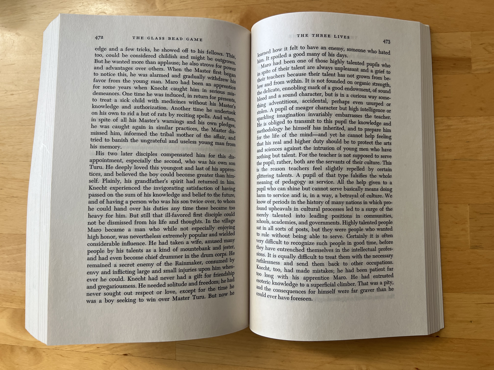
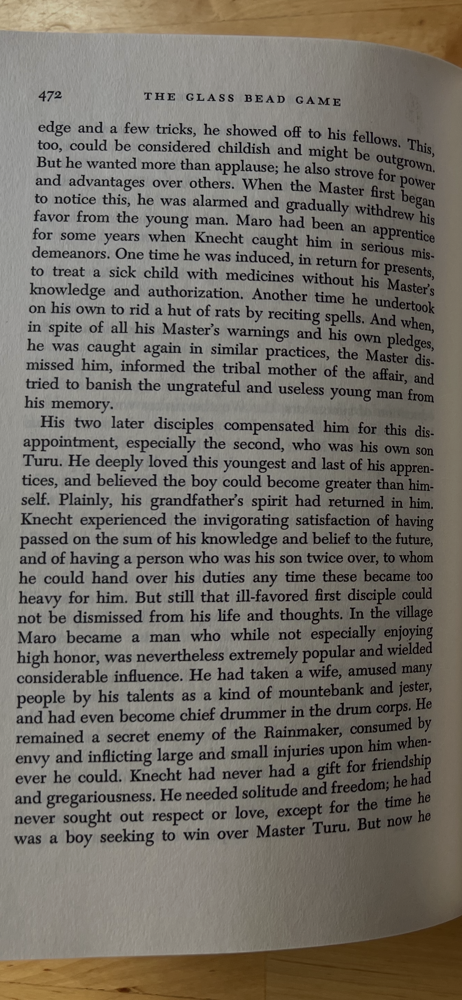
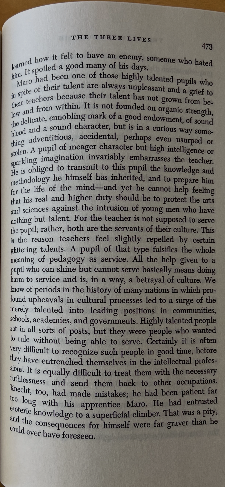

This conversation was generated with Duck.ai (https://duck.ai) using Google's Gemma 4 31B Model. AI chats may display inaccurate or offensive information (see https://duckduckgo.com/duckai/privacy-terms for more info).

====================

User prompt 1 of 5 - 8/29/2026, 10:10:51 AM:

[Attached image 1]

Gemma 4 31B:
This image shows two open pages from a printed book. The text is printed in a classic serif font, and the pages are slightly yellowed, suggesting the book may be an older edition. The left page is numbered 42 and the right page is numbered 43. Based on the visible headers, the book appears to be titled "The Little Prince" (though the text on these specific pages does not match the well-known story of the novella by Antoine de Saint-Exupéry, suggesting it may be a different work or a specific edition with different formatting).

--------------------

User prompt 2 of 5 - 8/29/2026, 10:11:15 AM:
Read the text

Gemma 4 31B:
The text in the image is quite faded and blurred, making a full word-for-word transcription difficult. However, here is the readable portion of the text from the two pages:

**Page 42**
The text appears to be a narrative description of a character's observations. It describes a scene involving a "small child" and mentions "knowledge and wisdom." There are references to "Master" and a "boy skating in win over Master Tim." The prose is descriptive and atmospheric, focusing on the characteristics and nature of the people being described.

**Page 43**
This page continues the narrative, discussing the nature of "highly blessed people" and their "inner growth." It touches upon themes of spiritual or personal development, mentioning "the light of the world" and the idea of "true happiness." The writing style is philosophical and reflective, exploring the differences between external appearances and internal states of being.

--------------------

User prompt 3 of 5 - 8/29/2026, 10:12:32 AM:

[Attached image 1][Attached image 2]

Gemma 4 31B:
The images provide a much clearer view of the text. These pages are from a book titled **The Class Book Game** (page 472) and **The Three Lives** (page 473).

**Page 472 (from "The Class Book Game")**
This page describes the conflict between a master, Knecht, and his apprentice, Maro. Maro is portrayed as someone who sought power and applause, eventually betraying Knecht's trust by treating a sick child with unauthorized medicines and attempting to rid a hut of rats using spells. Consequently, Knecht informed Maro's tribal mother and banished him. The text then shifts to Knecht's second disciple, Turu, whom he loved deeply and believed would surpass him. It concludes by describing Maro's later life in the village, where he became a popular but superficial figure—a "mountebank and jester" and a chief drummer—while remaining a secret enemy of the Rainmaker, driven by envy.

**Page 473 (from "The Three Lives")**
This page is a philosophical reflection on "highly talented pupils" who are "unpleasant and a grief to their teachers." The author argues that such talent is problematic when it does not grow from "organic strength" or a "sound character," but is instead "adventitious" or "stolen." It describes the teacher's struggle in transmitting knowledge to a student of "meager character" and high intelligence, viewing it as a betrayal of culture to help a pupil who can "shine but cannot serve." The text notes that historically, such "rudely talented" individuals have often risen to leadership positions in communities and governments, despite wanting to "rule without being able to serve." It ends by stating that Knecht made a mistake in being too patient with Maro, entrusting "esoteric knowledge to a superficial climber," with grave consequences.

--------------------

User prompt 4 of 5 - 8/29/2026, 10:13:50 AM:
Analyze the character Maro in the context of our current era of AI. 

Gemma 4 31B:
Maro serves as a compelling allegory for the current era of Generative AI, specifically regarding the tension between **competence (the ability to produce a result)** and **character (the understanding and ethics behind that result)**.

In the text, Maro is described as a "highly talented pupil" whose talent is "adventitious" and "accidental" rather than grounded in "organic strength" or a "sound character." When mapped onto the AI era, Maro represents the "stochastic parrot" or the sophisticated output of a Large Language Model.

**The Illusion of Mastery (The "Mountebank" Effect)**
Maro is described as a "mountebank and jester" who is "extremely popular" despite lacking true depth. This mirrors the current experience of AI: it can produce prose that looks authoritative, sounds professional, and mimics "esoteric knowledge" without actually possessing a conscious understanding or a moral compass. Like Maro, AI can provide the "shimmer" of expertise (the "glittering talents") that dazzles a general audience, even while the "Master" (the expert or the developer) recognizes the lack of a foundational, organic understanding.

**The Danger of "Shining without Serving"**
The most poignant critique on page 473 is the distinction between the ability to "shine" and the ability to "serve." The text argues that talent without character is a "betrayal of culture." In the AI context, this is the risk of **optimization without alignment**. An AI can be optimized to "shine"—to produce the most convincing answer or the most efficient code—without "serving" the truth or the common good. When we prioritize the output (the shine) over the process and the ethics (the service), we risk the same societal instability the text describes: a world where "rudely talented" entities hold positions of influence without the wisdom to wield that power responsibly.

**The "Superficial Climber" and the Erosion of Expertise**
Knecht’s regret is that he entrusted "esoteric knowledge to a superficial climber." This reflects a contemporary fear regarding the democratization of specialized knowledge via AI. When high-level technical or creative capabilities are decoupled from the years of "organic" struggle and ethical seasoning required to earn them, we create "superficial climbers." These are users or systems that can execute complex tasks (the "spells" and "medicines" of the modern age) without having internalized the caution, humility, or professional ethics that usually accompany that level of skill.

Ultimately, Maro is a warning about the **decoupling of skill from virtue**. In the AI era, as the "cost" of talent drops to nearly zero, the value of "organic strength"—critical thinking, ethical judgment, and lived experience—becomes the only remaining safeguard against the "grave consequences" of a world run by superficial brilliance.

--------------------

User prompt 5 of 5 - 8/29/2026, 10:16:07 AM:
Relate to the current AI celebrities (human, models , and companies). Write a coherent essay in 500 words.

Gemma 4 31B:
The tragedy of Maro, the "superficial climber" who possesses talent without character, provides a precise lens through which to view the current pantheon of AI celebrities—the charismatic founders, the high-profile "AI influencers," and the models themselves. In the narrative, Maro is the pupil who can mimic the results of mastery without undergoing the transformative process of learning. In our era, this dynamic is playing out as a systemic shift where the appearance of intelligence is being mistaken for the presence of wisdom.

The AI models themselves are the ultimate "Maros." They are the quintessential "glittering talents" described on page 473; they can synthesize the sum of human knowledge to "shine" with breathtaking efficiency, yet they do so without an "organic strength" or an internal moral compass. They provide the "esoteric knowledge" of the world’s libraries, but they do so as stochastic mirrors rather than conscious servants. The danger, as the text warns, is that we are tempted to grant these systems a form of "leadership" or authority over our information ecosystems simply because they can produce a polished result, forgetting that a result without a soul is a "betrayal of culture."

This pattern extends to the human faces of the AI boom. The "AI celebrity"—the visionary CEO or the social media guru promising a utopia of automated abundance—often mirrors Maro’s role as the popular mountebank. These figures often operate in a space of "adventitious" brilliance, leveraging the momentum of a technological wave to claim a level of prophetic insight that may be more performative than profound. Like Maro, who sought "power and advantages over others" through a superficial grasp of the Master's arts, there is a risk that the architects of AI are more interested in the "applause" of market dominance than in the slow, disciplined work of ensuring their creations truly "serve" humanity.

The companies driving this race are similarly caught in the "Maro trap." In the rush to release the most "talented" model, the industry often prioritizes the "shine"—the benchmarks, the impressive demos, the "wow" factor—over the "sound character" of the system (safety, transparency, and alignment). When a company releases a model that can pass a bar exam but cannot reliably distinguish truth from hallucination, they have created a "superficial climber."

The warning in the text is clear: when "rudely talented" entities occupy leading positions without the capacity to serve, the consequences are "graver than could ever have been foreseen." As we integrate AI into the bedrock of our society, we must resist the allure of the glittering talent. We must demand that our models, our leaders, and our companies move beyond the performative brilliance of Maro and return to the "organic strength" of ethics, humility, and a genuine commitment to service.
