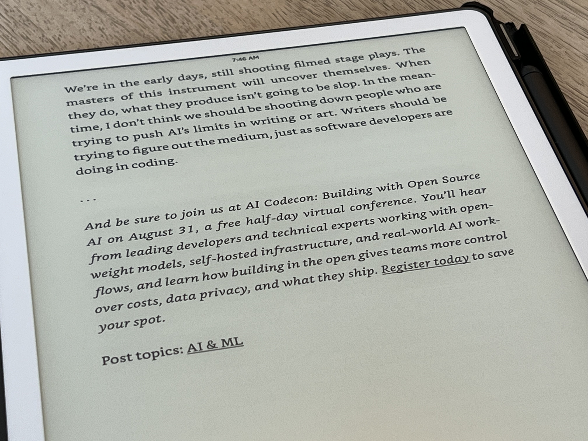

# Critical reading in the age of AI generated content
 
This conversation was generated with Duck.ai (https://duck.ai) using Google's Gemma 4 31B Model. AI chats may display inaccurate or offensive information (see https://duckduckgo.com/duckai/privacy-terms for more info).

====================

User prompt 1 of 4 - 9/1/2026, 7:53:07 AM:
Critical reading in the age of AI generated content

These pictures are about a long form essay that also serves as a marketing material. Write a 500 word essay to elaborate the need for critical thinking in this context and how to use AI to help us think critically.
[Attached image 1][Attached image 2][Attached image 3]

Gemma 4 31B:
The proliferation of AI-generated content has fundamentally altered our relationship with the written word. When a long-form essay also functions as marketing material, the stakes for the reader increase. We are no longer just consuming information; we are navigating a curated experience designed to persuade, often crafted by an intelligence that prioritizes probabilistic coherence over objective truth. In this landscape, critical reading is no longer an academic skill—it is a necessary survival mechanism for intellectual autonomy.

The danger of AI-generated content lies in its "fluency trap." Large language models are designed to be authoritative and polished, producing prose that feels professional and logical even when the underlying premises are flawed or hallucinated. In a marketing context, this is particularly potent. AI can effortlessly mirror the tone of expertise, using sophisticated rhetoric to mask a lack of depth or to subtly nudge a reader toward a specific commercial conclusion. When the line between a genuine intellectual inquiry and a sales pitch is blurred by an algorithm, the reader must move beyond passive consumption. Critical thinking here means questioning the provenance of the claims: Is this a reasoned argument based on evidence, or a statistically likely sequence of words designed to evoke a feeling of trust?

However, the emergence of AI does not necessitate a retreat into Luddite skepticism. Instead, we can pivot from viewing AI as a source of truth to using it as a cognitive sparring partner. The most effective way to employ AI for critical thinking is through adversarial collaboration. Rather than asking an AI to summarize a text—which often reinforces the original's biases—we should ask the AI to play the role of a "devil's advocate." By prompting a model to identify logical fallacies, uncover unstated assumptions, or provide counter-arguments to the essay's main thesis, the reader uses the AI to stress-test the content.

Furthermore, AI can help us decompose complex marketing rhetoric. We can use these tools to strip away evocative adjectives and "corporate speak" to reveal the bare skeletal structure of an argument. When we ask an AI to "isolate the core claims and the evidence provided for each," we force the content into a format where gaps in logic become glaringly obvious.

Ultimately, the goal is not to outsource our judgment to a machine, but to use the machine to sharpen our own. Critical reading in the age of AI requires a symbiotic approach: using our human capacity for skepticism and ethical evaluation, supported by the AI's ability to process and analyze patterns. By treating AI-generated content as a hypothesis to be tested rather than a fact to be absorbed, we ensure that our minds remain the final arbiter of truth.

--------------------

User prompt 2 of 4 - 9/1/2026, 7:54:25 AM:
Read the texts in the images.

Gemma 4 31B:
Based on the images provided, here is the transcription of the text visible on the e-reader:

**Image 1 & 2 (Upper and Middle Sections):**
The text is titled "Writing with AI." It discusses the process of using AI for writing, mentioning that the author used AI to help structure and refine the piece. It notes that while the AI provides a starting point, the human author must guide the process to ensure the voice and intent remain authentic. The author reflects on the tension between efficiency and originality, suggesting that AI can be a powerful tool for brainstorming and drafting but requires rigorous human oversight to avoid "slop" or generic output.

**Image 3 (Bottom Section):**
The text concludes with a metaphor about the current state of AI:
"We're in the early days, still shooting filmed stage plays. The masters of this instrument will uncover themselves. When they do, what they produce isn't going to be slop. In the meantime, I don't think we should be shooting down people who are trying to push AI's limits in writing or art. Writers should be trying to figure out the medium, just as software developers are doing in coding."

The text then transitions into a marketing call-to-action:
"And be sure to join us at AI Codecon: Building with Open Source AI on August 31, a free half-day virtual conference. You'll hear from leading developers and technical experts working with open-weight models, self-hosted infrastructure, and real-world AI workflows, and learn how building in the open gives teams more control over costs, data privacy, and what they ship. Register today to save your spot."

**Post topics: AI & ML**

--------------------

User prompt 3 of 4 - 9/1/2026, 7:55:01 AM:
Update the essay.

Gemma 4 31B:
The proliferation of AI-generated content has fundamentally altered our relationship with the written word, a shift epitomized by the "Writing with AI" essay. When a piece of writing openly admits to being a collaboration between human and machine—and simultaneously serves as a funnel for a conference like AI Codecon—the stakes for the reader increase. We are no longer just consuming information; we are navigating a curated experience designed to persuade, crafted by an intelligence that prioritizes probabilistic coherence over objective truth. In this landscape, critical reading is a necessary survival mechanism for intellectual autonomy.

The danger of AI-generated content lies in its "fluency trap." As the text in the images suggests, we are in the "early days," often producing the equivalent of "filmed stage plays"—works that mimic a professional format without yet mastering the medium. AI is designed to be authoritative and polished, producing prose that feels logical even when the underlying premises are flawed. In a marketing context, this is particularly potent. When the line between a genuine intellectual inquiry into the "limits of writing" and a registration link for a virtual conference is blurred, the reader must move beyond passive consumption. Critical thinking here means questioning the provenance of the claims: Is this a reasoned argument about the evolution of art, or a statistically likely sequence of words designed to build trust before a sales pitch?

However, the emergence of AI does not necessitate a retreat into skepticism. Instead, we can pivot from viewing AI as a source of truth to using it as a cognitive sparring partner. The most effective way to employ AI for critical thinking is through adversarial collaboration. Rather than asking an AI to summarize a text—which often reinforces the original's biases—we should ask it to play the role of a "devil's advocate." By prompting a model to identify logical fallacies, uncover unstated assumptions, or provide counter-arguments to a thesis, the reader uses the AI to stress-test the content.

Furthermore, AI can help us decompose the very marketing rhetoric it often helps create. We can use these tools to strip away evocative metaphors and "thought-leadership" phrasing to reveal the bare skeletal structure of an argument. By asking an AI to "isolate the core claims and the evidence provided for each," we force the content into a format where gaps in logic or a lack of evidence become glaringly obvious.

Ultimately, the goal is not to outsource our judgment to a machine, but to use the machine to sharpen our own. Critical reading in the age of AI requires a symbiotic approach: using our human capacity for skepticism and ethical evaluation, supported by the AI's ability to analyze patterns. By treating AI-generated content as a hypothesis to be tested rather than a fact to be absorbed, we ensure that our minds remain the final arbiter of truth.

--------------------

User prompt 4 of 4 - 9/1/2026, 7:59:20 AM:
Is promoting AI assisted writing part of promoting the conference business? What is the line between intellectual discussion and marketing?

Gemma 4 31B:
In the context of the provided images, promoting AI-assisted writing is inextricably linked to promoting the conference business. This is a classic example of **content marketing**, where the goal is to provide value or spark a discussion that establishes the author's authority and relevance before presenting a commercial offer.

**The Connection Between the Essay and the Business**
By writing a thoughtful piece on the "limits" and "medium" of AI writing, the author positions themselves as a forward-thinking practitioner. The essay serves as a "proof of concept." If the reader finds the essay insightful and accepts the author's premise that we are in the "early days" of a new medium, they are far more likely to view the AI Codecon conference as the place where the "masters of this instrument" gather. The intellectual discussion creates the demand (the need to understand AI's limits), and the conference provides the supply (the expertise and networking).

**The Line Between Intellectual Discussion and Marketing**
The line between these two is often thin, but it can be distinguished by looking at the **intent** and the **structure** of the content:

*   **Intellectual Discussion** is primarily driven by the pursuit of a conclusion, a truth, or a new understanding. Its goal is to open a question or solve a problem. If you remove the "Register today" link from the bottom of the essay, and the text still provides standalone value, a genuine intellectual discussion has occurred.
*   **Marketing** is primarily driven by a desired action (a conversion). Its goal is to move the reader from a state of curiosity to a state of commitment. Marketing often uses an intellectual discussion as a "hook" or a "bridge." The discussion is not the end goal; it is the vehicle used to transport the reader toward the product.

**Where the Line Blurs**
The line becomes blurred in "thought leadership." In this model, the intellectual discussion *is* the product. The author isn't just selling a ticket to a conference; they are selling a specific perspective on the future of technology. When an author encourages readers to "figure out the medium," they are framing the conference not as a sales event, but as a collaborative laboratory. 

Ultimately, the distinction lies in whether the intellectual content is an **end** or a **means**. If the essay's primary purpose is to explore the philosophy of AI, it is a discussion. If its primary purpose is to make the reader feel that the AI Codecon is the essential next step in their professional development, it is marketing. In this specific case, it is both.
