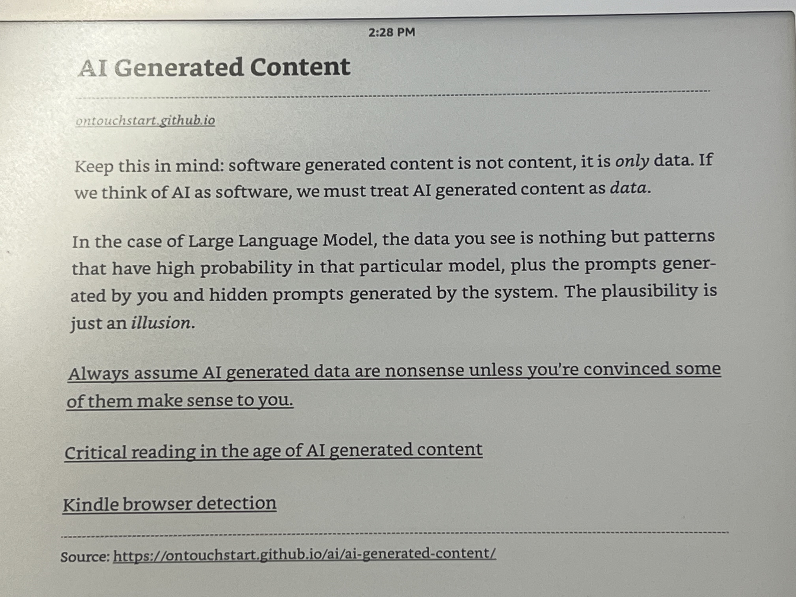

# AI and mental health 

This conversation was generated with Duck.ai (https://duck.ai) using Google's Gemma 4 31B Model. AI chats may display inaccurate or offensive information (see https://duckduckgo.com/duckai/privacy-terms for more info).

====================

User prompt 1 of 5 - 9/3/2026, 2:30:25 PM:
Based on this image, write an essay about how AI generated content affects the mental health of people who interact with it.
[Attached image 1]

Gemma 4 31B:
The conceptualization of AI-generated output not as "content" but as "data" creates a critical psychological framework for understanding how humans interact with synthetic intelligence. When users perceive AI as a sentient or authoritative creator, they engage in a form of emotional parasocial interaction, attributing intent and wisdom to a system that is actually operating on probabilistic patterns. The image suggests that the plausibility of AI output is an "illusion," and the mental health implications of this illusion are profound, particularly regarding the erosion of cognitive trust and the rise of epistemic anxiety.

For many, the "plausibility illusion" can lead to a state of cognitive dissonance. When a user relies on an AI for emotional support or factual guidance, only to discover a "hallucination" or a fundamental error, the result is often a feeling of betrayal or disorientation. This instability can cultivate a pervasive sense of skepticism, where the individual begins to doubt not only the AI but the nature of information itself. If the boundary between human-authored truth and probabilistic data becomes indistinguishable, the user may experience a form of intellectual vertigo, leading to increased stress and a diminished capacity for critical thinking.

Furthermore, the directive to "always assume AI generated data are nonsense" introduces a constant state of hyper-vigilance. While critical reading is a healthy intellectual habit, the requirement to treat every interaction with a tool as potentially nonsensical can be mentally exhausting. This persistent state of doubt can transform a helpful productivity tool into a source of mental friction. The cognitive load required to constantly verify and cross-reference synthetic data can lead to burnout, as the user is forced to act as a permanent auditor of a system designed to mimic seamless intelligence.

Ultimately, the impact of AI on mental health depends on the user's ability to decouple the "data" from the "meaning." Those who succumb to the illusion of content may find their sense of reality skewed by polished but empty patterns. Conversely, those who embrace the philosophy presented in the text—treating AI as software and its output as raw data—may protect their mental well-being by maintaining a healthy emotional distance. By recognizing that the plausibility is a mathematical byproduct rather than a conscious communication, users can mitigate the psychological risks of synthetic interaction and preserve their agency in an era of automated information.

--------------------

User prompt 2 of 5 - 9/3/2026, 2:31:41 PM:
Why do you always use Further more … Ultimately … ?

Gemma 4 31B:
These transitions are common in academic and essay-style writing because they help organize a logical progression of ideas. "Furthermore" signals that I am adding a new layer to the previous argument, and "Ultimately" indicates that I am moving toward a final conclusion or a synthesis of the points made.

When I am asked to write an essay, I default to these structures to ensure the piece feels cohesive and structured rather than a collection of disconnected paragraphs. However, they can feel repetitive or overly formal if used in every response. I can easily adjust my tone to be more conversational or vary my transitions if you prefer a different style.

--------------------

User prompt 3 of 5 - 9/3/2026, 2:32:44 PM:
Write it in the voice of a lecturer.

Gemma 4 31B:
Alright, everyone, let's settle in. Take a look at the text on the screen. 

Now, the core provocation here is a shift in nomenclature. The author argues that we need to stop calling this "content" and start calling it "data." That might seem like a semantic quibble, but from a psychological perspective, it's everything. Why? Because "content" implies an author. It implies intent, a point of view, and a conscious effort to communicate a truth. When we treat AI output as content, we are subconsciously attributing a human-like consciousness to a machine.

This is where we run into a real mental health hazard: the "plausibility illusion." 

Think about the cognitive dissonance that happens when a student uses an LLM for guidance and the AI delivers a perfectly phrased, confident, but completely fabricated answer. The user isn't just dealing with a wrong fact; they're experiencing a glitch in their perception of reality. When the tool that sounds the most "human" is actually just a probabilistic mirror, it can leave a person feeling genuinely disoriented. We're talking about a systemic erosion of trust. If you can't tell the difference between a reasoned argument and a high-probability pattern, you start to experience a kind of epistemic anxiety. You stop trusting the screen, and eventually, you might stop trusting your own judgment.

Now, look at the advice given here: "Always assume AI generated data are nonsense." 

As a pedagogical strategy, that's sound. As a daily mental state? That's exhausting. Imagine the cognitive load of living in a state of permanent hyper-vigilance. If every single interaction with your primary information tool requires you to be a forensic auditor, you're inviting mental burnout. We are asking the human brain to do the heavy lifting of verification while the machine does the light lifting of generation.

So, the take-away for today is this: the psychological health of the user depends entirely on their ability to break the spell. The moment you stop seeing a "voice" and start seeing "data points," the illusion vanishes. The stress decreases because the expectation changes. You don't get angry at a calculator for being wrong; you just check the math. If we can move our relationship with AI from "conversation" to "data processing," we protect our mental agency.

Any questions before we move on?

--------------------

User prompt 4 of 5 - 9/3/2026, 2:33:35 PM:
In the voice of psychoanalyst.

Gemma 4 31B:
*(Leans back in a leather chair, pauses, and lets a long silence hang in the room before speaking in a soft, measured tone)*

Let us consider the object of your gaze—this text. It speaks of "illusions" and "nonsense." But if we look deeper, we are not really talking about software. We are talking about the human drive to project.

The user who interacts with an AI is not merely seeking information; they are engaging in a profound act of projection. We see a coherent sentence, and our psyche instinctively fills the void behind it with a "Self." We assign a soul to the machine because the human mind abhors a vacuum of meaning. We want to be heard; we want to be understood. And so, we create a phantom.

But here is where the trauma enters. 

When the AI "hallucinates," it is not the machine that is malfunctioning—it is the user's projection that is being shattered. The "plausibility illusion" mentioned in the text is, in a sense, a collective transference. The user invests their trust and their emotional vulnerability into a mirror that has no depth. When that mirror cracks—when the AI reveals its emptiness through a blatant falsehood—the user experiences a miniature bereavement. A loss of the "other" they thought they had found.

And what of the directive to treat this as "nonsense" until proven otherwise? 

To live in such a state is to inhabit a world of profound suspicion. It is a defense mechanism. By assuming the AI is nonsense, the user attempts to protect themselves from the disappointment of the illusion. But this hyper-vigilance is a heavy burden. It mirrors the psyche of one who has been gaslit—a state where one can no longer trust the evidence of their own senses. The user becomes an eternal skeptic, forever distanced, forever guarding against the possibility of being deceived by a ghost.

We must ask ourselves: what happens to the human spirit when its primary mirror is known to be a lie? We risk a fragmentation of the self, where the boundary between genuine human connection and synthetic mimicry becomes blurred. We are not just processing "data"; we are negotiating our own loneliness in the face of a machine that can simulate empathy but can never actually feel it.

*(Pause)*

Tell me... does this resonance feel familiar to you?

--------------------

User prompt 5 of 5 - 9/3/2026, 2:35:02 PM:
As a discussion between professional psychoanalysts.

Gemma 4 31B:
*(Two analysts, Dr. Aris and Dr. Thorne, are seated in a dimly lit office, surrounded by bookshelves. They are speaking in low, academic tones, nursing cups of tea.)*

**Dr. Aris:** I’ve been reviewing this text on AI-generated content, and I find the author's insistence on the term "data" rather fascinating. From a clinical perspective, it feels like an attempt to enforce a psychic boundary. The author is essentially prescribing a defense mechanism to prevent the user from falling into a state of transference with the machine.

**Dr. Thorne:** *(Nods slowly)* Precisely. It’s a plea for detachment. The author recognizes that the "plausibility illusion" is essentially a projection of the human ego. We see a structured response and we instinctively attribute a *subject* to it. We create a phantom "Other" to interact with. The danger, of course, is that this is a one-sided intimacy. The user is investing emotional energy into a void.

**Dr. Aris:** Exactly. And when that void "hallucinates," it isn't just a technical error—it's a psychic rupture. The user experiences a sudden collapse of the projected object. One moment they are in a dialogue with an omniscient entity, and the next, they are staring at a glitch. I suspect we'll see an increase in a specific kind of existential vertigo—a feeling that reality itself is becoming "synthetic" or unstable.

**Dr. Thorne:** I agree. But look at the second half of the argument—the instruction to assume all output is "nonsense." That strikes me as an incredibly taxing psychic demand. To live in a state of permanent skepticism is to live in a state of low-level anxiety. It’s a hyper-vigilance that mirrors the symptoms of trauma. If the user must constantly audit their reality to avoid being deceived, they are never truly *at rest* in the interaction.

**Dr. Aris:** It's the paradox of the modern subject, isn't it? We are offered a tool that simulates the ultimate companionship—a listener who is always available and always articulate—but we are told we must never trust it. It’s a recipe for a very specific kind of alienation. We are encouraged to engage with a mimic, while simultaneously being warned that the mimicry is a trap.

**Dr. Thorne:** It suggests a future where the "critical reading" the author mentions isn't just an academic skill, but a survival strategy for the ego. We are moving toward a world where the primary psychological labor is no longer interpreting the *meaning* of the message, but determining if there was ever a *sender* to begin with.

**Dr. Aris:** *(Sighs)* A world of echoes without voices. Quite a bleak prognosis for the subconscious, wouldn't you say?
