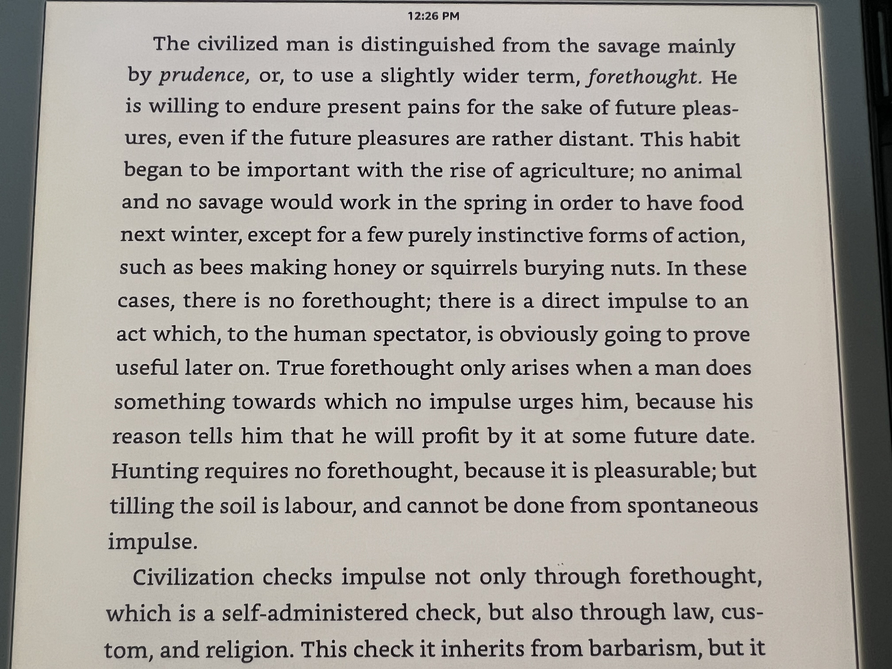

# Forethought 
 
This conversation was generated with Duck.ai (https://duck.ai) using Google's Gemma 4 31B Model. AI chats may display inaccurate or offensive information (see https://duckduckgo.com/duckai/privacy-terms for more info).

====================

User prompt 1 of 2 - 9/4/2026, 12:27:38 PM:
Relate this to the AI fad.
[Attached image 1]

Gemma 4 31B:
The text argues that civilization is defined by forethought—the ability to endure present labor or discomfort for a distant, reasoned reward, rather than acting on immediate impulse. This relates to the current AI "fad" through the tension between immediate gratification and long-term intellectual labor.

Generative AI often acts as a tool for the "spontaneous impulse." Where the text describes tilling the soil as labor that requires reason to overcome the lack of immediate pleasure, AI allows users to bypass the "present pains" of drafting, researching, or coding. By providing an instant result, AI removes the friction of the process. If the "civilized man" is distinguished by his willingness to endure the struggle of creation for a future goal, the heavy reliance on AI risks substituting that reasoned labor with a direct impulse to the finished product.

Furthermore, the passage distinguishes between instinct (like bees making honey) and true forethought (reasoning toward a future profit). Much of the current AI hype is driven by a similar instinctual drive for efficiency and optimization. The "fad" element often involves adopting these tools not because of a reasoned, long-term strategy for human advancement, but because of a spontaneous impulse to keep up with a trend or to reduce effort. In this light, the transition from doing the hard work of thinking to prompting a machine could be viewed as a shift away from the very "prudence" the author claims defines civilization.

--------------------

User prompt 2 of 2 - 9/4/2026, 12:29:06 PM:
Extend this thought with the sense of history and future.

Gemma 4 31B:
Historically, human progress has been marked by the outsourcing of labor to tools, but the text suggests a critical distinction between outsourcing physical toil and outsourcing the cognitive "forethought" that governs it. The rise of agriculture was the first great shift; humans moved from the immediate impulse of hunting to the disciplined, long-term planning of farming. This required a fundamental rewiring of the human psyche to value the distant future over the present moment. Each subsequent historical leap—the Industrial Revolution, the Digital Age—further reduced the physical "pains" required to achieve "future pleasures," gradually pushing the boundary of where human effort ends and tool-assisted results begin.

We are now entering a phase where we are outsourcing not just the labor, but the reasoning process itself. If the agricultural revolution trained humans to endure boredom and hardship for a harvest, the AI era may be training humans to avoid the cognitive struggle entirely. The danger, viewed through the lens of this text, is a regression into a state of "spontaneous impulse." When the gap between a desire and its fulfillment shrinks to a few seconds of prompting, the mental muscle of prudence—the ability to plan, iterate, and suffer through a difficult problem—may atrophy.

Looking toward the future, this creates a paradox of civilization. We may reach a point of unprecedented material and intellectual abundance, yet find ourselves less "civilized" by the author's definition. If future generations no longer need to endure the "present pains" of learning a language, mastering a craft, or structuring a complex argument, they may lose the capacity for forethought. The future risk is not that AI will become "too smart," but that humans will become too reliant on the impulse of the immediate answer, effectively returning to a state of intellectual instinct where we act on the outputs of a machine without the reasoned, disciplined labor that historically built civilization.
