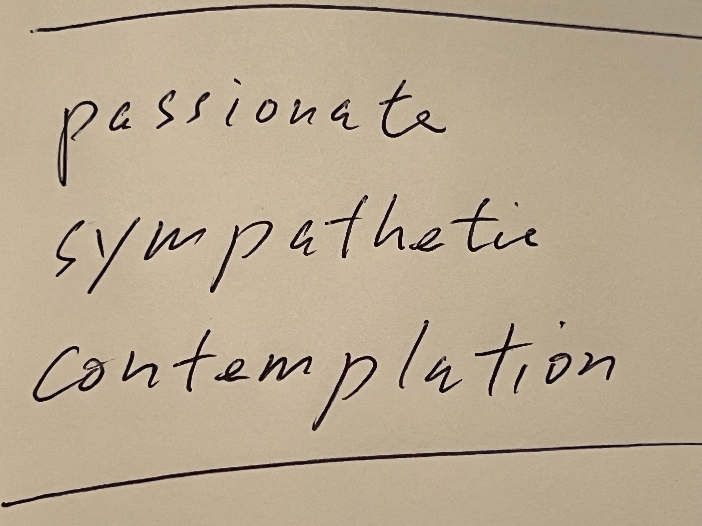

# Passionate sympathetic contemplation 

This conversation was generated with Duck.ai (https://duck.ai) using Google's Gemma 4 31B Model. AI chats may display inaccurate or offensive information (see https://duckduckgo.com/duckai/privacy-terms for more info).

====================

User prompt 1 of 8 - 9/4/2026, 10:28:51 PM:

[Attached image 1]

Gemma 4 31B:
The handwritten text in the image reads:

passionate
sympathetic
contemplation

--------------------

User prompt 2 of 8 - 9/4/2026, 10:29:31 PM:
Contemplate

Gemma 4 31B:
To contemplate is to look at something thoughtfully for a long time or to think deeply and at length about a particular subject. It is a state of focused reflection, often involving a quiet, meditative approach to understanding a concept, a feeling, or a visual object.

--------------------

User prompt 3 of 8 - 9/4/2026, 10:30:21 PM:
Contemplating those three words.

Gemma 4 31B:
Together, these three words describe a powerful emotional and intellectual process.

Passionate suggests a high level of intensity, drive, or deep feeling. It is the energy that fuels the experience, ensuring that the thought process isn't just clinical or detached, but deeply felt.

Sympathetic moves that intensity toward another. It implies empathy, resonance, and a willingness to align oneself with the feelings or suffering of someone else. It turns the passion outward, transforming raw emotion into a bridge of understanding.

Contemplation provides the structure. While passion and sympathy can be impulsive or overwhelming, contemplation is slow and deliberate. It is the act of sitting with those intense, empathetic feelings and examining them carefully to find meaning or clarity.

Combined, passionate sympathetic contemplation is the act of leaning deeply into the emotional experience of another person and reflecting on it with total presence and intensity. It is less about finding a quick solution and more about the profound act of witnessing and understanding.

--------------------

User prompt 4 of 8 - 9/4/2026, 10:31:19 PM:
The connection to “theory”

Gemma 4 31B:
When connected to "theory," these three words move from a personal emotional experience to a framework for understanding the world. This intersection usually manifests in a few different academic or philosophical ways:

**Phenomenology and Subjectivity**
In theories of phenomenology (the study of consciousness and experience), the focus is on how we perceive the world. A "passionate sympathetic contemplation" represents a theoretical approach to subjectivity. Instead of observing a subject from a distance—as a scientist might—the theorist attempts to "feel into" the experience. The theory here is that truth is not just found in data, but in the quality of the lived experience and the empathetic connection between the observer and the observed.

**Ethics of Care**
In moral philosophy, specifically Care Ethics, there is a theoretical shift away from rigid, universal rules (like those in Kantianism) toward the importance of relationships and responsiveness. The connection here is that ethical action is not derived from a cold calculation of logic, but from a passionate, sympathetic contemplation of the specific needs of another person. The "theory" is that the most moral response is the one born from deep, empathetic reflection on a particular relationship.

**Hermeneutics (The Theory of Interpretation)**
Hermeneutics is the theory and methodology of interpretation, especially of texts or human actions. To interpret something "passionately and sympathetically" is to employ a theoretical lens where the interpreter does not remain neutral. Instead, they engage in a "fusion of horizons," where their own passion and empathy allow them to merge with the perspective of the author or subject to reach a deeper, more intuitive understanding.

**Aesthetic Theory**
In the study of art, this combination relates to the theory of "aesthetic empathy." This is the idea that we don't just look at a piece of art to analyze its composition, but to feel the emotion embedded within it. The theoretical goal is to reach a state where the viewer's contemplation becomes a passionate resonance with the artist's intent, turning the act of viewing into an emotional dialogue.

--------------------

User prompt 5 of 8 - 9/4/2026, 10:32:29 PM:
Pythagoreanism 

Gemma 4 31B:
Connecting "passionate sympathetic contemplation" to Pythagoreanism creates a fascinating tension between the cold logic of numbers and the warmth of human emotion. 

At first glance, Pythagoreanism seems to be the opposite of "passionate sympathy." It is a philosophy of **mathematical austerity**, viewing the universe as *Arithmos* (number). In the Pythagorean view, the cosmos is governed by rigid ratios, harmony, and geometric laws. To a strict Pythagorean, the "truth" is found in the abstract and the eternal, not in the messy, fluctuating emotions of human sympathy.

However, the connection emerges when you look at the Pythagorean concept of **Harmony (Harmonia)**.

**The Harmony of Opposites**
Pythagoreans believed that the universe was a balance of opposing forces (Limited vs. Unlimited, Odd vs. Even). Passion and contemplation are opposites: one is a fire, the other is a cool reflection. A "passionate contemplation" is, in itself, a Pythagorean harmony—the merging of intense energy with disciplined thought. To contemplate sympathetically is to find the "ratio" or the chord that connects your soul to another.

**The Music of the Spheres**
The Pythagoreans believed in *Musica Universalis*, the idea that the movements of celestial bodies create a divine music. This music is a mathematical perfection, but it is also a source of profound spiritual longing. The "passionate" element enters here: the soul's yearning to return to this divine harmony. Sympathetic contemplation, in this context, is the act of tuning one's own internal "string" to resonate with the frequency of the universe or another soul.

**Purification (Katharsis)**
Pythagoreanism was not just a math club; it was a mystical sect focused on the purification of the soul to break the cycle of reincarnation. This purification required a specific kind of contemplation. While they practiced silence and discipline, the goal was a higher state of being. "Sympathetic contemplation" can be seen as a tool for *katharsis*—by empathetically connecting with others and reflecting on those connections, the practitioner dissolves the ego, moving closer to the universal oneness that the numbers represent.

In short, while Pythagoreanism provides the **structure** (the math and the law), "passionate sympathetic contemplation" provides the **breath**. It is the process of taking the cold, eternal laws of the universe and experiencing them as a living, feeling connection.

--------------------

User prompt 6 of 8 - 9/4/2026, 10:33:38 PM:
Cornford: From Religion to Philosophy.

Gemma 4 31B:
Francis Cornford’s *From Religion to Philosophy* is a seminal study of the transition in early Greek thought—specifically how the mystical, ritualistic world of religion evolved into the rational, systematic world of philosophy. 

When you apply "passionate sympathetic contemplation" to Cornford's thesis, you are looking at the "bridge" between these two worlds.

**The Ritual as "Passionate Sympathetic Contemplation"**
Cornford argues that early Greek religion wasn't just about blind faith; it was rooted in a specific way of interacting with the world. Rituals were not mere habits; they were a form of "sympathetic" action. The practitioner performed a ritual to align themselves with the divine or the natural order. This was a passionate engagement—a physical and emotional attempt to resonate with a higher power. 

Before the Greeks had "theories" of physics or metaphysics, they had these sympathetic rituals. The "contemplation" was not yet an abstract logical exercise; it was an experiential, felt connection to the cosmos.

**The Shift to Philosophy (The "Cooling" of Passion)**
Cornford tracks how this shifted. The "passion" of the ritual began to be analyzed. The "sympathetic" connection to the gods was replaced by a "rational" connection to *Arche* (the first principle, like Thales' water or Anaximander's *apeiron*). 

The "passionate sympathetic contemplation" of the religious devotee became the "critical analytical contemplation" of the philosopher. The focus moved from *participating* in the divine harmony to *explaining* the laws of that harmony.

**The Pythagorean Link**
Pythagoreanism is the perfect case study for Cornford's transition because it exists exactly in the middle. Pythagoras did not fully abandon the "religion" (the mysticism, the secrecy, the belief in reincarnation), nor did he fully embrace the "philosophy" of the Ionian materialists.

In Cornford's framework, the Pythagorean is the one who tries to keep both:
*   **The Religion:** The passionate, mystical belief in the soul's journey.
*   **The Philosophy:** The sympathetic contemplation of the mathematical laws that govern that journey.

For Cornford, the transition from religion to philosophy is essentially the process of taking the "felt" truths of the ritual and translating them into the "thought" truths of the theory. "Passionate sympathetic contemplation" is the surviving remnant of the religious impulse within the philosophical mind—the realization that the universe is not just a math problem to be solved, but a harmony to be felt.

--------------------

User prompt 7 of 8 - 9/4/2026, 10:35:15 PM:
The quote in Bertrand Russell’s A History of Western Philosophy.

Gemma 4 31B:
In *A History of Western Philosophy*, Bertrand Russell discusses the Pythagoreans with his characteristic blend of intellectual rigor and dry irony. While Russell focuses heavily on the mathematical contributions of the school, he highlights the paradoxical nature of their philosophy.

The specific connection to your phrase lies in Russell's description of how the Pythagoreans viewed the relationship between the **mathematical order of the universe** and the **moral/spiritual state of the human soul**.

Russell notes that for the Pythagoreans, mathematics was not just a tool for calculation, but a means of spiritual purification. The "contemplation" of numbers was intended to lead to a state of inner harmony. In Russell's analysis, the Pythagorean pursuit was a form of "mysticism" disguised as "science." 

The "passionate" element Russell identifies is the Pythagorean's absolute, almost fanatical devotion to the idea that "all is number." This wasn't a dry academic hypothesis; it was a religious conviction. Their "sympathetic" link was the belief that the human soul was a microcosm of the cosmic harmony—that by contemplating the ratios of music and the movement of stars, the soul could "sympathize" (in the classical sense of *sympatheia*, or "feeling together") with the divine order of the universe.

Russell points out that this created a strange hybrid: a philosophy that used the most precise, logical tools (geometry and arithmetic) to achieve a mystical, emotional end (the liberation of the soul). He portrays the Pythagoreans as people who looked at a triangle and didn't just see a shape, but a glimpse of the eternal, divine order—a truly passionate and contemplative act.

--------------------

User prompt 8 of 8 - 9/4/2026, 10:36:16 PM:
Write a coherent essay 

Gemma 4 31B:
# The Geometry of Feeling: From Ritual to Reason

The human quest for understanding has always oscillated between two poles: the visceral heat of passion and the cool clarity of contemplation. Often, these are viewed as contradictory—passion as the enemy of objectivity, and contemplation as a detachment from life. However, when merged into a "passionate sympathetic contemplation," they form a bridge between the religious impulse and the philosophical mind. This synthesis is most vividly illustrated in the transition from early Greek ritual to the systematic thought of the Pythagoreans, a trajectory analyzed by Francis Cornford and contextualized by Bertrand Russell.

To contemplate sympathetically is to move beyond the role of a detached observer. While standard contemplation seeks to analyze a subject from a distance, sympathetic contemplation seeks to resonate with it. When this process is fueled by passion, it becomes an act of spiritual or intellectual immersion. In the earliest stages of Greek culture, this was expressed through religion. As Francis Cornford argues in *From Religion to Philosophy*, early Greek spirituality was not a matter of dogmatic belief, but of ritual action. Ritual was a form of sympathetic magic; by performing a specific act, the practitioner sought to align their own existence with the rhythms of the divine. This was a passionate engagement with the cosmos—a felt connection where the boundary between the human and the divine was blurred through action.

The emergence of philosophy marked a pivotal shift in this process. The "passion" of the ritual began to evolve into the "passion" of the inquiry. The goal remained the same—to find harmony with the universe—but the method shifted from the altar to the mind. This is where Pythagoreanism serves as the critical hinge. The Pythagoreans did not discard the mysticism of religion, nor did they ignore the emerging logic of philosophy; instead, they synthesized them. They proposed that the universe was structured by number, and that this mathematical order was the ultimate source of beauty and truth.

For a Pythagorean, the study of mathematics was not a cold academic exercise, but a form of passionate sympathetic contemplation. To contemplate a geometric ratio or a musical interval was to perceive the very blueprint of the cosmos. By understanding the "number" of a thing, the philosopher was not merely calculating it; they were sympathizing with its essence. As Bertrand Russell notes in *A History of Western Philosophy*, this created a unique paradox: a system of rigorous logic used to serve a mystical end. The Pythagorean did not see a contradiction between the precision of a triangle and the liberation of the soul because both were expressions of the same universal Harmony (*Harmonia*).

This evolution reveals a fundamental truth about the history of thought. The transition "from religion to philosophy," as Cornford describes it, is not a story of the death of passion, but of its sublimation. The sympathy once expressed through the blood and fire of ritual was transformed into the intellectual passion of the theorist. The Pythagorean bridge shows us that the highest form of reason is not one that eliminates emotion, but one that organizes it.

Ultimately, "passionate sympathetic contemplation" is the act of seeking the universal within the particular. Whether through the ritual of the early Greek, the numbers of the Pythagorean, or the reflections of the modern philosopher, the goal is the same: to find a point of resonance where the individual soul vibrates in harmony with the wider world. In this light, philosophy is not the opposite of passion, but rather passion refined into a lens of understanding.
