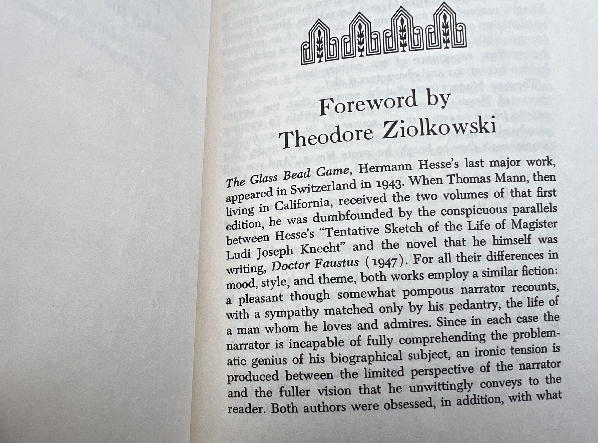

# Who is Theodore Ziolkowski?
 
This conversation was generated with Duck.ai (https://duck.ai) using Google's Gemma 4 31B Model. AI chats may display inaccurate or offensive information (see https://duckduckgo.com/duckai/privacy-terms for more info).

====================

User prompt 1 of 4 - 9/6/2026, 9:43:11 AM:
Who is Theodore Ziolkowski?
[Attached image 1]

Gemma 4 31B:
Theodore Ziolkowski (1932–2020) was a distinguished American scholar and educator specializing in German studies and comparative literature. <citation src="1"></citation> He spent much of his academic career at Princeton University, where he served as the Class of 1900 Professor of German and Comparative Literature and held the position of Dean of the Graduate School from 1979 to 1992. <citation src="1,4"></citation>

Ziolkowski was widely recognized for his thematic erudition and his ability to trace complex motifs and images across a vast array of literary works. <citation src="2"></citation> His scholarship covered a broad spectrum of topics, including:
*   **German Literature:** He wrote extensively on authors such as Goethe, Nietzsche, Hesse, and Kafka. <citation src="2"></citation>
*   **Comparative Literature:** His work explored encounters with ancient epics (such as *Gilgamesh*), the literature of cult and conspiracy, and the representation of alchemy in literature. <citation src="1"></citation>
*   **Interdisciplinary Studies:** He examined the intersection of music and fiction, as well as the literary reflections of legal crises. <citation src="1,4"></citation>

Beyond his teaching and research, Ziolkowski served as the president of the Modern Language Association in 1985 and the Association of Graduate Schools in 1992. <citation src="2"></citation> He received numerous prestigious honors, including the James Russell Lowell Prize, the Henry Allen Moe Prize in the Humanities, and the Commander's Cross of the German Order of Merit. <citation src="1,2"></citation> He was also a member of the American Philosophical Society and the American Academy of Arts and Sciences. <citation src="2"></citation>

--------------------

User prompt 2 of 4 - 9/6/2026, 9:46:47 AM:
Continue the analysis.

Gemma 4 31B:
Based on the text provided in the image, Ziolkowski is providing a comparative literary analysis between two major 20th-century works: Hermann Hesse's *The Glass Bead Game* (1943) and Thomas Mann's *Doctor Faustus* (1947).

He focuses on a specific structural similarity: both novels utilize a narrator who is "pleasant though somewhat pompous" and whose "sympathy" is matched by "pedantry." Ziolkowski argues that this choice of narrator creates a deliberate "ironic tension." Because the narrator is unable to fully grasp the "problematic genius" of the subject he is describing, the reader is actually given a "fuller vision" of the character than the narrator himself provides. In essence, the author uses the narrator's limitations to communicate a deeper truth to the reader.

--------------------

User prompt 3 of 4 - 9/6/2026, 9:54:14 AM:
Is Ziolkowski also a kind of Magister Ludi figure himself ?

Gemma 4 31B:
Whether Theodore Ziolkowski functions as a "Magister Ludi" (Master of the Game) figure depends on whether you view the role as a literal title or a metaphorical approach to knowledge.

In Hesse's novel, the Magister Ludi is the pinnacle of an intellectual elite, tasked with synthesizing all human knowledge—music, mathematics, philosophy, and art—into a single, complex "Game." The role is defined by an exhaustive, multidisciplinary mastery and the pursuit of a universal synthesis.

Metaphorically, Ziolkowski's career mirrored this pursuit. As a scholar of comparative literature, he did not specialize in a single narrow niche; instead, he traversed vast terrains of knowledge, connecting ancient Mesopotamian epics to 19th-century German poetry, and linking alchemy and legal history to modern fiction. His ability to weave these disparate threads into a cohesive analysis is very much in the spirit of the Glass Bead Game.

However, there is a key difference: the Magister Ludi exists within a secluded, utopian intellectual sanctuary (Kastalien) that is eventually criticized for being detached from the "real" world. Ziolkowski, by contrast, operated within the academic institutions of the 20th century, engaging in the public and pedagogical work of a university dean and professor. While he shared the Magister Ludi's passion for synthesis and erudition, he applied it to the critical study of literature rather than the preservation of a synthetic game.

--------------------

User prompt 4 of 4 - 9/6/2026, 9:56:35 AM:
Compare Princeton to Waldzell.

Gemma 4 31B:
While Princeton University and the province of Castalien (specifically the center at Waldzell) both serve as sanctuaries for high intellectual achievement, they differ fundamentally in their relationship to the outside world.

**Princeton University** is an elite institution of higher learning, but it is integrated into the modern global society. It functions as a hub for research, debate, and professional advancement, where scholars interact with a diverse student body and produce work intended for public and academic consumption. Its goal is the advancement of knowledge within a societal framework, maintaining a constant—if sometimes tension-filled—dialogue with the political and social realities of the United States.

**Waldzell**, the heart of Castalien, is a designed utopia of the mind. It is a sequestered society where the "intellectuals" have almost entirely decoupled themselves from the mundane concerns of the state and the economy. In Waldzell, the pursuit of knowledge is not a means to a professional end or a social contribution, but an end in itself. It is a world of extreme specialization and ritualized learning, where the "Game" is played in a vacuum of aesthetic and intellectual purity.

The primary contrast lies in the nature of their isolation. Princeton is a "walled garden" in the sense of prestige and exclusivity, but its gates are open to the world. Waldzell is a fortress of the spirit; its isolation is a prerequisite for its existence. While a scholar at Princeton might study the decline of a civilization to prevent its recurrence, the citizens of Waldzell largely ignore the decaying world outside their borders until the contradictions of their isolation become unsustainable.
