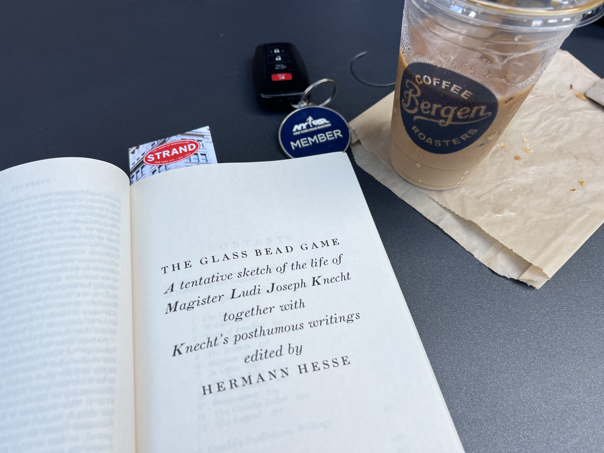

# Strand

This conversation was generated with Duck.ai (https://duck.ai) using Google's Gemma 4 31B Model. AI chats may display inaccurate or offensive information (see https://duckduckgo.com/duckai/privacy-terms for more info).

====================

User prompt 1 of 7 - 9/6/2026, 10:12:48 AM:
Describe this picture.
[Attached image 1]

Gemma 4 31B:
An open copy of the novel The Glass Bead Game by Hermann Hesse lies on a dark gray surface. A red and white bookmark from Strand Bookstore is tucked into the pages. To the right of the book is a plastic cup of iced coffee from Bergen Coffee Roasters, resting on a crumpled brown paper napkin. In the background, there is a black car key fob and a blue circular keychain that says Member.

--------------------

User prompt 2 of 7 - 9/6/2026, 10:15:08 AM:
Write an opening paragraph of a fiction based on this picture. 

Gemma 4 31B:
The caffeine had long since gone cold, leaving a pale, creamy residue against the plastic walls of the cup, but Elias didn't notice. He remained anchored to the small cafe table, his thumb tracing the edge of a page in The Glass Bead Game. Beside the book, his car keys and a blue membership token sat like discarded relics of a life he no longer felt a part of—the mundane requirements of a city that demanded punctuality and presence. He had come to the coffee shop to disappear into the intellectual labyrinth of Hesse's prose, seeking a sanctuary where the noise of the street outside was muted by the weight of a story about a world dedicated entirely to the pursuit of synthesis and art.

--------------------

User prompt 3 of 7 - 9/6/2026, 10:16:48 AM:
Direct the story line to the memory of Strand Bookstore 30 years ago in New York City.

Gemma 4 31B:
As he stared at the red and white bookmark, the vibrant crimson seemed to bleed into a memory of a different New York, one that existed thirty years prior. He could almost smell the intoxicating, dusty scent of a million aging pages and the metallic tang of the city air drifting in through the open doors of the Strand. Back then, the bookstore wasn't just a shop; it was a sprawling, chaotic cathedral of ink and paper where he had spent entire Saturdays getting lost in the narrow aisles of the rare book room. He remembered the feeling of his oversized corduroy jacket brushing against stacks of poetry and philosophy that reached toward the ceiling, and the quiet, knowing nods shared with strangers who were all searching for the same elusive truth hidden in a leather-bound spine. In that version of the city, the world felt infinitely larger and more mysterious, and the act of finding a book felt less like a purchase and more like a discovery.

--------------------

User prompt 4 of 7 - 9/6/2026, 10:17:27 AM:
To be continued 

Gemma 4 31B:
The memory shifted, sharpening until he could see a specific afternoon in the autumn of 1996. He recalled the way the pale sunlight had filtered through the grime of the storefront windows, illuminating dancing motes of dust above a table of discounted paperbacks. It was there, tucked between a weathered volume of Kierkegaard and a nameless journal of essays, that he had first encountered a used copy of the very book he now held. He remembered the woman who had been standing beside him—a graduate student with ink-stained fingers and a look of profound intensity—who had noticed him eyeing the text and whispered, "It's a dangerous book to read if you're looking for easy answers." They had spoken for an hour in the cramped alleyway of the store, two ghosts in a city of millions, bonded by a shared hunger for a world that valued the mind over the machine. Now, three decades later, the bookmark was the only physical bridge left to that conversation and the version of himself that had believed a book could actually change the trajectory of a life.

--------------------

User prompt 5 of 7 - 9/6/2026, 10:23:10 AM:
It is iced coffee, update.

Gemma 4 31B:
The memory shifted, sharpening until he could see a specific afternoon in the autumn of 1996. He recalled the way the pale sunlight had filtered through the grime of the storefront windows, illuminating dancing motes of dust above a table of discounted paperbacks. He looked down at his current drink, the condensation from the iced coffee pooling on the table, a stark, cold contrast to the warm, humid haze of those New York afternoons. Back then, he had wandered the Strand with nothing but a few crumpled bills and a restless heart, the air thick with the scent of aging paper and city exhaust. It was there, tucked between a weathered volume of Kierkegaard and a nameless journal of essays, that he had first encountered a used copy of the very book he now held. He remembered the woman who had been standing beside him—a graduate student with ink-stained fingers and a look of profound intensity—who had noticed him eyeing the text and whispered, "It's a dangerous book to read if you're looking for easy answers." They had spoken for an hour in the cramped alleyway of the store, two ghosts in a city of millions, bonded by a shared hunger for a world that valued the mind over the machine. Now, three decades later, as he took a slow sip of the chilled coffee, the bookmark remained the only physical bridge left to that conversation and the version of himself that had believed a book could actually change the trajectory of a life.

--------------------

User prompt 6 of 7 - 9/6/2026, 10:23:44 AM:
Make a coherent first draft.

Gemma 4 31B:
The caffeine had long since gone cold, leaving a pale, creamy residue against the plastic walls of the cup, but Elias didn't notice. He remained anchored to the small cafe table, his thumb tracing the edge of a page in *The Glass Bead Game*. Beside the book, his car keys and a blue membership token sat like discarded relics of a life he no longer felt a part of—the mundane requirements of a city that demanded punctuality and presence. He had come to the coffee shop to disappear into the intellectual labyrinth of Hesse's prose, seeking a sanctuary where the noise of the street outside was muted by the weight of a story about a world dedicated entirely to the pursuit of synthesis and art.

As he stared at the red and white bookmark, the vibrant crimson seemed to bleed into a memory of a different New York, one that existed thirty years prior. He could almost smell the intoxicating, dusty scent of a million aging pages and the metallic tang of the city air drifting in through the open doors of the Strand. Back then, the bookstore wasn't just a shop; it was a sprawling, chaotic cathedral of ink and paper where he had spent entire Saturdays getting lost in the narrow aisles of the rare book room. He remembered the feeling of his oversized corduroy jacket brushing against stacks of poetry and philosophy that reached toward the ceiling, and the quiet, knowing nods shared with strangers who were all searching for the same elusive truth hidden in a leather-bound spine. In that version of the city, the world felt infinitely larger and more mysterious, and the act of finding a book felt less like a purchase and more like a discovery.

The memory shifted, sharpening until he could see a specific afternoon in the autumn of 1996. He looked down at his current drink, the condensation from the iced coffee pooling on the table, a stark, cold contrast to the warm, humid haze of those New York afternoons. He recalled the way the pale sunlight had filtered through the grime of the storefront windows, illuminating dancing motes of dust above a table of discounted paperbacks. It was there, tucked between a weathered volume of Kierkegaard and a nameless journal of essays, that he had first encountered a used copy of the very book he now held. 

He remembered the woman who had been standing beside him—a graduate student with ink-stained fingers and a look of profound intensity—who had noticed him eyeing the text and whispered, "It's a dangerous book to read if you're looking for easy answers." They had spoken for an hour in the cramped alleyway of the store, two ghosts in a city of millions, bonded by a shared hunger for a world that valued the mind over the machine. Now, three decades later, as he took a slow sip of the chilled coffee, the bookmark remained the only physical bridge left to that conversation and the version of himself that had believed a book could actually change the trajectory of a life.

--------------------

User prompt 7 of 7 - 9/6/2026, 10:24:54 AM:
There is an error in the first line, iced coffee doesn’t get cold.

Gemma 4 31B:
The caffeine had long since lost its chill, the ice having melted into a watery, pale residue against the plastic walls of the cup, but Elias didn't notice. He remained anchored to the small cafe table, his thumb tracing the edge of a page in *The Glass Bead Game*. Beside the book, his car keys and a blue membership token sat like discarded relics of a life he no longer felt a part of—the mundane requirements of a city that demanded punctuality and presence. He had come to the coffee shop to disappear into the intellectual labyrinth of Hesse's prose, seeking a sanctuary where the noise of the street outside was muted by the weight of a story about a world dedicated entirely to the pursuit of synthesis and art.

As he stared at the red and white bookmark, the vibrant crimson seemed to bleed into a memory of a different New York, one that existed thirty years prior. He could almost smell the intoxicating, dusty scent of a million aging pages and the metallic tang of the city air drifting in through the open doors of the Strand. Back then, the bookstore wasn't just a shop; it was a sprawling, chaotic cathedral of ink and paper where he had spent entire Saturdays getting lost in the narrow aisles of the rare book room. He remembered the feeling of his oversized corduroy jacket brushing against stacks of poetry and philosophy that reached toward the ceiling, and the quiet, knowing nods shared with strangers who were all searching for the same elusive truth hidden in a leather-bound spine. In that version of the city, the world felt infinitely larger and more mysterious, and the act of finding a book felt less like a purchase and more like a discovery.

The memory shifted, sharpening until he could see a specific afternoon in the autumn of 1996. He looked down at his current drink, the condensation from the iced coffee pooling on the table, a stark contrast to the warm, humid haze of those New York afternoons. He recalled the way the pale sunlight had filtered through the grime of the storefront windows, illuminating dancing motes of dust above a table of discounted paperbacks. It was there, tucked between a weathered volume of Kierkegaard and a nameless journal of essays, that he had first encountered a used copy of the very book he now held. 

He remembered the woman who had been standing beside him—a graduate student with ink-stained fingers and a look of profound intensity—who had noticed him eyeing the text and whispered, "It's a dangerous book to read if you're looking for easy answers." They had spoken for an hour in the cramped alleyway of the store, two ghosts in a city of millions, bonded by a shared hunger for a world that valued the mind over the machine. Now, three decades later, as he took a slow sip of the watered-down coffee, the bookmark remained the only physical bridge left to that conversation and the version of himself that had believed a book could actually change the trajectory of a life.

[⏭️](https://ontouchstart.github.io/duck.ai/2026/09/06/duck.ai_2026-09-06_16-02-48)
