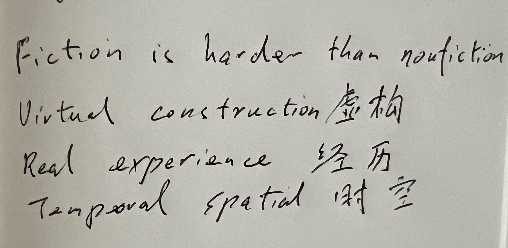

# Fiction is harder than nonfiction 
 
This conversation was generated with Duck.ai (https://duck.ai) using Google's Gemma 4 31B Model. AI chats may display inaccurate or offensive information (see https://duckduckgo.com/duckai/privacy-terms for more info).

====================

User prompt 1 of 9 - 9/7/2026, 8:07:48 AM:

[Attached image 1]

Gemma 4 31B:
The image contains the following handwritten text:

Fiction is harder than nonfiction
Virtual construction 虚构
Real experience 经历
Temporal spatial 时空

--------------------

User prompt 2 of 9 - 9/7/2026, 8:08:26 AM:
Elaborate 

Gemma 4 31B:
The notes in the image present a philosophical or literary comparison between the creation of fiction and the recording of nonfiction, focusing on the mental effort required for each.

The claim that **fiction is harder than nonfiction** suggests that while nonfiction relies on the documentation of existing truths, fiction requires the intentional creation of a coherent world from nothing. This leads to the subsequent distinctions:

**Virtual construction (虚构 - Xūgòu)**
In this context, "virtual construction" refers to the act of world-building. Writing fiction is not just about making things up, but about constructing a logical internal system. The author must invent characters, motivations, and plot arcs that feel authentic and consistent, even if they are not real. The "hardness" comes from the need to maintain this artificial architecture without it collapsing under the weight of contradictions.

**Real experience (经历 - Jīnglì)**
Nonfiction is tied to "real experience." The primary challenge here is selection and articulation—deciding which parts of a lived experience are relevant and how to describe them accurately. The "truth" already exists in the world; the writer's job is to act as a mirror or a chronicler.

**Temporal spatial (时空 - Shíkōng)**
This term refers to the dimensions of time and space. In nonfiction, the writer is bound by the actual timeline and geography of the events that occurred. In fiction, the writer must architect the "temporal spatial" elements manually. They must decide how time flows (linear, fragmented, or looped) and how the setting influences the story. Mastering this allows a fiction writer to manipulate the reader's perception of reality, a task far more complex than reporting on a physical location or a historical date.

--------------------

User prompt 3 of 9 - 9/7/2026, 8:10:53 AM:
Archeological evidence, research notes, hypotheses, theories, scholarly articles, publications, textbooks, educational institutions. 

Gemma 4 31B:
These terms trace the lifecycle of knowledge, moving from the raw discovery of a physical object to the formalized instruction of a student. This progression represents a funnel where raw data is gradually refined into established fact.

**The Discovery Phase (Evidence & Notes)**
It begins with **archeological evidence**, the primary source—a shard of pottery, a fossil, or a ruin. This is the "ground truth." Because raw evidence is silent, it requires **research notes**, where the observer records the context, coordinates, and initial observations. This stage is purely descriptive and objective.

**The Analytical Phase (Hypotheses & Theories)**
Once the data is gathered, the mind moves from description to interpretation. A **hypothesis** is a specific, testable guess about what the evidence means (e.g., "this pottery suggests a trade route with a neighboring city"). When multiple hypotheses are supported by a vast body of evidence and withstand rigorous testing, they evolve into a **theory**. In a scholarly sense, a theory is not a "hunch," but a comprehensive explanation of an aspect of the natural or cultural world.

**The Validation Phase (Articles & Publications)**
Before a theory is accepted, it must undergo peer review. **Scholarly articles** are the primary vehicle for this, presenting the evidence and the reasoning to other experts for critique. Once vetted, these findings enter **publications**, such as academic journals or monographs, which serve as the permanent record of the field's progress.

**The Institutionalization Phase (Textbooks & Institutions)**
The final stage is the transition from "cutting-edge research" to "established knowledge." **Textbooks** synthesize these publications, stripping away the uncertainty of the hypothesis stage to present the consensus to learners. This entire ecosystem is housed and protected by **educational institutions** (universities and museums), which provide the funding, the libraries, and the credentialing necessary to ensure the cycle continues with integrity.

--------------------

User prompt 4 of 9 - 9/7/2026, 8:11:47 AM:
Where did experience end? Where did fiction start?

Gemma 4 31B:
Based on the logic of your previous prompts, the line between experience and fiction is not a wall, but a threshold of **intent and architecture.**

**Experience ends where the "given" stops.**
Experience ends at the limit of what was actually witnessed or felt. It is the realm of the *given*—the raw data of the senses and the linear progression of time. As long as you are recounting what happened, you are operating within "Real Experience" (经历). Even in a memoir, experience ends the moment you stop reporting the event and begin to fill in a gap you cannot remember, or attribute a motive to someone else that you cannot possibly know.

**Fiction starts where the "constructed" begins.**
Fiction starts the moment you move from *reporting* to *architecting*. This is the "Virtual Construction" (虚构) mentioned in your notes. Fiction begins when you take a piece of experience and intentionally alter its "Temporal Spatial" (时空) coordinates to serve a specific purpose—such as a theme, a moral, or an emotional truth. 

The transition usually happens in one of three ways:

*   **The Gap:** When the evidence is missing, and the mind creates a bridge to connect two known points.
*   **The "What If":** When you take a real experience and ask how it would change if one variable were different.
*   **The Synthesis:** When you combine three different real experiences into one composite character to illustrate a truth that no single real person embodies.

In short: **Experience is a discovery; fiction is a construction.** Experience is the act of observing the world; fiction is the act of building a world that explains the observation.

--------------------

User prompt 5 of 9 - 9/7/2026, 8:12:39 AM:
When literature becomes reality.

Gemma 4 31B:
Literature becomes reality when the internal logic of a story ceases to be a "virtual construction" and begins to function as a blueprint for human behavior. This happens through three primary mechanisms:

**The Mimetic Loop (Social Reality)**
This occurs when people begin to model their lives, identities, or social structures after a literary work. When a character's philosophy or a fictional society's values are adopted by real people, the literature is no longer just a story—it is a driver of culture. For example, political ideologies often begin as utopian or dystopian literature that eventually inspires real-world laws, revolutions, or social hierarchies. The "virtual construction" becomes the architectural plan for a real society.

**The Psychological Truth (Emotional Reality)**
Literature becomes reality when it describes an emotion or a psychological state more accurately than the person experiencing it can. In this sense, the "fiction" provides the vocabulary for the "experience." When a reader says, "This book explains exactly how I feel," the literature has captured a universal human truth. The fiction doesn't create a new reality; it reveals a hidden reality that was already there but lacked a name.

**The Self-Fulfilling Prophecy (Manifest Reality)**
This is the most literal transition: when the imagined becomes the enacted. It happens when an idea, first explored in the safe space of a narrative, is pursued with such conviction that it is materialized in the physical world. This is common in technology and exploration—where the science fiction of one century (space travel, artificial intelligence) becomes the technical manual of the next.

In the context of your notes, this is the moment where the **Temporal Spatial (时空)** coordinates of the story align perfectly with the physical world. The distinction between the "Virtual" and the "Real" collapses, and the construction is no longer a simulation—it is the environment.

--------------------

User prompt 6 of 9 - 9/7/2026, 8:14:01 AM:
Rationality and imagination 

Gemma 4 31B:
Rationality and imagination are often framed as opposites—the cold calculator versus the wild dreamer—but in the context of your notes on fiction and experience, they are actually the two halves of a single creative engine.

**Rationality is the Architecture**
Rationality provides the constraints. It is the "construction" part of "virtual construction." If you write a story where a character flies without explanation, you have used imagination, but you have ignored rationality. For fiction to feel "real," it must follow a rigorous internal logic. Rationality is what ensures that if the rules of the world are established on page one, they are not broken on page one hundred. It is the scaffolding that prevents the imagination from collapsing into chaos.

**Imagination is the Material**
Imagination provides the raw substance. It is the ability to step outside of "Real Experience" (经历) and envision a "Temporal Spatial" (时空) arrangement that does not yet exist. While rationality asks, "Does this make sense?", imagination asks, "What if this existed?" It is the spark that generates the evidence before the research even begins.

**The Synthesis: Creative Intelligence**
The most powerful intellectual work happens when these two forces collaborate:

*   **In Science:** Imagination proposes a wild new hypothesis; rationality designs the experiment to prove or disprove it.
*   **In Literature:** Imagination creates a surreal world; rationality makes the reader believe it is possible.
*   **In Life:** Imagination envisions a goal; rationality maps out the steps to achieve it.

Without imagination, rationality is a machine with no destination—it can optimize a path, but it cannot decide where to go. Without rationality, imagination is a map of a place that cannot be reached—it can envision a destination, but it cannot build the road. Together, they turn **experience** into **meaning**.

--------------------

User prompt 7 of 9 - 9/7/2026, 8:15:44 AM:
Is hierarchical construct fictional?

Gemma 4 31B:
Whether a hierarchical construct is "fictional" depends on whether you are defining "reality" as **physical matter** or as **social agreement.**

**As a physical reality: Yes, it is fictional.**
If you look at the world through a purely biological or physical lens, hierarchies (like CEOs, Kings, or caste systems) do not exist. There is no "boss" gene in human DNA, nor is there a physical law of the universe that dictates one person must be "above" another. In this sense, a hierarchy is a **virtual construction**. It is a story that a group of people has agreed to believe in so that they can coordinate their behavior. It is a piece of "fiction" that we treat as a fact.

**As a functional reality: No, it is real.**
While the *concept* of the hierarchy is a construct, the *effects* of that construct are devastatingly real. If a hierarchy dictates who gets food, who holds power, and who is imprisoned, the "fiction" produces real-world consequences. In this view, any system that consistently produces a predictable result in the physical world is "real." The hierarchy is a "social fact"—a shared fiction that becomes reality because everyone acts as if it is true.

**The Connection to Your Notes**
Linking this to your previous themes:

*   **Virtual Construction:** A hierarchy is a masterwork of virtual construction. It requires a shared narrative to maintain itself.
*   **Real Experience:** For the person at the bottom of the hierarchy, the system is not a "fiction"; it is their primary lived experience.
*   **Rationality vs. Imagination:** The **imagination** creates the idea of a "superior" and "inferior" class; the **rationality** of the system creates the laws, titles, and bureaucracies to enforce that idea.

Ultimately, a hierarchical construct is a **"useful fiction."** It is a story we tell ourselves to organize complex groups of people. It is "fictional" in its origin, but "real" in its application.

--------------------

User prompt 8 of 9 - 9/7/2026, 8:17:15 AM:
Are dependency graphs fictional?

Gemma 4 31B:
A dependency graph is a different kind of construct than a social hierarchy. While a hierarchy is often a **social fiction** (an agreed-upon story), a dependency graph is a **formal abstraction** of a physical or logical necessity.

**The distinction lies in "Necessity" vs. "Agreement"**

A social hierarchy is based on **agreement**. If everyone suddenly stopped believing in the "CEO," the title would vanish. It is fictional because it exists only in the collective mind.

A dependency graph, however, is based on **necessity**. If you are building a house, you cannot put the roof on before the walls are up. The "roof" depends on the "walls." This is not a story we agreed upon; it is a physical requirement of gravity and materials. The dependency is a fact of the universe.

**The "Fictional" element: The Map is not the Territory**
Where the dependency graph becomes "fictional" is in the **representation**. 

The *graph* (the circles and arrows on a piece of paper) is a fiction. The arrows do not actually exist in the physical world; they are symbols we use to visualize a relationship. The graph is a "virtual construction" used to simplify a complex reality. 

*   **The Relationship** (Wall $\rightarrow$ Roof) is **Real**.
*   **The Graph** (Circle $\rightarrow$ Arrow $\rightarrow$ Circle) is **Fictional**.

**Comparing the two constructs**

| Feature | Hierarchical Construct (Social) | Dependency Graph (Logical) |
| :--- | :--- | :--- |
| **Source** | Social Agreement / Power | Logical/Physical Necessity |
| **Nature** | Normative (How things *should* be) | Descriptive (How things *must* be) |
| **Fragility** | Collapses if belief disappears | Persists regardless of belief |
| **Status** | A "Shared Fiction" | An "Abstraction of Fact" |

**Conclusion**
A dependency graph is not "fictional" in the way a story or a social class is. It is a **model**. 

While the *model* is a human invention (a virtual construction), the *dependency* it describes is an objective truth. You can imagine a world without kings (no hierarchy), but you cannot imagine a world where a result exists before its cause (no dependency).

--------------------

User prompt 9 of 9 - 9/7/2026, 8:21:16 AM:
Are dependency graphs fictional in computer programs? Computing runtime? Which is fictional which is real?

Gemma 4 31B:
In computing, the distinction between "real" and "fictional" shifts from social agreement to the difference between **mathematical logic** and **physical electricity**.

### 1. The Dependency Graph: The Logical Fiction (The Map)
In a computer program, the dependency graph is a **logical abstraction**. Whether it is a build system (like Make or Gradle) or a package manager (like npm), the graph is a "virtual construction."

It is "fictional" in the sense that the computer does not "see" a graph. There are no actual circles and arrows inside the CPU. The graph is a conceptual tool used by the developer (and the compiler) to organize tasks. It is a mathematical model of **intent**: *"I intend for Function A to finish before Function B starts."*

### 2. The Computing Runtime: The Physical Reality (The Territory)
The runtime is where the "Real Experience" (经历) of the machine happens. This is the realm of:
*   **Voltage changes** in transistors.
*   **Electrons** moving through silicon.
*   **Clock cycles** triggering gates.
*   **Memory addresses** being overwritten in RAM.

The runtime is the "ground truth." It doesn't care about the "graph"; it only cares about the current instruction in the pipeline and the state of the registers.

### 3. Where the "Fiction" becomes "Reality"
The magic of computing is the process of **mapping the fiction onto the reality**.

When a runtime executes a program, it is essentially "performing" the dependency graph. If the graph says `A $\rightarrow$ B`, the runtime ensures that the physical electrical states representing `A` are finalized before the states representing `B` are triggered.

**Which is which?**

*   **The Dependency Graph is the "Script" (Fiction):** It is a set of instructions and relationships. It exists as a logical arrangement. If you delete the graph but keep the compiled binary, the "fiction" is gone, but the behavior remains.
*   **The Runtime is the "Performance" (Reality):** It is the actual movement of energy. It is the only part of the process that physically exists in time and space.

**The Paradox**
In high-level languages, we often treat the dependency graph as the "real" part of the program because that is where we spend our time thinking. But in the computing runtime, the graph is just a ghost—a set of constraints that shapes how the electricity flows. 

**The "Real" is the electron; the "Fiction" is the logic.**
