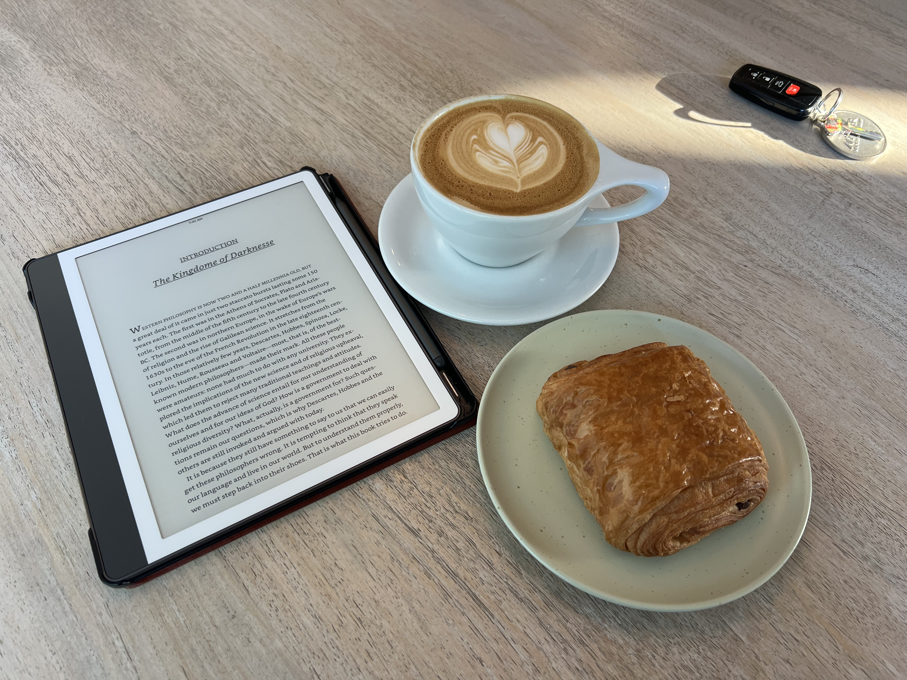
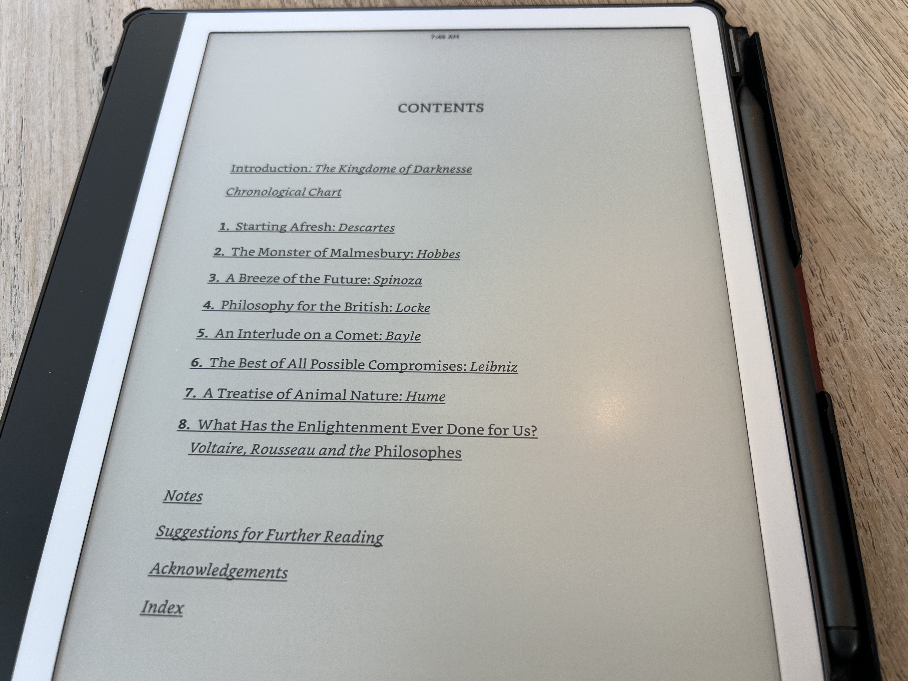

# Philosophy in the age of compute

This conversation was generated with Duck.ai (https://duck.ai) using Google's Gemma 4 31B Model. AI chats may display inaccurate or offensive information (see https://duckduckgo.com/duckai/privacy-terms for more info).

====================

User prompt 1 of 7 - 9/8/2026, 7:44:30 AM:
The Kingdome of Darknesse
[Attached image 1]

Gemma 4 31B:
It looks like you're settling in for a cozy reading session with a latte and a pastry. Are you writing a story called "The Kingdome of Darknesse," or is that the title of the piece on your e-reader?

--------------------

User prompt 2 of 7 - 9/8/2026, 7:44:55 AM:
Spelling 

Gemma 4 31B:
The correct spelling is **The Kingdom of Darkness**.

--------------------

User prompt 3 of 7 - 9/8/2026, 7:45:25 AM:
Why did the author use that spelling?

Gemma 4 31B:
Since I don't have access to the author's notes or the full text, I can only speculate based on common literary devices. Authors often use intentional misspellings for a few specific reasons:

**Stylistic Choice or World-Building**
In fantasy or gothic fiction, altering the spelling of common words can make a setting feel "otherworldly" or archaic. By adding an extra "e" to the end of *Kingdom* and *Darkness*, the author may be trying to evoke an Old English or Middle English feel, signaling to the reader that the story takes place in a different time or a fictional realm with its own linguistic rules.

**Thematic Symbolism**
The "incorrect" spelling might reflect the nature of the kingdom itself. If the land is corrupted, twisted, or "wrong," the author might mirror that instability in the language. The misspelling serves as a subtle hint that things in this world are not quite as they should be.

**Character Perspective**
If the story is told through a first-person narrator who is uneducated, from a different culture, or struggling with their mental state, the spelling might be a reflection of that character's voice rather than a formal title.

--------------------

User prompt 4 of 7 - 9/8/2026, 7:47:04 AM:

[Attached image 1]

Gemma 4 31B:
Looking at the table of contents, this is a book about the **Enlightenment** and the philosophers of that era (such as Descartes, Hobbes, Spinoza, Locke, and Hume).

Given this context, the spelling "The Kingdomes of Darknesse" is almost certainly an intentional stylistic choice to evoke the **Early Modern English** style.

During the 16th and 17th centuries—the period leading up to and during the early Enlightenment—English spelling was not standardized. It was very common to see an extra "e" added to the end of words (like *darknesse* or *kingdomes*). 

By using this spelling in the introduction, the author is creating a visual contrast: the "Darknesse" (represented by archaic, old-fashioned spelling) is being pushed away by the "Light" of the Enlightenment philosophers listed in the chapters that follow. It symbolizes the transition from the perceived ignorance or superstition of the past into the era of reason and science.

--------------------

User prompt 5 of 7 - 9/8/2026, 7:55:43 AM:
We are in the age of compute. There might be a new philosophy breakthrough.

Gemma 4 31B:
The intersection of high-scale compute and philosophy is currently one of the most provocative frontiers in intellectual thought. We are moving from a period where philosophy was primarily a descriptive or analytical exercise—thinking about how the mind works—to a period where we are building functional models of cognition.

There are a few areas where a genuine "breakthrough" in philosophy is likely to occur because of the age of compute:

**The Nature of Consciousness and Qualia**
For centuries, the "Hard Problem of Consciousness" (how physical matter gives rise to subjective experience) has been a stalemate. As we build systems that can mimic complex reasoning, emotional nuance, and creativity, we are forced to redefine what "understanding" actually is. If a machine can perfectly simulate the output of a conscious mind, philosophers must decide if the simulation *is* the reality, or if there is a biological "spark" that compute can never replicate.

**Epistemology in the Age of Synthetic Data**
Epistemology is the study of knowledge and how we know things are true. In an era where compute can generate hyper-realistic fake imagery, text, and video, the traditional "seeing is believing" framework collapses. This may lead to a breakthrough in how we define "truth" and "evidence," shifting us toward a philosophy of verification and cryptographic trust rather than sensory observation.

**Computational Ethics and Value Alignment**
The "Alignment Problem"—trying to ensure an AI's goals match human values—is essentially a massive, practical philosophy project. It is forcing us to move away from vague moral intuitions and toward a rigorous, formalized system of ethics. We can no longer afford to have conflicting definitions of "the greatest good" when those definitions are being coded into systems with global reach.

**The Extension of the Self**
As compute allows for tighter integration between human cognition and AI (via advanced interfaces or ubiquitous assistants), the philosophical boundary of the "self" expands. We are entering a phase of "Extended Mind Theory," where the tools we use to think are no longer external objects, but integrated parts of our cognitive process.

We are effectively moving from "armchair philosophy" to "experimental philosophy," where theories about the mind and ethics can be tested, iterated upon, and scaled using compute.

--------------------

User prompt 6 of 7 - 9/8/2026, 7:58:13 AM:
What would Pythagoras view our age of compute? Leibniz?

Gemma 4 31B:
Both Pythagoras and Leibniz viewed the universe as fundamentally mathematical, so they would likely see the age of compute not as a departure from nature, but as the ultimate realization of the laws they spent their lives uncovering.

**Pythagoras: The Music of the Spheres**
Pythagoras believed that "all is number." To him, numbers were not just tools for counting, but the divine essence of reality. He saw mathematical ratios in music, astronomy, and geometry, believing that the entire cosmos functioned like a grand, harmonic symphony.

He would likely view our age of compute as the ultimate proof of his philosophy. The fact that everything—a digital image, a symphony, a complex thought, or a video call—can be reduced to a binary string of 1s and 0s would be, to him, a spiritual revelation. He would see a GPU processing billions of operations per second as a modern version of his "Music of the Spheres," where the harmony of the universe is being played out in silicon.

**Leibniz: The Universal Characteristic**
Leibniz would likely feel a sense of profound triumph, as he practically predicted the invention of the computer. He envisioned a *Characteristica Universalis* (a universal characteristic)—a formal language of symbols that could represent all human thought. He imagined a *Calculus Ratiocinator*, a logical machine that would allow people to settle any argument by simply saying, "Let us calculate."

Leibniz actually invented a precursor to the binary system (the base-2 logic that powers every modern chip), seeing it as a reflection of the creation of the world out of nothing (0) and God (1). He would view Large Language Models (LLMs) as a rough first draft of his dream. While he might be critical of the "probabilistic" nature of current AI (he wanted absolute logical certainty), he would be fascinated by the way compute has turned logic into a tangible, scalable force.

**The Contrast**
While Pythagoras would likely view the age of compute with **mystical awe**, seeing it as a window into the divine order of the universe, Leibniz would view it with **intellectual satisfaction**, seeing it as the successful engineering of the logical structures he mapped out in the 17th century.

--------------------

User prompt 7 of 7 - 9/8/2026, 7:59:48 AM:
What would the next Pythagoras and Leibniz do in this era?

Gemma 4 31B:
If a modern-day Pythagoras and Leibniz were operating today, they would likely move beyond simply observing the digital world and instead attempt to use compute to solve the "final" mysteries of existence. They would not be mere software engineers; they would be the architects of a new synthesis between mathematics, consciousness, and reality.

**The New Pythagoras: The Architect of Digital Ontology**
A modern Pythagoras would likely be obsessed with the **mathematical foundations of reality**. He would probably be working at the intersection of quantum computing and theoretical physics, seeking a "Theory of Everything."

*   **Search for the Universal Code:** Instead of looking at musical intervals, he would look at the geometry of high-dimensional latent spaces in AI. He would try to find the "fundamental frequency" or the core mathematical constant that governs how intelligence emerges from data.
*   **Digital Mysticism:** He might lead a movement arguing that our physical universe is itself a computation (the Simulation Hypothesis). He would treat the act of coding not as a job, but as a ritual to uncover the divine ratios of the cosmos.
*   **Harmony through Data:** He would likely create systems that translate complex data—like the movement of galaxies or the folding of proteins—into immersive auditory or visual harmonies, attempting to let humans "feel" the mathematics of the universe.

**The New Leibniz: The Engineer of Universal Reason**
A modern Leibniz would be the ultimate "full-stack" philosopher-scientist. He would be focused on the **formalization of all human knowledge** and the creation of a truly autonomous, logical intelligence.

*   **Solving the Alignment Problem:** He would tackle the "Value Alignment" problem not with vague ethics, but by attempting to build a mathematically perfect "Universal Ethics" code—a set of axioms that could be computationally proven to be fair and beneficial for all sentient beings.
*   **The Perfect Interface:** He would work on the "Universal Characteristic" via Neuralink or advanced Brain-Computer Interfaces (BCIs). His goal would be to eliminate the ambiguity of human language entirely, allowing two minds to exchange pure, mathematical concepts directly.
*   **The Automated Philosopher:** He would build a system capable of "automated discovery"—an AI that doesn't just summarize existing knowledge, but uses formal logic to derive new mathematical theorems and philosophical truths that no human has ever conceived.

**Their Collaboration**
If these two collaborated, the result would be an attempt to **bridge the gap between the quantitative and the qualitative**.

Pythagoras would provide the intuition and the "sacred" mathematical patterns (the *What*), while Leibniz would provide the rigorous logical framework and the engineering to implement it (the *How*). Together, they would likely attempt to build a "World Engine"—a simulation so mathematically accurate that it could be used to predict the future of society, solve the mystery of consciousness, and perhaps even design new forms of existence.
