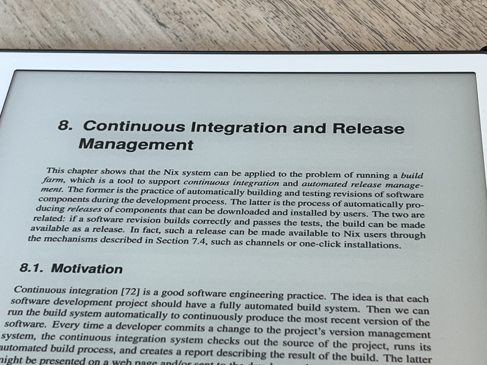

# Nix in a super large-scale environment
 
This conversation was generated with Duck.ai (https://duck.ai) using Google's Gemma 4 31B Model. AI chats may display inaccurate or offensive information (see https://duckduckgo.com/duckai/privacy-terms for more info).

====================

User prompt 1 of 3 - 9/9/2026, 7:53:09 AM:

[Attached image 1][Attached image 2]

Gemma 4 31B:
The text on the screen discusses the application of the Nix system to continuous integration (CI) and release management. It explains that a build farm can be used to automate the building and testing of software revisions (CI) and the subsequent production of downloadable components for users (release management). The "Motivation" section describes CI as a software engineering practice where a fully automated build system continuously produces the most recent version of the software, triggering a build and generating a report every time a developer commits a change to the version management system.

--------------------

User prompt 2 of 3 - 9/9/2026, 7:55:15 AM:
How do we scale CI and release management in the age of super large scale data and continuous data flows?

Gemma 4 31B:
Scaling continuous integration (CI) and release management for massive data volumes and constant data flows requires moving away from traditional "build-and-deploy" cycles toward a streaming and decoupled architecture.

One of the primary shifts is the move toward data-centric CI/CD, where the pipeline doesn't just test the code, but also validates the data schemas and quality of the incoming data flows. In large-scale environments, this often involves implementing "Data Contracts" between producers and consumers. These contracts act as a formal agreement on the data's structure and quality, allowing the CI system to automatically reject changes to a data producer's code if it would break downstream consumers, preventing "data downtime" in a production flow.

From an infrastructure perspective, scaling is achieved through extreme parallelism and ephemeral environments. Rather than a few large build servers, modern systems use container orchestration (like Kubernetes) to spin up thousands of isolated, short-lived environments that run tests in parallel. To handle the "super large scale" aspect, teams often employ "test impact analysis," which uses dependency graphing to run only the subset of tests affected by a specific code change, rather than the entire suite, which would be computationally prohibitive at scale.

For release management, the risk of a "big bang" deployment is too high with continuous data flows. Instead, companies use progressive delivery techniques:

*   **Canary Releases:** Routing a small percentage of the data flow to a new version of the service to monitor for errors before a full rollout.
*   **Feature Flags:** Decoupling deployment (moving code to production) from release (turning the feature on for users), allowing for instant rollbacks without needing to redeploy code.
*   **Blue-Green Deployment:** Maintaining two identical production environments to ensure zero-downtime handovers.

Finally, the "continuous" nature of the data flow necessitates a shift toward observability and automated remediation. At this scale, manual monitoring is impossible, so systems are designed with "automated rollbacks" triggered by SLIs (Service Level Indicators). If a new release causes a spike in latency or error rates in the data stream, the system automatically reverts to the previous stable version without human intervention.

--------------------

User prompt 3 of 3 - 9/9/2026, 7:57:49 AM:
Can Nix adapt to this new environment?

Gemma 4 31B:
Nix is uniquely positioned to adapt to large-scale, data-intensive environments because its core philosophy—**functional purity and immutability**—directly addresses the biggest pain points of scaling CI/CD: non-determinism and environment drift.

In a super large-scale environment, Nix provides several critical advantages:

**Elimination of "It Works on My Machine"**
Traditional CI often fails because the build environment differs slightly from the production environment. Because Nix stores every dependency in a unique path based on a cryptographic hash of its inputs, the environment is identical across every stage of the pipeline. This means a build that passes in CI is guaranteed to be the exact same binary in production, eliminating the "drift" that often causes catastrophic failures during large-scale releases.

**Efficient Scaling via Binary Caching**
Scaling CI for massive projects usually leads to "build bottlenecks" where developers wait hours for tests. Nix solves this through its binary cache. Since a Nix derivation is a pure function, if the inputs haven't changed, the output won't either. If one node in a global build farm has already built a specific dependency, every other node can simply download the pre-compiled binary. This transforms the CI process from a computational problem into a distribution problem, drastically reducing build times.

**Safe Progressive Delivery**
Nix makes atomic rollbacks trivial. Because it doesn't overwrite files but instead creates new paths for new versions, switching a production service from version A to version B is simply a matter of updating a symlink. If a data flow begins to fail during a canary release, Nix can revert the entire system state to the previous known-good configuration in milliseconds, as the previous version's dependencies remain intact on the disk.

**Managing Complex Data Toolchains**
Large-scale data flows often require a fragile mix of system libraries, Python versions, and C++ binaries. Managing these with traditional tools (like Docker alone) can lead to bloated images and slow startup times. Nix allows for "fine-grained" environment management, providing only the exact libraries needed for a specific data processing task without the overhead of a full OS image, which improves the cold-start time of ephemeral CI runners.

**The Gap: The "Data" in Data-Centric CI**
Where Nix needs to adapt further is in the distinction between **code** and **state**. Nix is a master of managing *immutable* inputs and outputs. However, "continuous data flows" involve *mutable* state and evolving schemas. Nix cannot "hash" a live Kafka stream or a multi-petabyte database. 

To fully adapt, Nix is typically used as the **foundation** (providing the reliable, reproducible engine) while being paired with data-specific orchestration tools (like Great Expectations for data validation or ArgoCD for Kubernetes delivery) to handle the fluid nature of the data itself.
