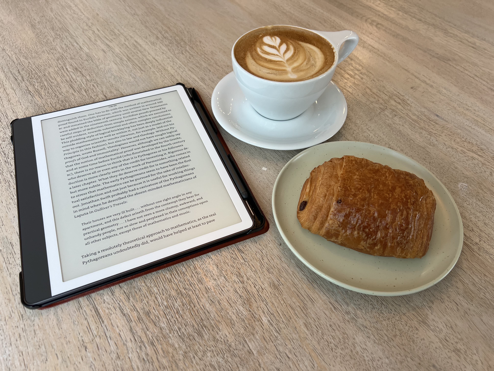
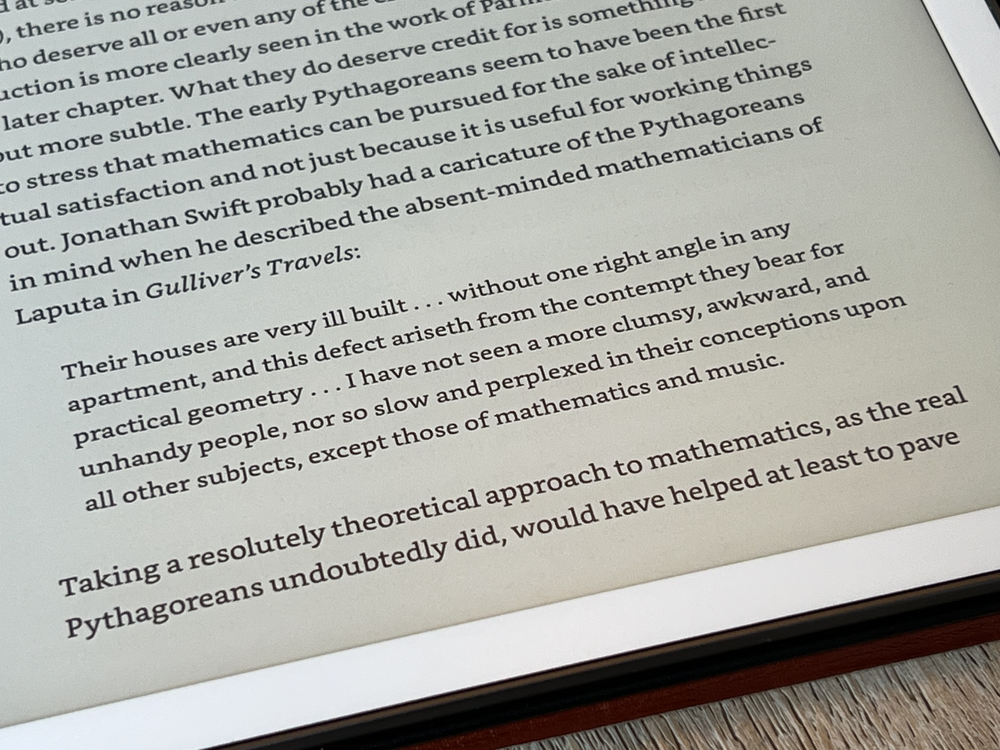
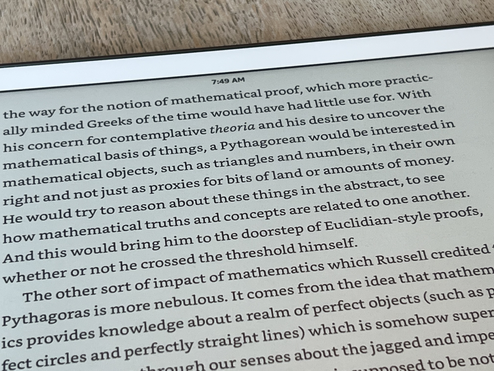

This conversation was generated with Duck.ai (https://duck.ai) using Google's Gemma 4 31B Model. AI chats may display inaccurate or offensive information (see https://duckduckgo.com/duckai/privacy-terms for more info).

====================

User prompt 1 of 4 - 9/10/2026, 7:51:02 AM:
Write an essay.
[Attached image 1][Attached image 2][Attached image 3]

Gemma 4 31B:
The images provided offer a serene tableau of modern intellectual leisure: an e-reader, a latte with intricate foam art, and a golden-brown pastry. While these objects seem disparate, they represent a curated experience of mindfulness and learning in a fast-paced digital age. Together, they illustrate the concept of the "slow morning," where the pursuit of knowledge is paired with sensory pleasure.

The e-reader, displaying a text on the philosophy of mathematics and the Pythagoreans, serves as the focal point of intellectual engagement. The text discusses the distinction between mathematics as a practical tool and mathematics as a theoretical pursuit for intellectual satisfaction. This mirrors the setting itself; the act of reading is not here a chore or a requirement of work, but a chosen leisure activity. By stepping away from a workstation and into a cafe, the reader transforms the act of learning into a ritual of self-care.

Complementing this mental exercise are the latte and the pastry, which engage the senses of taste and smell. The precision of the latte art suggests a level of craftsmanship and intention that parallels the rigorous logic of the mathematical proofs described on the screen. The warmth of the coffee and the richness of the pastry provide a grounding, physical contrast to the abstract, theoretical nature of the reading material.

Ultimately, this scene captures a delicate balance between the mind and the body. It suggests that the most effective way to engage with complex ideas—such as the "contemplative theoria" of the Pythagoreans—is not through stressed urgency, but through a state of relaxed openness. In this small intersection of technology, art, and gastronomy, the simple act of reading becomes a holistic experience of well-being.

--------------------

User prompt 2 of 4 - 9/10/2026, 7:52:21 AM:
Dive deeper into pure mathematics.

Gemma 4 31B:
Pure mathematics is the study of mathematical concepts for their own sake, independent of any application to the physical world. While applied mathematics seeks to solve specific problems in physics, engineering, or economics, pure mathematics is driven by curiosity, symmetry, and the pursuit of absolute truth. It is often described as the "poetry of logical ideas," where the goal is not to find a useful answer, but to uncover an elegant and undeniable proof.

At the heart of pure mathematics is the concept of the axiom—a starting statement accepted as true without proof. From these basic building blocks, mathematicians use rigorous deductive reasoning to derive theorems. This process creates a cascading architecture of truth; once a theorem is proven, it becomes a permanent tool that can be used to reach even more complex conclusions. Unlike the natural sciences, which rely on empirical evidence and are subject to revision as new data emerges, a mathematical proof is timeless. A theorem proven by Euclid over two thousand years ago remains as true today as it was then.

The landscape of pure mathematics is vast, spanning several major domains:

Number Theory explores the properties of integers, particularly prime numbers. Once dismissed as the "purest" and most useless branch of mathematics, it now forms the backbone of modern digital security through RSA encryption.

Analysis deals with limits, continuity, and infinite series. It is the rigorous foundation upon which calculus is built, focusing on how functions behave as they approach specific points or infinity.

Algebra, in its pure form (Abstract Algebra), moves beyond solving for $x$. It studies algebraic structures such as groups, rings, and fields, looking for universal patterns that govern how operations work, regardless of whether the objects being manipulated are numbers, matrices, or symmetries of a crystal.

Topology, often called "rubber-sheet geometry," studies the properties of space that remain unchanged under continuous deformation. In topology, a coffee mug and a donut are considered identical because one can be morphed into the other without tearing or gluing.

The appeal of pure mathematics lies in its purity. There is a profound intellectual satisfaction in reaching a "Q.E.D." (quod erat demonstrandum), knowing that a conclusion is not merely likely or probable, but logically inevitable. By stripping away the "noise" of the physical world, pure mathematicians explore the fundamental laws of logic and structure, often discovering patterns that later prove essential to the functioning of the universe.

--------------------

User prompt 3 of 4 - 9/10/2026, 7:53:33 AM:
What is theoria?

Gemma 4 31B:
In the context of ancient Greek philosophy and the text shown in your images, **theoria** (from the Greek *theōrein*, meaning "to gaze upon" or "to contemplate") refers to a specific type of intellectual observation or contemplation.

Unlike practical knowledge (*praxis*), which is concerned with doing, acting, or achieving a specific result, *theoria* is the act of observing a truth for its own sake. It is a "disinterested" gaze—meaning it is not driven by a desire to use the information for a personal gain, a mechanical tool, or a financial profit.

For the Pythagoreans and later philosophers like Plato and Aristotle, *theoria* was considered the highest form of human activity. To engage in *theoria* was to contemplate the eternal, unchanging laws of the universe—such as the properties of numbers, the harmony of the spheres, or the nature of the "Good."

In the text on your e-reader, the author contrasts this with the "practically minded Greeks." While a practical person might look at a triangle to figure out how to divide a piece of land (application), a person engaging in *theoria* looks at the triangle to understand the inherent, abstract relationship between its angles and sides (contemplation). In this sense, *theoria* is the ancestral root of what we now call "pure mathematics" or "theoretical science."

--------------------

User prompt 4 of 4 - 9/10/2026, 7:56:22 AM:
In the age of automated synthesis and the hype called AGI, what would pure mathematics look like?

Gemma 4 31B:
In an era defined by automated synthesis and the pursuit of Artificial General Intelligence (AGI), pure mathematics would likely undergo a fundamental shift in *how* it is done, but not in *what* it is. While AGI could revolutionize the discovery of proofs, it cannot change the nature of mathematical truth.

The role of pure mathematics in an AGI world would likely evolve across three primary dimensions:

**The Shift from Discovery to Architecture**
Currently, much of a mathematician's time is spent on the "grunt work" of verification—checking tedious steps in a proof to ensure no errors were made. AGI, particularly when paired with formal verification languages (like Lean or Coq), could automate the "search" for a proof. The mathematician would shift from being the person who manually climbs the mountain to the architect who decides which mountains are worth climbing. The human element would move toward the high-level conceptualization: defining new axioms, spotting deep symmetries, and posing the questions that are actually worth answering.

**The Crisis of "Black Box" Truth**
One of the most provocative tensions would be the arrival of the "unintuitive proof." An AGI might synthesize a proof for a long-standing conjecture (like the Riemann Hypothesis) that is millions of pages long—far too vast for any human brain to hold at once. We would face a philosophical crisis: Is a theorem "proven" if the proof is logically sound but humanly incomprehensible? Pure mathematics would then become a struggle for *translation*, where humans work to distill AGI-generated proofs into "conceptual" proofs—the kind of elegant, intuitive insights that provide actual understanding rather than just a binary "True" or "False."

**The Return to the "Theoria"**
As AGI takes over the "applied" side of mathematics—optimizing logistics, predicting protein folds, and managing economies—the value of pure mathematics would paradoxically increase as a form of intellectual sanctuary. When the "useful" parts of math are fully automated, the only reason left to do mathematics is the *theoria* mentioned earlier: the sheer joy of contemplation. Pure mathematics would become the ultimate expression of human curiosity, a way to explore the boundaries of thought simply because we can.

In short, AGI would strip away the mechanical labor of mathematics, leaving behind the raw, distilled essence of the field: the creative act of conceptualization and the aesthetic pursuit of elegance. Pure mathematics would cease to be a tool for progress and would instead become a pure art form of the mind.
