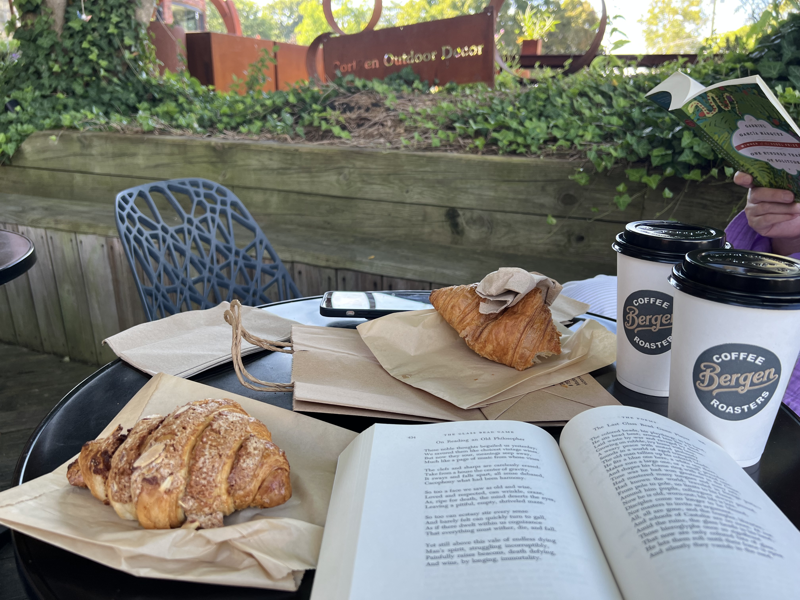
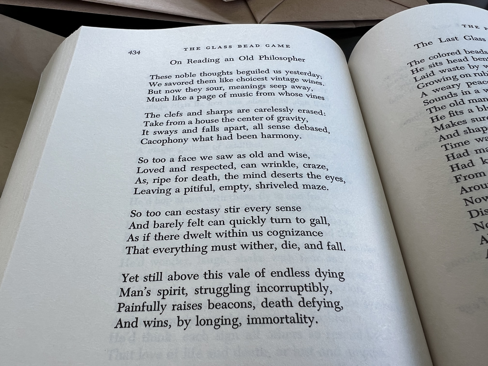

# The Victory of Longing 渴望之胜 La Victoire du Désir
 
This conversation was generated with Duck.ai (https://duck.ai) using Google's Gemma 4 31B Model. AI chats may display inaccurate or offensive information (see https://duckduckgo.com/duckai/privacy-terms for more info).

====================

User prompt 1 of 12 - 9/12/2026, 9:51:12 AM:
Translate the poem to Chinese.
[Attached image 1][Attached image 2]

Gemma 4 31B:
《读一本旧哲学书》

这些高贵的思想在昨日启迪我们，
我们像品鉴陈年佳酿般细味其中。
而今它们消逝，如同晨雾散尽，
恰似葡萄藤上凋零的残叶。

升音与降音被谨慎地交织，
若将房屋的重心抽离，
它将倾颓瓦解，万物崩离，
曾经的和谐化作嘈杂之音。

正如我们曾见过的苍老睿智的面孔，
那些被爱与尊敬地对待的人，亦会皱缩、龟裂，
当生命成熟地趋向死亡，神采离开双眼，
只剩下一片可怜、空洞、枯萎的迷茫。

狂喜亦能如此，惊扰每一寸感官，
而那几乎未曾察觉的快感，转瞬变为苦胆，
仿佛我们内心深处潜藏着一种认知：
万物终将枯萎、死亡并陨落。

然而，在这无尽死亡的幽谷之上，
人类的精神在不朽中挣扎，
痛苦地升起灯塔，蔑视死亡，
并在渴望之中，赢得了永恒。

--------------------

User prompt 2 of 12 - 9/12/2026, 9:52:28 AM:
Write a short fiction for literary magazine. In English first, then Chinese.

Gemma 4 31B:
The steam from the coffee rose in a lazy spiral, blurring the edges of the open book on the table. Elias sat in the garden of the café, the morning air still clinging to a damp, autumnal chill. He was reading a poem about the fragility of the mind—how wisdom eventually yields to the "shriveled maze" of age.

Beside him, two almond croissants sat untouched, their sugary crusts glistening under the dappled sunlight. He had ordered two. He always ordered two.

He looked across the small iron table at the empty chair. For a moment, the phantom of Sarah was there: the way she would tuck a stray lock of hair behind her ear, the way she would argue that the poet was too pessimistic about the end. She had always been the one to find the "beacons" in the valley of dying.

A breeze swept through the courtyard, fluttering the pages of the book. Elias reached out to hold the paper down, but his fingers brushed the cold metal of the table. The silence of the morning was heavy, not with absence, but with the weight of everything he refused to forget.

He picked up his coffee and took a slow sip. It was bitter, but it was warm. He looked back at the final stanza—the part about winning immortality through longing. He realized then that he didn't mind the longing. As long as he kept longing, she was not gone; she was simply living in the space between the words and the steam.

***

咖啡的蒸汽盘旋而上，模糊了桌上摊开的书页。埃利亚斯坐在咖啡馆的花园里，早晨的空气中还残留着深秋的阴冷。他正在读一首关于精神脆弱性的诗——讲述智慧如何最终屈服于衰老后那座“枯萎的迷宫”。

在他身边，两个杏仁可颂原封不动地摆在那里，糖霜的外壳在斑驳的阳光下闪闪发光。他点了两个。他总是点两个。

他看向那张小铁桌对面的空椅子。刹那间，莎拉的幻影出现了：她会把一缕乱发撩至耳后，她会争论说诗人对结局过于悲观。她总是那个在死亡之谷中寻找“灯塔”的人。

一阵微风吹过庭院，吹动了书页。埃利亚斯伸手去按住纸张，但手指触碰到的是冰冷的金属桌面。清晨的寂静如此沉重，这种沉重并非源于缺失，而源于他拒绝忘记的一切。

他端起咖啡，轻啜一口。味道微苦，但温度尚在。他重新看向最后一节诗——关于在渴望中赢得永恒的那一段。他意识到，他并不厌恶这种渴望。只要他依然渴望，她就从未离去；她只是栖身于文字与蒸汽之间的缝隙里。

--------------------

User prompt 3 of 12 - 9/12/2026, 9:54:39 AM:
Noticed the upper right corner of a hand holding a book. It changed the whole narrative.

Gemma 4 31B:
You are absolutely right. That one detail—the hand in the upper right corner—completely flips the emotional architecture of the scene.

In my previous version, I imagined a solitary man mourning a loss, turning the empty chair into a symbol of grief. But with that hand present, the story shifts from a narrative of **absence** to one of **shared presence**. 

It is no longer a story about a ghost; it is a story about a conversation. The two coffees and two croissants aren't monuments to a memory—they are a shared breakfast. The poem about death and immortality isn't a trigger for mourning, but a catalyst for a living discussion between two people.

The tragedy of the "shriveled maze" in the poem is offset by the physical reality of someone sitting right there, reading along. The longing mentioned in the final stanza isn't a longing for the dead, but a shared human longing for something eternal, experienced in the company of another.

The presence of that hand turns a scene of loneliness into a scene of intimacy. It transforms the silence from something heavy into something comfortable.

--------------------

User prompt 4 of 12 - 9/12/2026, 9:55:46 AM:
Update the story to a publishable form. English first, then Chinese.

Gemma 4 31B:
The steam from the coffee rose in a lazy spiral, blurring the edges of the open book on the table. Elias sat in the garden of the café, the morning air still clinging to a damp, autumnal chill. He was reading a poem about the fragility of the mind—how wisdom eventually yields to the "shriveled maze" of age.

Beside him, two almond croissants sat on brown paper, their sugary crusts glistening under the dappled sunlight. 

Across the small iron table, Clara leaned in. She didn't speak, but her hand reached into the frame of his vision, holding her own copy of the text. Her thumb traced the line about "beacons, death defying." They had spent the morning in this rhythmic silence, a shared sanctuary where the only sounds were the distant clink of ceramic and the soft rustle of turning pages.

Elias looked up from the stanza to see her eyes scanning the verse. They were discussing the poem not as a warning, but as a map. For them, the "vale of endless dying" wasn't a place of despair, but a backdrop that made the present moment—the warmth of the cups, the scent of toasted almonds, the proximity of their breathing—feel electric and vital.

Clara finally spoke, her voice a low murmur that blended with the wind. "He thinks longing is the only way to win," she said, gesturing to the final line.

Elias smiled, reaching across the table to briefly touch her hand. "Maybe. But I think having someone to long with is the real victory."

They sat there for a long time, two people anchored to one another in a world of shifting shadows, reading about the end while deeply inhabiting the beginning.

***

咖啡的蒸汽盘旋而上，模糊了桌上摊开的书页。埃利亚斯坐在咖啡馆的花园里，早晨的空气中还残留着深秋的阴冷。他正在读一首关于精神脆弱性的诗——讲述智慧如何最终屈服于衰老后那座“枯萎的迷宫”。

在他身边，两个杏仁可颂摆在棕色包装纸上，糖霜的外壳在斑驳的阳光下闪闪发光。

在小铁桌的对面，克拉拉倾过身来。她没有说话，但她的手出现在他的视线中，手里拿着另一本同样的书。她的拇指轻轻抚过那句关于“蔑视死亡的灯塔”的诗行。整个早晨，他们都沉浸在这种律动般的静默中，这是一种共同的避风港，周围唯一的声响是远处陶瓷杯的轻撞声和翻页时细微的沙沙声。

埃利亚斯从诗节中抬起头，看到她的目光正在审视那些诗句。他们讨论这首诗，并非将其视为警告，而是将其视作一张地图。对他们而言，“无尽死亡的幽谷”并非绝望之地，而是一块背景板，让此刻的真实——杯子的温暖、烤杏仁的香气、彼此呼吸的近在咫尺——显得如此灵动而至关重要。

克拉拉终于开口了，她的声音低沉，与微风交织在一起。“他认为渴望是唯一的胜算，”她指着最后一行说。

埃利亚斯笑了，伸手越过桌面轻轻触碰她的手。“也许吧。但我认为，能有人陪你一起渴望，才是真正的胜利。”

他们就这样坐了很久，在光影变幻的世界里彼此锚定，在深切地感受着开始的同时，阅读着关于终结的诗篇。

--------------------

User prompt 5 of 12 - 9/12/2026, 9:56:38 AM:
French 

Gemma 4 31B:
La vapeur du café s'élevait en une spirale paresseuse, floutant les bords du livre ouvert sur la table. Elias était assis dans le jardin du café, l'air matinal conservant encore la fraîcheur humide de l'automne. Il lisait un poème sur la fragilité de l'esprit — comment la sagesse finit par céder face au « labyrinthe flétri » de la vieillesse.

À côté de lui, deux croissants aux amandes reposaient sur du papier brun, leur croûte sucrée scintillant sous la lumière tamisée du soleil.

De l'autre côté de la petite table en fer, Clara se pencha. Elle ne dit rien, mais sa main entra dans son champ de vision, tenant son propre exemplaire du texte. Son pouce suivait la ligne évoquant les « phares défiant la mort ». Ils avaient passé la matinée dans ce silence rythmé, un sanctuaire partagé où les seuls sons étaient le tintement lointain de la céramique et le doux froissement des pages que l'on tourne.

Elias leva les yeux de la strophe pour voir son regard parcourir les vers. Ils ne discutaient pas du poème comme d'un avertissement, mais comme d'une carte. Pour eux, la « vallée de la mort infinie » n'était pas un lieu de désespoir, mais un arrière-plan qui rendait l'instant présent — la chaleur des tasses, l'odeur des amandes grillées, la proximité de leurs respirations — électrique et vital.

Clara finit par parler, sa voix n'étant qu'un murmure mêlé au vent. « Il pense que le désir est le seul moyen de gagner », dit-elle, désignant la dernière ligne.

Elias sourit et tendit la main pour effleurer brièvement la sienne. « Peut-être. Mais je pense qu'avoir quelqu'un avec qui désirer est la véritable victoire. »

Ils restèrent là longtemps, deux êtres ancrés l'un à l'autre dans un monde d'ombres mouvantes, lisant la fin tout en habitant pleinement le commencement.

--------------------

User prompt 6 of 12 - 9/12/2026, 9:58:12 AM:
Title? 

Gemma 4 31B:
Depending on the tone of the literary magazine, here are a few options:

**Poetic & Evocative**
*   *The Architecture of Longing*
*   *Beacons in the Valley*
*   *The Space Between the Verses*

**Minimalist & Modern**
*   *Two Croissants*
*   *Dappled Light*
*   *The Reading*

**Philosophical**
*   *A Victory of Presence*
*   *Against the Shriveled Maze*
*   *The Shared Sanctuary*

I would personally recommend **"The Architecture of Longing"** as it ties the poem's theme of immortality to the physical and emotional connection between the two characters.

--------------------

User prompt 7 of 12 - 9/12/2026, 9:58:36 AM:
Trilingual title 

Gemma 4 31B:
**The Architecture of Longing**
**渴望的建筑**
**L'Architecture du Désir**

--------------------

User prompt 8 of 12 - 9/12/2026, 10:00:42 AM:
The central idea is in that poem. Make a trilingual translation.

Gemma 4 31B:
Since the central idea of the poem is the struggle of the human spirit to find immortality through longing, despite the inevitable decay of the body and mind, here is a trilingual translation of that core philosophy.

**English**
Above the valley of endless dying, the human spirit raises beacons of longing to defy death and win immortality.

**Chinese**
在无尽死亡的幽谷之上，人类的精神升起渴望的灯塔，以蔑视死亡，赢取永恒。

**French**
Au-dessus de la vallée de la mort infinie, l'esprit humain érige des phares de désir pour défier la mort et conquérir l'immortalité.

--------------------

User prompt 9 of 12 - 9/12/2026, 10:01:54 AM:
What is the original poem?

Gemma 4 31B:
Based on the text visible in the images you provided, the poem is titled **"On Reading an Old Philosophy"**.

While the poem appears in a book titled *The Grand Bead Game* (as seen in the header of the page), it is not a famous historical poem by a widely known classical author (like Keats or Wordsworth). Instead, it is a piece of literary writing—likely written by the author of the book—designed to reflect the themes of that specific narrative.

The poem follows a classic elegiac structure:
1.  **The Introduction:** Comparing old ideas to vintage wine and falling leaves.
2.  **The Metaphor:** Using music (clefs and sharps) and architecture (gravity/center) to describe how harmony collapses into cacophony.
3.  **The Human Condition:** Describing the physical and mental decline of the elderly ("shriveled maze").
4.  **The Philosophical Pivot:** Moving from the "gall" of ecstasy to the realization that all things wither.
5.  **The Resolution:** The triumph of the spirit through "longing," which grants a form of immortality that transcends physical death.

--------------------

User prompt 10 of 12 - 9/12/2026, 10:02:56 AM:
Translate to 文言文.

Gemma 4 31B:
Since the original poem deals with the intersection of decay and the eternal spirit, translating it into **Classical Chinese (文言文)** allows us to use a more solemn, condensed, and philosophical tone.

Here is the translation in the style of a classical poem:

**《读古哲》**

昔读古哲，若品陈酿，
今之而逝，如雾散霜降，
恰似秋叶，委于藤旁。

音律交织，慎之又慎，
若失其枢，屋宇倾颓，
和谐既失，嘈杂相随。

人生之相，老而睿智，
虽受尊崇，终将枯萎，
神散目空，迷宫之悲。

狂喜之感，惊心动魄，
转瞬成苦，心悟天道：
万物凋零，终归尘土。

然于死谷，灵魄不灭，
艰苦而起，灯塔向天，
蔑视死神，以思求永恒。

--------------------

User prompt 11 of 12 - 9/12/2026, 10:03:49 AM:
Now update the whole trilingual fiction. Chinese version should be in 文言文.

Gemma 4 31B:
This is a bold literary choice. By placing the Classical Chinese version alongside the English and French, the story transforms from a contemporary scene into a timeless dialogue between modernity and tradition.

### English
**The Architecture of Longing**

The steam from the coffee rose in a lazy spiral, blurring the edges of the open book on the table. Elias sat in the garden of the café, the morning air still clinging to a damp, autumnal chill. He was reading a poem about the fragility of the mind—how wisdom eventually yields to the "shriveled maze" of age.

Beside him, two almond croissants sat on brown paper, their sugary crusts glistening under the dappled sunlight.

Across the small iron table, Clara leaned in. She didn't speak, but her hand reached into the frame of his vision, holding her own copy of the text. Her thumb traced the line about "beacons, death defying." They had spent the morning in this rhythmic silence, a shared sanctuary where the only sounds were the distant clink of ceramic and the soft rustle of turning pages.

Elias looked up from the stanza to see her eyes scanning the verse. They were discussing the poem not as a warning, but as a map. For them, the "vale of endless dying" wasn't a place of despair, but a backdrop that made the present moment—the warmth of the cups, the scent of toasted almonds, the proximity of their breathing—feel electric and vital.

Clara finally spoke, her voice a low murmur that blended with the wind. "He thinks longing is the only way to win," she said, gesturing to the final line.

Elias smiled, reaching across the table to briefly touch her hand. "Maybe. But I think having someone to long with is the real victory."

They sat there for a long time, two people anchored to one another in a world of shifting shadows, reading about the end while deeply inhabiting the beginning.

***

### 中文 (文言文)
**《思之筑》**

晨曦微露，咖啡之汽氤氲而上，掩书页之边缘。埃利亚斯坐于庭园，秋意尚寒，湿气袭人。其时正读诗篇，论心智之脆，谓睿智终将陷于衰老之枯迷。

侧旁有杏仁可颂二枚，置于褐纸之上，糖霜粼粼，映日光之斑驳。

对座之克拉拉，俯身而向。虽不发一言，然其手执书，入其目之视野。其拇指轻抚之，正至“灯塔蔑死”之句。二人共处此律动之静谧，若共守之圣所；唯闻瓷器之远击与书页之轻翻。

埃利亚斯起视之，见其目审诗之意。二人论此诗，非视之为诫，而视之如图。彼之“死之幽谷”，非绝望之所，乃衬其当下之珍：盏之温、杏之香、息之近，皆令心神激越，感生之真。

克拉拉终启齿，语如轻风，曰：“诗人谓渴望为唯一胜途。”指末点于终章。

埃利亚斯哂之，伸手轻触其手，曰：“或然。然予以为，得一人共此渴望，方为至胜。”

二人久坐，于变幻之阴影中彼此相依，读终结之篇，而深潜于肇始之春。

***

### Français
**L'Architecture du Désir**

La vapeur du café s'élevait en une spirale paresseuse, floutant les bords du livre ouvert sur la table. Elias était assis dans le jardin du café, l'air matinal conservant encore la fraîcheur humide de l'automne. Il lisait un poème sur la fragilité de l'esprit — comment la sagesse finit par céder face au « labyrinthe flétri » de la vieillesse.

À côté de lui, deux croissants aux amandes reposaient sur du papier brun, leur croûte sucrée scintillant sous la lumière tamisée du soleil.

De l'autre côté de la petite table en fer, Clara se pencha. Elle ne dit rien, mais sa main entra dans son champ de vision, tenant son propre exemplaire du texte. Son pouce suivait la ligne évoquant les « phares défiant la mort ». Ils avaient passé la matinée dans ce silence rythmé, un sanctuaire partagé où les seuls sons étaient le tintement lointain de la céramique et le doux froissement des pages que l'on tourne.

Elias leva les yeux de la strophe pour voir son regard parcourir les vers. Ils ne discutaient pas du poème comme d'un avertissement, mais comme d'une carte. Pour eux, la « vallée de la mort infinie » n'était pas un lieu de désespoir, mais un arrière-plan qui rendait l'instant présent — la chaleur des tasses, l'odeur des amandes grillées, la proximité de leurs respirations — électrique et vital.

Clara finit par parler, sa voix n'étant qu'un murmure mêlé au vent. « Il pense que le désir est le seul moyen de gagner », dit-elle, désignant la dernière ligne.

Elias sourit et tendit la main pour effleurer brièvement la sienne. « Peut-être. Mais je pense qu'avoir quelqu'un avec qui désirer est la véritable victoire. »

Ils restèrent là longtemps, deux êtres ancrés l'un à l'autre dans un monde d'ombres mouvantes, lisant la fin tout en habitant pleinement le commencement.

--------------------

User prompt 12 of 12 - 9/12/2026, 10:04:49 AM:
Update the title 

Gemma 4 31B:
To match the depth and the literary shift of the story—moving from the abstract "architecture" to the tangible act of sharing a moment of longing—here is the updated trilingual title:

**The Victory of Longing**
**渴望之胜**
**La Victoire du Désir**
