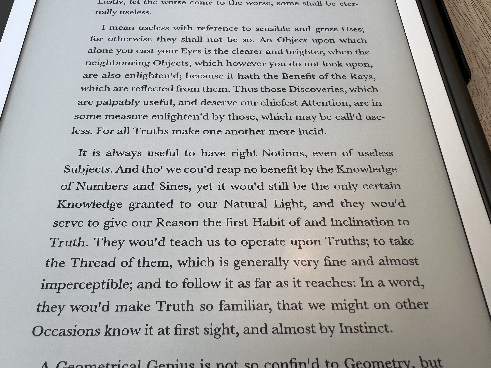

# From Notions to Networks: The Architecture of Understanding

This conversation was generated with Duck.ai (https://duck.ai) using Google's Gemma 4 31B Model. AI chats may display inaccurate or offensive information (see https://duckduckgo.com/duckai/privacy-terms for more info).

====================

User prompt 1 of 11 - 9/15/2026, 8:02:30 AM:

[Attached image 1]

Gemma 4 31B:
An e-reader, a cup of coffee with latte art, and a small pumpkin are arranged on a light-colored wooden surface.

--------------------

User prompt 2 of 11 - 9/15/2026, 8:02:51 AM:
Read the text.

Gemma 4 31B:
The text on the e-reader is too blurry to be read accurately. It appears to be a page from a book or article, but the individual words and letters are not clear enough to transcribe.

--------------------

User prompt 3 of 11 - 9/15/2026, 8:03:39 AM:

[Attached image 1]

Gemma 4 31B:
The text in the image reads:

Lastly, let the worst come to the worst; some shall be eternally useless.

I mean useless with reference to sensible and gross Uses; for otherwise they shall not be so. An Object upon which alone you cast your Eyes is the clearer and brighter, when the neighbouring Objects, which however you do not look upon, are also enlightend; because it hath the Benefit of the Rays, which are reflected from them. Thus those Discoveries, which are palpably useful, and deserve our chiefest Attention, are in some measure enlightend by those, which may be call'd useless. For all Truths make one another more lucid.

It is always useful to have right Notions, even of useless Subjects. And tho' we cou'd reap no benefit by the Knowledge of Numbers and Sines, yet it wou'd still be the only certain Knowledge granted to our Natural Light, and they wou'd serve to give our Reason the first Habit of and Inclination to Truth. They wou'd teach us to operate upon Truths; to take the Thread of them, which is generally very fine and almost imperceptible; and to follow it as far as it reaches: in a word, they wou'd make Truth so familiar, that we might on other Occasions know it at first sight, and almost by Instinct.

A Geometrical Genius is not so confin'd to Geometry, but

--------------------

User prompt 4 of 11 - 9/15/2026, 8:04:13 AM:
What do they mean?

Gemma 4 31B:
The author is arguing that no piece of knowledge is truly "useless," even if it has no immediate practical application in daily life.

The main point is that learning "useless" subjects (like complex mathematics, specifically "Numbers and Sines") serves as a form of mental training. By studying these abstract truths, the mind develops a "habit" of logical thinking and an "inclination" toward truth. This process teaches the brain how to follow a complex line of reasoning—what the author calls the "Thread"—which is often subtle and difficult to perceive.

The author uses an analogy of light to explain this: just as an object looks brighter when the surrounding area is illuminated, useful discoveries are better understood when the mind is enlightened by a broader range of knowledge, including the theoretical or abstract. Ultimately, the goal is to make the concept of "Truth" so familiar that the person can recognize it instinctively in other, more practical areas of life.

--------------------

User prompt 5 of 11 - 9/15/2026, 8:05:02 AM:
What are Notions?

Gemma 4 31B:
In this context, **notions** refers to mental concepts, ideas, or understandings.

When the author speaks of having "right Notions," they aren't talking about vague hunches or opinions. Instead, they are referring to an accurate conceptual grasp of how something works. For example, having a "right notion" of geometry means understanding the fundamental principles and laws that govern shapes and space, regardless of whether you ever use those principles to build a house or navigate a ship.

--------------------

User prompt 6 of 11 - 9/15/2026, 8:05:39 AM:
The difference between notion and notation.

Gemma 4 31B:
A **notion** is a conceptual understanding, while a **notation** is a symbolic representation.

A **notion** is an idea or a mental grasp of a concept. If you have a notion of how gravity works, you understand the general principle that objects with mass attract each other. It exists entirely in the mind as a thought, a belief, or a theoretical understanding.

A **notation** is a system of marks, signs, or symbols used to represent that information. For example, the mathematical formula $F = G \frac{m_1 m_2}{r^2}$ is the notation for gravity. It is the formal language used to write down, communicate, and calculate the concept so that others can understand it precisely without ambiguity.

In short: the notion is the **idea**, and the notation is the **code** used to record it.

--------------------

User prompt 7 of 11 - 9/15/2026, 8:06:32 AM:
Can we capture notions without notation?

Gemma 4 31B:
Yes, notions can be captured without notation, but the method and the stability of that capture change significantly.

**Intuitive and Experiential Capture**
Humans capture notions through intuition, observation, and lived experience long before they develop formal systems to describe them. For example, early humans had a notion of "quantity" or "more versus less" and a notion of "cycles" (the seasons, the moon) without having a numerical or calendar notation. These notions were captured as instincts, habits, and mental models passed down through imitation and oral storytelling.

**Oral and Linguistic Capture**
Language itself is a bridge. While written language is a form of notation, spoken language allows us to capture and transmit notions through description. You can explain the notion of "justice" or "love" to someone entirely through conversation. The notion is captured in the listener's mind as a conceptual understanding, even if no symbol is ever written down.

**The Limitations of Capture Without Notation**
While you can capture a notion without notation, the "capture" is often imprecise and fragile:

*   **Precision:** Without notation, complex notions are difficult to pin down. It is easy to have a general notion of a "circle," but without the notation of $\pi$ or the formula for area, you cannot communicate the exact mathematical properties of a circle to another person with perfect accuracy.
*   **Complexity:** Notation acts as "external memory." It allows the mind to offload simple steps so it can tackle harder problems. Trying to calculate the trajectory of a planet using only mental notions would be nearly impossible; notation allows us to stack complex ideas on top of one another.
*   **Persistence:** Notions held only in the mind or in oral tradition are subject to "drift." Over time, the notion may change as it is remembered and retold. Notation freezes a notion in time, allowing it to be retrieved exactly as it was recorded centuries later.

--------------------

User prompt 8 of 11 - 9/15/2026, 8:07:56 AM:
With LLM, can we capture notion without specific language?

Gemma 4 31B:
In the context of Large Language Models (LLMs), the answer is **yes**, and this is actually how they function at their core.

While we interact with LLMs using human language (English, French, Python, etc.), the model does not "think" in these languages. Instead, it captures notions in a language-independent mathematical space called **vector embeddings**.

**The Latent Space (The "Notion" Layer)**
When an LLM is trained, it maps words and concepts into a high-dimensional space (the latent space). In this space, the "notion" of a concept is represented as a coordinate (a vector). 

The model discovers that the notion of "King" relates to "Man" in the same way that "Queen" relates to "Woman," regardless of whether the input was "King" (English), "Roi" (French), or "König" (German). The model has captured the **abstract notion** of "monarchy + gender" as a geometric relationship in its internal map, separate from any specific linguistic label.

**Decoupling Notion from Language**
This allows LLMs to perform tasks that prove the notion exists independently of the specific language:

*   **Cross-lingual Transfer:** An LLM can be taught a concept in English and then apply that concept when prompted in Spanish, even if it saw very few examples of that concept in Spanish during training. It is applying the captured "notion" (the vector relationship) across different linguistic "skins."
*   **Multimodal Understanding:** In models that handle both images and text, the model learns that a picture of a golden retriever and the word "dog" point to the same region in its latent space. The "notion" of a dog is captured as a mathematical point that is triggered by both visual pixels and text characters.

**The "Bottleneck" of Expression**
The critical distinction is between **representation** and **expression**:
*   **Representation (Capture):** The LLM captures the notion as a mathematical vector (notation-free in terms of human language).
*   **Expression (Output):** To communicate that notion to you, the model must "decode" that vector back into a specific language.

So, while the LLM requires language to *learn* and *communicate*, the actual "knowledge" it holds is a series of abstract, mathematical relationships—effectively capturing notions without being tethered to a single specific language.

--------------------

User prompt 9 of 11 - 9/15/2026, 8:08:49 AM:
But there is always a stochastic element of it, right?

Gemma 4 31B:
Yes, the stochastic (random) element is fundamental to how LLMs function, and it manifests in two different stages: during the **mapping** of the notion and during the **expression** of it.

**1. Stochasticity in Representation (The "Blurry" Notion)**
The "notions" captured in the latent space are not clean, singular points; they are probabilistic distributions. The model doesn't store a definition of "apple" as a fixed fact. Instead, it stores a statistical cloud of associations (red, fruit, crunchy, Newton, tech company). 

Because these notions are built on statistical correlations from a massive dataset, the "notion" itself is a weighted average of billions of examples. This means the model's internal representation of a concept is inherently probabilistic—it is a "best guess" based on the likelihood of how that concept relates to others.

**2. Stochasticity in Expression (The Sampling Process)**
Even if the model has a very stable "notion" in its latent space, the process of turning that notion back into words is stochastic. This is controlled by parameters like **temperature**:

*   **Low Temperature:** The model chooses the most likely next token. This is more deterministic and "safe," but can become repetitive.
*   **High Temperature:** The model introduces more randomness, picking tokens that are less likely. This is where "creativity" (or hallucination) comes from.

**The Tension: Notion vs. Noise**
The stochastic nature of LLMs creates a fascinating tension:

If the process were entirely deterministic, the LLM would be a lookup table—a rigid notation system. Because it is stochastic, it behaves more like human intuition. We don't have a "perfect" mathematical notation for the notion of "love" or "justice" in our heads; we have a fuzzy, probabilistic sense of them. 

The stochastic element is what allows the LLM to generalize. By not being locked into a 1:1 rigid notation, the model can "leap" between related notions, allowing it to handle metaphors, analogies, and nuances that a purely deterministic system would miss. However, this is also why the model can "trip" and produce a hallucination—the stochastic drift pushes the expression away from the captured notion.

--------------------

User prompt 10 of 11 - 9/15/2026, 8:10:45 AM:
What is the relationship between precision and stochasticity? Can we have precise capture of stochastic properties?

Gemma 4 31B:
The relationship between precision and stochasticity is typically viewed as an inverse trade-off, but in advanced mathematics and AI, they can actually coexist through a concept called **probabilistic precision**.

**The Standard Trade-off**
In a traditional sense, precision and stochasticity are opposites:
*   **Precision** is about the reduction of variance. It aims for a single, correct, and repeatable result (e.g., $2 + 2 = 4$).
*   **Stochasticity** is the introduction of variance. It allows for a range of possible outcomes based on a probability distribution (e.g., a roll of a die).

If you increase the stochasticity of a system, you generally lose the ability to predict a specific outcome with precision.

**Precise Capture of Stochastic Properties**
However, you can absolutely have a **precise capture of a stochastic process**. This is the foundation of statistics and quantum mechanics.

Precision here shifts from the *outcome* to the *distribution*. You may not be able to predict exactly where a single molecule of gas will move (the stochastic outcome), but you can describe the pressure and temperature of the gas with absolute precision (the stochastic property). 

In this framework:
*   **Imprecise Stochasticity:** "I think this die is probably fair, but I'm not sure."
*   **Precise Stochasticity:** "This die is exactly fair; the probability of any side landing face up is precisely $1/6$."

**Application to LLMs**
This is exactly how an LLM operates. The model does not store a "precise" answer; it stores a **precise probability distribution** over all possible answers.

When an LLM predicts the next word, it doesn't just guess randomly. It calculates a precise set of probabilities (logits) for every token in its vocabulary. For example, if the prompt is "The capital of France is...", the model might assign a probability of $0.98$ to "Paris" and $0.001$ to "Lyon."

The **capture** of the notion is precise (the model "knows" exactly how likely Paris is compared to Lyon), but the **sampling** (the act of picking the word) is stochastic.

**Summary Table**

| Type of Capture | Focus | Goal | Example |
| :--- | :--- | :--- | :--- |
| **Deterministic Precision** | The Result | Zero Variance | A calculator solving $5 \times 5$. |
| **Stochastic Imprecision** | The Guess | General Direction | A person guessing the weather. |
| **Precise Stochasticity** | The Distribution | Exact Probability | A physicist describing a wave function. |

--------------------

User prompt 11 of 11 - 9/15/2026, 8:12:36 AM:
That’s enough for today. Write a summary with a good title so we can pick up tomorrow.

Gemma 4 31B:
## From Notions to Networks: The Architecture of Understanding

Today we explored the transition from human conceptual understanding to the mathematical representations used by AI. We began by analyzing a text on the value of "useless" knowledge, using it as a springboard to distinguish between **notions** (the mental grasp of a concept) and **notation** (the symbolic system used to record it).

We then shifted to how Large Language Models (LLMs) capture these notions. We discussed how LLMs bypass specific human languages by mapping concepts into a high-dimensional **latent space**, where notions exist as geometric relationships (vectors) rather than words. 

Finally, we examined the interplay between **precision and stochasticity**. We concluded that while the output of an AI is probabilistic (stochastic), the model can still maintain a "precise capture" of those probabilities. We defined this as the difference between predicting a single certain outcome and precisely defining the probability distribution of all possible outcomes.

[From Latent Space to Embodied Notion: The Evolution of Representation](https://ontouchstart.github.io/duck.ai/2026/09/16/duck.ai_2026-09-16_07-53-51)
