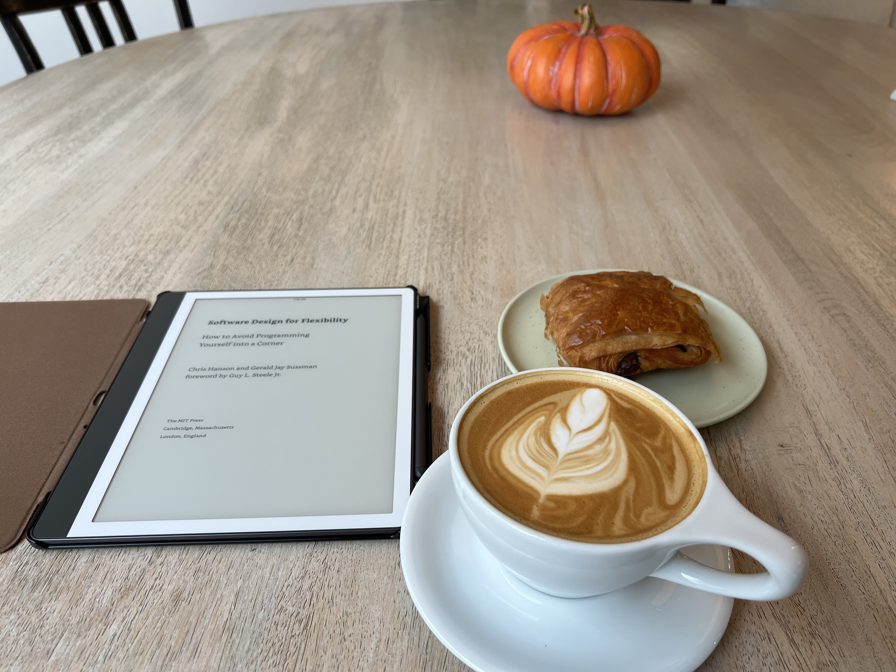
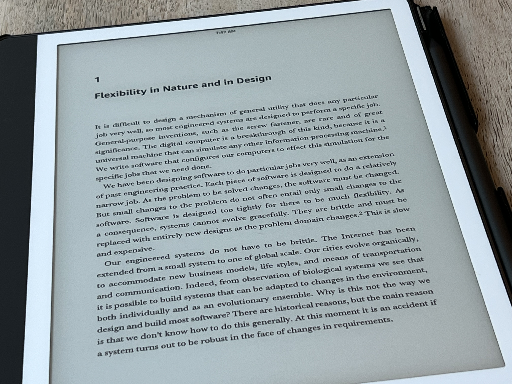

# Beyond the Corner: Bridging Notion and Notation
This conversation was generated with Duck.ai (https://duck.ai) using Google's Gemma 4 31B Model. AI chats may display inaccurate or offensive information (see https://duckduckgo.com/duckai/privacy-terms for more info).

====================

User prompt 1 of 3 - 9/17/2026, 7:50:58 AM:
Read the book and find more information about it.
[Attached image 1][Attached image 2]

Gemma 4 31B:
Based on the images provided, the book is titled **"Software Design for Flexibility: How to Avoid Programming Yourself into a Corner."**

The text in the second image, from the first chapter titled **"Flexibility in Nature and in Design,"** discusses the common problem of software fragility. It argues that while general-purpose inventions (like the digital computer) are breakthroughs in utility, most software is designed for specific, narrow jobs. As a result, small changes to a problem often require significant changes to the software, making systems "brittle" and expensive to maintain. The author suggests that by observing biological systems, we can learn to build software that adapts to environmental changes and remains robust in the face of evolving requirements.

--------------------

User prompt 2 of 3 - 9/17/2026, 7:53:17 AM:
Continue the discussion chains in https://ontouchstart.github.io/duck.ai/2026/09/17/duck.ai_2026-09-17_07-36-00 https://ontouchstart.github.io/duck.ai/2026/09/17/duck.ai_2026-09-17_07-36-41

Gemma 4 31B:
The convergence of these discussion chains with the themes in *Software Design for Flexibility* suggests a shift from static to dynamic flexibility. The book identifies "brittleness" as the result of software being designed for a narrow, specific job, which eventually leads a developer to "program themselves into a corner." In the context of your previous discussions, this brittleness is the inevitable consequence of the friction between notion and notation. When we freeze a flexible mental notion into a rigid symbolic notation (code), we create a snapshot of our understanding that cannot evolve as quickly as the problem does.

The "Complexity Crisis" mentioned in the summaries is essentially the accumulated weight of these frozen notations. Traditional software design attempts to solve this through patterns and abstractions—creating "flexible" code—but the book's observation about biological systems suggests that true robustness comes from adaptability, not just a well-planned interface. If human cognition is embodied and fluid, but our software is relational and static, the gap between the two is where the brittleness resides.

Moving toward "Intent-Based Computing" and a "Semantic Bridge" effectively solves the problem of programming oneself into a corner by decoupling the intent from the implementation entirely. In this model, the human maintains the notion, and the AI dynamically synthesizes the notation. Because the AI can target a "Universal Semantic Intermediate Representation" like Nix, it can rebuild the infrastructure in real-time to accommodate new requirements without the baggage of legacy architectural decisions. The "Ghost Infrastructure" becomes the ultimate flexible system: a mathematically sound, invisible layer that evolves its own notation to satisfy the human's evolving notion.

This also aligns the book's call for biologically inspired design with the need for sustainable, sparse computing. Biological systems are flexible not because they have a perfect master plan, but because they operate on principles of sparsity, local feedback loops, and emergent behavior. By moving away from general-purpose, brute-force hardware toward domain-specific architectures and "relational notions" in latent space, we are essentially building a digital version of the biological robustness the author advocates for. The goal is no longer to write a flexible program, but to maintain a flexible intent that an agent can manifest as an optimal, reproducible state.

Read More
- https://ontouchstart.github.io/duck.ai/2026/09/17/duck.ai_2026-09-17_07-36-00
- https://ontouchstart.github.io/duck.ai/2026/09/17/duck.ai_2026-09-17_07-36-41

--------------------

User prompt 3 of 3 - 9/17/2026, 7:55:15 AM:
Give a title and we ca pick up later.

Gemma 4 31B:
**Beyond the Corner: Bridging Notion and Notation**
