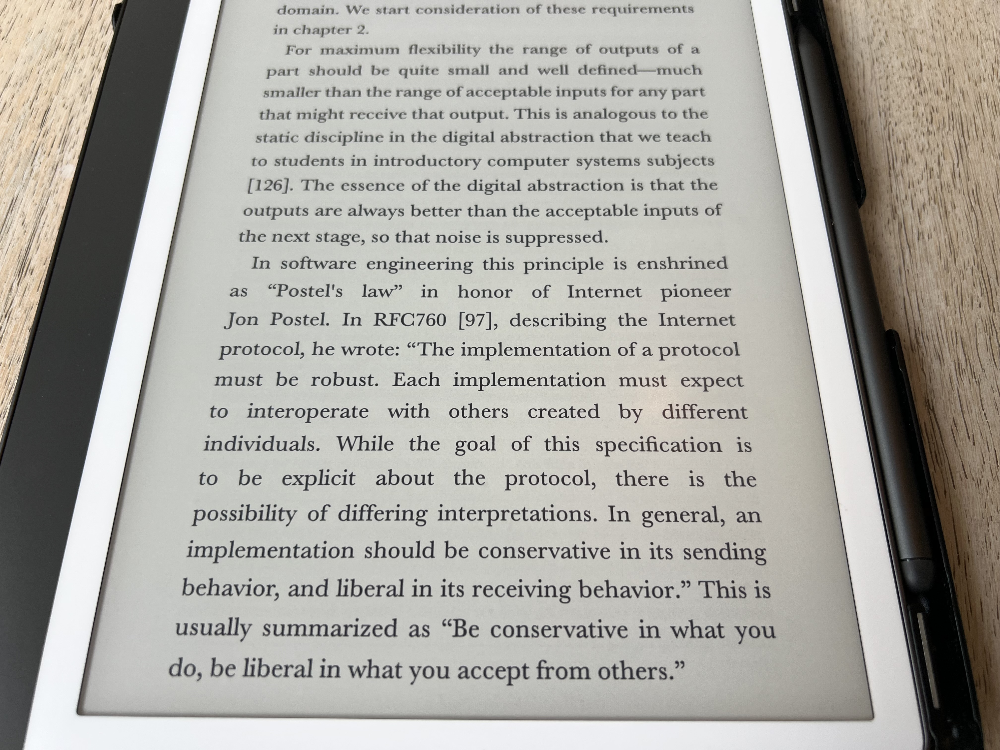

# Postel’s law
This conversation was generated with Duck.ai (https://duck.ai) using Google's Gemma 4 31B Model. AI chats may display inaccurate or offensive information (see https://duckduckgo.com/duckai/privacy-terms for more info).

====================

User prompt 1 of 1 - 9/17/2026, 8:29:40 AM:
Apply this to LLM and  agentic AI.
[Attached image 1]

Gemma 4 31B:
Applying Postel's law to large language models means balancing the flexibility of human communication with the rigidity required for machine interoperability. LLMs already embody the liberal side of the principle in their input processing; they are remarkably robust at interpreting misspelled words, fragmented grammar, and ambiguous prompts to infer a user's intent. This flexibility allows them to function as an intuitive interface between unstructured human thought and structured digital data.

The challenge arises with the output, where LLMs tend to be too liberal. For an LLM to follow Postel's law, it must be conservative in what it produces, especially when acting as a component in a larger software system. This is why developers use techniques like constrained sampling or strict system prompts to force a model to output valid JSON or a specific API schema. By strictly adhering to a narrow, well-defined output format, the model ensures that the next stage of the pipeline—which may be a fragile piece of traditional code—does not crash.

In agentic AI, this principle becomes the foundation for stability in multi-agent orchestration. When one agent calls another or triggers a tool, it must be extremely conservative, providing precisely formatted instructions that leave no room for ambiguity. If an orchestrator agent is loose with its specifications, the subordinate agent may hallucinate a parameter or misinterpret the goal, leading to a cascading failure. Conversely, the receiving agent or tool should be liberal in how it handles the return data. Because tools often return messy or unexpected strings, a robust agent must be able to parse that noise and extract the relevant information without failing the entire task.

However, applying this law to AI introduces a unique security risk known as prompt injection. Being too liberal in accepting inputs can allow a malicious user or a compromised third-party tool to "hijack" the agent's logic. In these cases, developers must intentionally deviate from Postel's law by becoming more conservative and suspicious of inputs, implementing strict validation layers to ensure that the flexibility of the LLM does not become a vulnerability.
