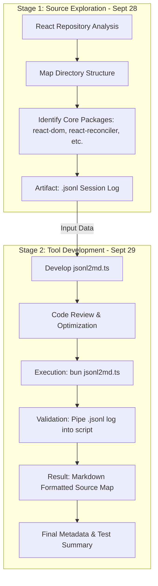
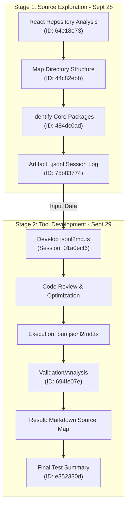

This conversation was generated with Duck.ai (https://duck.ai) using Google's Gemma 4 31B Model. AI chats may display inaccurate or offensive information (see https://duckduckgo.com/duckai/privacy-terms for more info).

====================

User prompt 1 of 7 - 9/29/2026, 9:29:52 AM:
Review this log

Gemma 4 31B:
I don't see a log attached or pasted here. Please provide the log you would like me to review, and I will analyze it for error codes, warnings, or unusual patterns.

For example, if you provide a system or application log, I can identify the root cause of a crash, highlight performance bottlenecks, or spot security anomalies.

--------------------

User prompt 2 of 7 - 9/29/2026, 9:30:23 AM:
https://ontouchstart.github.io/home/pi/2026-09-29/2026-09-29T11-39-52-738Z_01a0ecf6-ce21-7130-84a3-53b1707977a5

Gemma 4 31B:
This log records a session from September 29, 2026, where a model (**Gemma 4 12B**) was used to process a previous log file.

**Key Observations:**
*   **Action Taken:** The session executed a bash command using Bun to run a conversion script: `bun jsonl2md.ts < 2026-09-28T17-21-57-027Z_01a0e909-9f23-7498-8d83-44df382cc107.jsonl`.
*   **Purpose:** The command converted a `.jsonl` log from the previous day (Sept 28) into a Markdown format.
*   **Output Content:** The resulting output is a detailed directory listing of a **React source tree**. It maps out the structure of several core packages, including:
    *   `react-dom` and `react-dom-bindings`
    *   `react-reconciler` (containing the Fiber engine logic)
    *   `react-server` and various server-DOM implementations (ESM, Parcel, Turbopack, and Webpack)
    *   `react-native-renderer`
*   **Status:** The execution was successful with no errors or warnings reported in the output.

**Summary:**
The log essentially captures a "log of a log conversion." The primary value of this specific entry is the comprehensive file map of the React repository it produced, which provides a clear overview of how the different React renderers and server-side components are organized.

Read More
- https://ontouchstart.github.io/home/pi/2026-09-29/2026-09-29T11-39-52-738Z_01a0ecf6-ce21-7130-84a3-53b1707977a5

--------------------

User prompt 3 of 7 - 9/29/2026, 9:32:19 AM:
Go to the end of the log and summarize it.

Gemma 4 31B:
The end of the log contains a **Test Results Summary** for an entry (ID `e352330d`). It records the technical metadata for the final model response, noting that the process finished normally (`stopReason: stop`) using the `gemma-4-12B-it-Q8_0.gguf` model. The final entry is timestamped `1790687911687` with a corresponding response ID of `chatcmpl-wjuTh6dL5fVTjNT8EuuvVuVrSt2vKcJr`.

Read More
- https://ontouchstart.github.io/home/pi/2026-09-29/2026-09-29T11-39-52-738Z_01a0ecf6-ce21-7130-84a3-53b1707977a5

--------------------

User prompt 4 of 7 - 9/29/2026, 9:33:02 AM:
Trace back the session tree.

Gemma 4 31B:
The session tree reveals a two-stage process where a prior exploration of a codebase was used as the test data for a new developer tool.

**Stage 1: The Source Session (September 28, 2026)**
The root of this tree is a deep-dive exploration of the **React source repository**. 
*   **Activity:** An agent mapped out the directory structure of `/react`, specifically verifying the existence of the `compiler/` directory and cataloging core packages such as `react-dom`, `react-reconciler`, and `scheduler`.
*   **Trace IDs:** The logical flow is tracked via a parent-child chain: `64e18e73` $\rightarrow$ `44c82ebb` $\rightarrow$ `484dc0ad` $\rightarrow$ `75b83774`.
*   **Artifact:** The resulting session data was saved as a JSONL file: `2026-09-28T17-21-57-027Z_01a0e909-9f23-7498-8d83-44df382cc107.jsonl`.

**Stage 2: The Current Session (September 29, 2026)**
The current log is a development and testing session focused on a utility script.
*   **Objective:** The agent implemented a new version of `jsonl2md.ts`, a tool designed to convert the complex `.jsonl` session logs into human-readable Markdown.
*   **Validation:** To test the tool, the agent used the artifact from Stage 1 as the input source.
*   **Execution:** The command `bun jsonl2md.ts < 2026-09-28T17-21-57-027Z_01a0e909-9f23-7498-8d83-44df382cc107.jsonl` was run to verify that the conversion correctly rendered the React directory map.

**Summary of the Tree**
`React Repo Exploration (Sept 28)` $\rightarrow$ `Generated .jsonl Log` $\rightarrow$ `Development of jsonl2md.ts (Sept 29)` $\rightarrow$ `Test Conversion` $\rightarrow$ `Final Markdown Output`

Read More
- https://ontouchstart.github.io/home/pi/2026-09-29/2026-09-29T11-39-52-738Z_01a0ecf6-ce21-7130-84a3-53b1707977a5

--------------------

User prompt 5 of 7 - 9/29/2026, 9:34:02 AM:
Analyze the Stage 2 in details.

Gemma 4 31B:
Stage 2 focuses on the development, code review, and validation of a utility script called `jsonl2md.ts`. The goal of this stage was to create a tool that transforms raw AI session logs (stored as JSON Lines) into a human-readable Markdown format.

### 1. Technical Implementation of `jsonl2md.ts`
The script was designed with a focus on efficiency and robustness to handle potentially massive log files:
*   **Memory Management:** It utilizes `readline.createInterface` and an asynchronous `for await...of` loop to process the file line-by-line. This prevents the application from crashing due to memory exhaustion when loading large datasets.
*   **Error Handling:** A `try...catch` block wraps the `JSON.parse` logic, ensuring that a single malformed line in the JSONL file does not halt the entire conversion process.
*   **Specialized Formatting:** The script does not just dump text; it implements specific logic to identify "message" objects. It extracts the `role` (e.g., user or assistant) and parses the `content` to separately format "thinking" blocks (reasoning) and "text" blocks.
*   **Data Representation:** Simple key-value pairs are rendered as text, while complex nested objects are automatically wrapped in JSON code blocks using `JSON.stringify(value, null, 2)` for readability.

### 2. Critical Code Review
During the session, the agent performed a detailed audit of the script, identifying several strengths and specific areas for improvement:
*   **Strengths:** The agent praised the stream-based output (`process.stdout.write`) and the intelligent differentiation between standard JSON data and AI-specific message structures.
*   **Weaknesses Identified:**
    *   **Type Safety:** The agent noted a potential `TypeError` because the script assumes `value.content` is always an array. It suggested adding an `Array.isArray()` check.
    *   **Code Complexity:** The nested logic for processing messages was flagged as overly complex and recommended for refactoring into a separate helper function.
    *   **Edge Cases:** The script was found to produce no output if `value.content` was an empty array, rather than indicating the content was empty.

### 3. Validation and "The Confusion"
The script was validated by piping the React exploration log from September 28 into the tool. This led to a moment of analytical friction (captured in Entry `694fe07e`):
*   **The Observation:** The agent initially thought the tool was malfunctioning because the output looked like a raw list of files (`ls -R` output) rather than a formatted Markdown document.
*   **The Realization:** The agent quickly deduced that the tool was actually working perfectly; it was successfully extracting the content of the previous session, which happened to consist of a massive directory listing of the React source tree.

### Summary of Stage 2 Outcome
The session concluded that `jsonl2md.ts` is a **highly effective utility** for transforming technical transcripts into documentation. The "test" was a success, confirming that the script could handle complex, nested data and render it in a way that preserved the original structure of the session.

Read More
- https://ontouchstart.github.io/home/pi/2026-09-29/2026-09-29T11-39-52-738Z_01a0ecf6-ce21-7130-84a3-53b1707977a5

--------------------

User prompt 6 of 7 - 9/29/2026, 9:53:35 AM:
Drag a diagram of the session tree.

Gemma 4 31B:

--------------------

User prompt 7 of 7 - 9/29/2026, 9:54:19 AM:
Add ids to the nodes

Gemma 4 31B:

